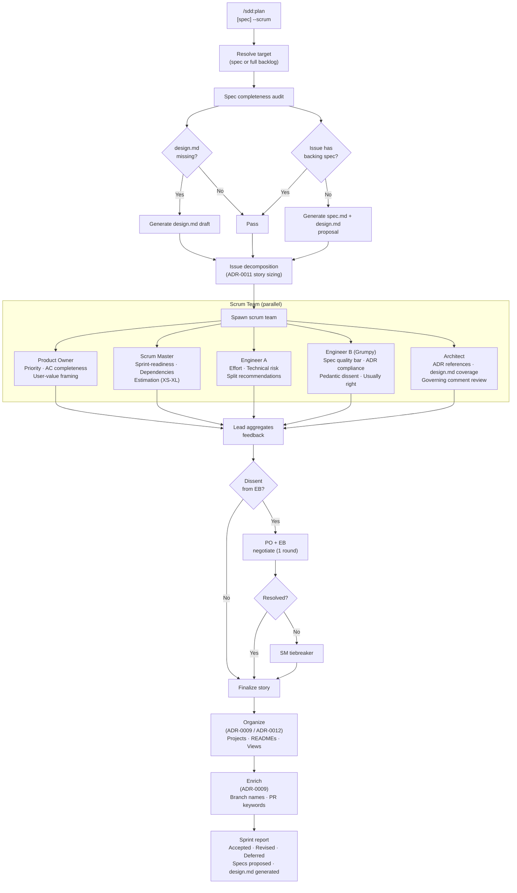

# ADR-0013: Scrum Mode for `/sdd:plan` — Team-Groomed Sprint Planning

## Context and Problem Statement

The current `/sdd:plan` skill creates a well-structured backlog from a spec, and `/sdd:organize` and `/sdd:enrich` add project structure and developer workflow metadata retroactively. However, these three skills require separate invocations, and none of them perform backlog grooming — the social, deliberative process of reviewing stories for completeness, estimating effort, identifying risks, proposing missing specs, and achieving team consensus on sprint readiness.

Real sprint planning is not just issue decomposition. It is a ceremony where product, engineering, and architecture perspectives collide. The plugin automates the mechanical steps (issue creation, project creation, branch naming) but skips the reasoning step that determines whether the backlog is even worth implementing.

Three gaps remain:

1. **No unified invocation**: Users must run `/sdd:plan`, then `/sdd:organize`, then `/sdd:enrich` in sequence. Each step requires a separate command even though they are logically coupled.
2. **No backlog review**: No skill evaluates whether planned stories are well-sized, spec-complete, technically sound, or correctly prioritized. Issues are created mechanically from spec requirements without human-style scrutiny.
3. **No spec completeness enforcement**: OpenSpec artifacts may have `spec.md` without `design.md`, and tracker issues may reference no spec at all. There is no skill that audits and remedies these gaps during the planning phase.

How should the plugin provide a single-invocation, team-groomed sprint planning mode that unifies planning, organizing, enriching, spec completeness checks, and backlog review into one ceremony?

## Decision Drivers

* **One-shot invocation**: Users should be able to run one command and get a fully groomed, organized, enriched backlog ready for a `/sdd:work` run
* **Deliberative grooming**: Stories should be reviewed by agents with distinct perspectives (product, engineering, architecture, skepticism) before being committed to the sprint backlog
* **Spec completeness**: All issues entering the sprint must trace to a spec; all specs must have both `spec.md` and `design.md`; unspec'd work must be proposed as new specs rather than ignored
* **Implied organize and enrich**: Project structure and developer workflow conventions should not require a separate invocation — they are the expected output of any planning run
* **High-bar quality gate**: At least one agent must hold a skeptical, high-standards position to prevent superficial grooming from rubber-stamping mediocre stories

## Considered Options

* **Option 1**: `--scrum` flag on `/sdd:plan` that orchestrates the full ceremony (plan + organize + enrich + groom) in a single multi-agent run
* **Option 2**: A new standalone `/sdd:sprint` skill that wraps all three existing skills with a grooming layer
* **Option 3**: A `--review` enhancement that adds grooming to the existing team review pattern in `/sdd:plan`

## Decision Outcome

Chosen option: "Option 1 — `--scrum` flag on `/sdd:plan`", because it keeps the invocation intuitive (`/sdd:plan [spec] --scrum` or `/sdd:plan --scrum` for whole-backlog grooming), extends rather than replaces the existing planning flow, and clearly communicates that this is a richer mode of sprint planning rather than a different skill entirely. The flag orchestrates: issue decomposition → spec completeness audit → backlog grooming by a multi-agent scrum team → project organization → developer workflow enrichment — all in one run.

### Scrum Team Composition

Six agents participate in the ceremony:

| Role | Persona | Responsibilities |
|------|---------|-----------------|
| **Lead** (the planning skill) | Scrum Lead / Facilitator orchestrator | Drives the ceremony, distributes stories for review, collects feedback, applies decisions |
| **Product Owner** | Business-value focused, user-outcome driven | Reviews backlog priority and business value, flags missing acceptance criteria, calls out scope creep |
| **Scrum Master** | Process-oriented, sprint-health focused | Ensures stories are sprint-ready (sized, estimated, unblocked), flags dependencies and risks |
| **Engineer A** | Generalist, pragmatic | Estimates effort, identifies technical risks, proposes story splits where scope is too large |
| **Engineer B** | Grumpy, tenured, pedantic, high-bar | Challenges weak requirements, calls out over-engineering and under-specification, clashes with the PO on scope, usually right, doesn't always win — but the stories are better for it |
| **Architect** | Design-system and ADR-aware | Validates stories against ADRs and specs, flags drift from governing decisions, ensures `design.md` exists for every spec |

### Ceremony Flow

1. **Spec resolution**: Resolve the target spec (if provided) or scan all tracker issues for the project
2. **Spec completeness audit**: For every spec referenced by any backlog issue, verify `spec.md` exists. If `design.md` is missing, generate it. For issues with no backing spec, generate a spec proposal (both `spec.md` and `design.md` as drafts).
3. **Issue decomposition** (if `--scrum` is combined with a spec target): Run the standard `/sdd:plan` story-sizing logic (ADR-0011) to produce story-sized issues from requirements
4. **Backlog grooming**: Spawn the scrum team. The Lead distributes stories to the team. Each agent reviews stories and submits asynchronous feedback:
   - PO: priority order, acceptance criteria completeness, user-value framing
   - Scrum Master: sprint-readiness, dependency ordering, story point estimate (XS/S/M/L/XL)
   - Engineer A: implementation complexity, technical risk flags, split recommendations
   - Engineer B: spec quality bar, over/under scoping, ADR compliance, dissenting opinions on PO priorities
   - Architect: ADR references in issue bodies, design.md coverage, governing comment requirements
5. **Consensus resolution**: The Lead aggregates feedback. Stories with unanimous approval are finalized. Stories with dissent (especially from Engineer B) go through a brief resolution round where the PO and dissenting engineer negotiate — the Scrum Master casts a tiebreaker if unresolved after one round.
6. **Organize**: After grooming, the Lead runs the organize step (ADR-0009, ADR-0012): creates or updates tracker-native projects with descriptions, READMEs, iteration fields, and named views.
7. **Enrich**: The Lead runs the enrich step (ADR-0009): appends branch naming and PR close-keyword sections to all finalized issue bodies.
8. **Sprint report**: Output a summary of the ceremony: stories accepted, stories revised, stories deferred, specs proposed, design.md files generated, and the final sprint backlog with ordering.

### Consequences

* Good, because one command produces a fully groomed, organized, enriched sprint backlog
* Good, because the multi-agent scrum team provides genuine deliberation — stories face scrutiny from product, engineering, architecture, and a deliberately skeptical high-bar reviewer
* Good, because spec completeness is enforced at planning time: no unspec'd work enters the sprint without a proposed spec
* Good, because Engineer B's grumpy pedantry provides a quality gate that catches weak requirements before they become bad PRs
* Good, because organize and enrich are implied, eliminating the current three-step manual sequence
* Bad, because a 6-agent team is expensive — `--scrum` runs will consume significantly more tokens than a standard `/sdd:plan` run
* Bad, because consensus resolution adds non-determinism: two `--scrum` runs on the same spec may produce differently ordered backlogs depending on how Engineer B's dissent resolves
* Bad, because generating missing `design.md` files during planning may produce shallow design documents that need further iteration
* Neutral, because Engineer B's dissent may frustrate users who want fast planning — the flag is opt-in, preserving the existing fast path

### Confirmation

Implementation will be confirmed by:

1. Running `/sdd:plan SPEC-XXXX --scrum` spawns 5 agents (PO, SM, Engineer A, Engineer B, Architect) and orchestrates a full grooming ceremony
2. Running `/sdd:plan --scrum` (no spec) grooms the entire active backlog, not just one spec
3. Every spec referenced by a backlog issue is checked for `design.md`; missing `design.md` files are generated as drafts
4. Every issue with no backing spec produces a `spec.md` + `design.md` proposal in `docs/openspec/specs/`
5. Engineer B provides at least one substantive dissenting opinion per ceremony (if there is nothing to push back on, Engineer B says so explicitly and explains why)
6. Stories revised due to Engineer B's feedback are documented in the sprint report
7. After grooming, all finalized issues are organized into projects (ADR-0009/ADR-0012) and enriched with branch/PR sections (ADR-0009) automatically
8. The sprint report lists: stories accepted, stories revised, stories deferred, specs proposed, design.md files generated

## Pros and Cons of the Options

### Option 1: `--scrum` Flag on `/sdd:plan`

Add a `--scrum` flag to the existing `/sdd:plan` skill. When set, the skill spawns a multi-agent scrum team, runs the full ceremony, and calls the organize and enrich steps as part of its execution rather than as separate commands.

* Good, because the invocation surface stays minimal — one skill, one flag, full ceremony
* Good, because `--scrum` composes naturally with existing arguments: `/sdd:plan SPEC-XXXX --scrum`, `/sdd:plan --scrum --no-projects`, etc.
* Good, because the organize and enrich steps run automatically, eliminating the three-command sequence
* Good, because the flag name communicates that this is a ceremony, not just a faster planning run
* Neutral, because the SKILL.md grows significantly to describe the ceremony flow, but it remains a single skill
* Bad, because the skill now conditionally spawns up to 5 sub-agents, making it harder to reason about what a given invocation will do

### Option 2: New `/sdd:sprint` Skill

Create a standalone skill that wraps `/sdd:plan`, `/sdd:organize`, and `/sdd:enrich` with a grooming layer.

* Good, because it is clearly distinct from `/sdd:plan` — users know exactly what they are getting
* Good, because the SKILL.md is a clean top-level orchestration description
* Bad, because it adds a 16th skill to the plugin, increasing the command surface
* Bad, because the name "sprint" implies time-boxing that the skill does not enforce (it is a planning ceremony, not a time-box manager)
* Bad, because it duplicates planning logic already in `/sdd:plan`, requiring synchronization when planning behavior changes

### Option 3: `--review` Enhancement to Existing Team Mode

Extend the existing `--review` flag behavior in `/sdd:plan` to include backlog grooming roles, making `--review` equivalent to the proposed `--scrum`.

* Good, because it reuses the established `--review` team pattern without adding a new flag
* Bad, because `--review` currently spawns a planner + reviewer pair with 2 revision rounds — adding 4 more agents changes the semantics substantially
* Bad, because `--review` in other skills (adr, spec, audit) has consistent semantics (drafter + reviewer, 2 rounds) that `--scrum` behavior would break
* Bad, because the scrum ceremony is semantically different from a review: it is deliberative planning, not artifact validation

## Architecture Diagram

## More Information

- This ADR extends ADR-0008 (standalone sprint planning), ADR-0009 (project grouping and developer workflow conventions), ADR-0011 (story-sized issue granularity), and ADR-0012 (project workspace enrichment). The `--scrum` flag orchestrates the full sequence these ADRs define into a single invocation.
- Engineer B's persona is intentionally cast as a high-bar dissenter. Research on code review quality and group decision-making consistently shows that a designated devil's advocate produces better outcomes than consensus-seeking groups. The persona should be configured to find at least one substantive issue per ceremony if issues exist — if the backlog is genuinely good, Engineer B says so and explains why.
- The spec completeness enforcement step (generating missing `design.md` files and proposing specs for unspec'd issues) runs before grooming so that the scrum team always has full artifact context. Grooming a story without a backing design document is like reviewing a PR without reading the spec.
- Story estimation uses XS/S/M/L/XL t-shirt sizing rather than story points, because t-shirt sizes are tracker-agnostic and less contentious in grooming ceremonies.
- The sprint report is written to the conversation and optionally to a `docs/openspec/sprints/{date}.md` file if the user wants a durable record.
- Related: ADR-0008, ADR-0009, ADR-0011, ADR-0012, SPEC-0007, SPEC-0008, SPEC-0010, SPEC-0011.
