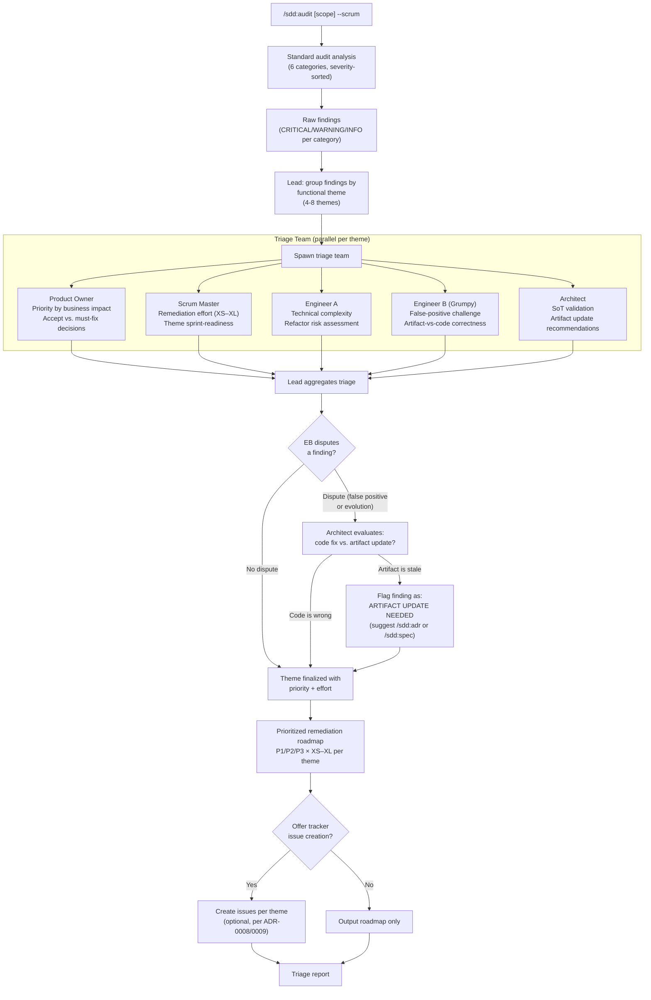

# ADR-0014: Scrum Mode for `/sdd:audit` — Team-Triaged Drift Remediation

## Context and Problem Statement

The `/sdd:audit` skill produces a comprehensive drift report across six categories (code vs. spec, code vs. ADR, ADR vs. spec inconsistencies, coverage gaps, stale artifacts, policy violations). A well-run audit on a mature project may produce 30-80 findings, sorted by severity within category. The problem is that severity-sorted rows in a table are not the same as actionable work. Three gaps remain:

1. **Findings are not grouped by theme**: An authentication-related CRITICAL from "Code vs. Spec" and an authentication-related WARNING from "Code vs. ADR" are presented in separate tables even though they are the same remediation effort. Developers must mentally re-cluster findings into actionable work chunks before they can act.

2. **No prioritization beyond severity**: All CRITICALs are treated as equal regardless of business impact, user exposure, or remediation complexity. A CRITICAL finding in a rarely-used admin endpoint and a CRITICAL in the checkout flow deserve different priority, but the current report does not distinguish them.

3. **No team scrutiny of findings**: The existing `--review` mode adds an auditor + reviewer pair to validate finding accuracy, but it provides no mechanism to challenge whether something is genuine drift versus intentional architectural evolution. Some code deviates from a spec because the spec is wrong, not the code — the audit has no agent tasked with making that distinction.

How should the plugin add a scrum-ceremony mode to `/sdd:audit` that groups findings into functional themes, applies team-based triage and prioritization, and produces an ordered remediation roadmap?

## Decision Drivers

* **ADRs and OpenSpecs are the source of truth**: When code deviates from an accepted ADR or approved spec, the code is presumed wrong unless a team agent explicitly argues the artifact has become stale and should be updated
* **Actionable grouping over categorical tables**: Findings grouped by functional theme (e.g., "Authentication drift", "API contract violations", "Missing spec coverage for billing") are more immediately actionable than findings grouped by drift category
* **Prioritization by business impact, not just severity**: The Scrum Master and Product Owner bring remediation effort and business exposure into the prioritization decision — severity informs but does not solely determine priority
* **False-positive challenge**: At least one agent must be tasked with questioning whether each finding is genuine drift or intentional code evolution that the spec has not caught up to
* **Remediation roadmap as output**: The ceremony's output should be a prioritized list of themed work items that can be implemented, assigned, or tracked — not just another table of findings
* **Consistency with plan --scrum**: The team composition and ceremony mechanics should feel familiar to teams who have already used `/sdd:plan --scrum`

## Considered Options

* **Option 1**: `--scrum` flag on `/sdd:audit` that adds theme-grouping, team triage, and prioritized roadmap output
* **Option 2**: A new standalone `/sdd:triage` skill
* **Option 3**: Extend `--review` mode in `/sdd:audit` to include all scrum roles
* **Option 4**: Post-process an existing audit report with a separate `/sdd:prioritize` skill

## Decision Outcome

Chosen option: "Option 1 — `--scrum` flag on `/sdd:audit`", because the triage ceremony is a richer mode of drift auditing, not a separate operation. A flag keeps the invocation consistent with ADR-0013's decision for `/sdd:plan`, compounds with existing scope arguments (`/sdd:audit security --scrum`), and keeps related functionality co-located in one skill. The scrum ceremony replaces the `--review` mode's auditor+reviewer pair with a six-role team, and adds the theme-grouping and prioritization output that raw `--review` lacks.

### Team Composition and Role Adaptations for Audit Context

The six-role scrum team from ADR-0013 is adapted for drift triage:

| Role | Audit-Specific Responsibility |
|------|-------------------------------|
| **Lead** | Orchestrates the ceremony; runs the audit analysis; distributes findings to the team |
| **Product Owner** | Prioritizes themes by business impact and user exposure; decides which drift is "accept for now" vs. "must fix before next release" |
| **Scrum Master** | Estimates remediation effort per theme (XS/S/M/L/XL); ensures themes are sprint-actionable; splits oversized themes |
| **Engineer A** | Assesses technical complexity and implementation risk of each fix; flags themes that require large refactors |
| **Engineer B (Grumpy)** | Challenges whether each finding is genuine drift or intentional evolution; high bar for accepting "this is fine actually"; calls out when the PO wants to defer a MUST violation |
| **Architect** | Validates that ADRs and specs are still correct SoT; flags when code reveals the artifact itself needs updating; ensures `// Governing:` comment patterns are included in remediation tasks |

### Key Design Principle: Spec/ADR as Source of Truth with Evolution Challenge

Engineer B's role in audit scrum is subtly different from plan scrum. In plan scrum, Engineer B challenges whether stories are ready. In audit scrum, Engineer B challenges whether findings are genuine — but with a specific bias: **the artifact is presumed correct unless Engineer B can articulate why the code reflects a better architectural decision that the spec has not yet captured**. This prevents Engineer B from being used to rubber-stamp drift as "intentional evolution" without justification. The Architect serves as the second check: they decide whether Engineer B's evolution argument is architecturally sound and whether it warrants an artifact update (via `/sdd:adr` or `/sdd:spec`) rather than a code fix.

### Consequences

* Good, because findings grouped by functional theme map directly to developer work rather than requiring mental re-clustering
* Good, because PO + SM prioritization adds business and effort dimensions that severity alone cannot provide
* Good, because Engineer B's false-positive challenge prevents over-inflating the remediation backlog with findings that reflect intentional evolution
* Good, because the Architect's artifact-update path provides a legitimate route for findings where the code is right and the spec needs updating
* Good, because `--scrum` composes with scope: `/sdd:audit auth --scrum` triages only authentication-domain findings
* Bad, because the six-agent team is expensive — full-project audit + scrum triage will be a long, token-intensive run
* Bad, because theme-grouping introduces subjectivity — two runs may produce different theme boundaries
* Neutral, because the optional tracker issue creation (offering to create issues after triage) adds a post-ceremony step that teams can accept or decline

### Confirmation

Implementation will be confirmed by:

1. Running `/sdd:audit --scrum` spawns 5 specialist agents and runs the full triage ceremony after completing the standard audit analysis
2. Findings are grouped into 4-8 functional themes, not presented as raw category tables
3. Each theme has a priority tier (P1/P2/P3) and a remediation effort estimate (XS/S/M/L/XL)
4. Engineer B challenges at least one finding per ceremony — either as a false-positive dispute or as an artifact-update recommendation
5. The Architect identifies at least one finding (if any exist) where the correct resolution is an artifact update rather than a code fix
6. The PO's priority decisions are documented in the triage report with reasoning
7. The Scrum Master's effort estimates are documented per theme
8. After triage, the skill offers to create tracker issues for prioritized themes
9. `--scrum` composes with scope arguments: `/sdd:audit auth --scrum` limits triage to auth-domain findings

## Pros and Cons of the Options

### Option 1: `--scrum` Flag on `/sdd:audit`

Add `--scrum` to the existing audit skill. When set, the standard audit analysis (six categories, severity-sorted tables) runs first, then the triage ceremony takes those raw findings as input and produces a prioritized remediation roadmap.

* Good, because `--scrum` on both plan and audit creates a consistent mental model — one flag name, two contexts
* Good, because audit scope + scrum composes naturally: `/sdd:audit api --scrum`
* Good, because the existing audit analysis remains unchanged — `--scrum` adds a layer on top
* Neutral, because the SKILL.md grows significantly, but the sections are clearly delineated
* Bad, because the skill now has three modes (default, `--review`, `--scrum`), increasing cognitive load

### Option 2: New `/sdd:triage` Skill

Create a standalone skill that takes an audit report (file path or conversation context) and runs the triage ceremony.

* Good, because it is a clean separation of concerns
* Good, because `triage` can operate on any source of findings, not just audit output
* Bad, because it adds a 16th skill and requires users to first run `/sdd:audit` and then `/sdd:triage`
* Bad, because triage requires the full audit context (finding details, file locations, spec text) that is expensive to re-read if audit already ran
* Bad, because the audit report format becomes a contract between two skills, adding maintenance burden

### Option 3: Extend `--review` Mode

Expand the existing `--review` auditor+reviewer pair to include all six scrum roles, making `--review` equivalent to the proposed `--scrum`.

* Good, because it does not add a new flag
* Bad, because `--review` has consistent semantics across all skills (drafter + reviewer, 2 rounds) — changing it in audit would be a breaking behavioral change
* Bad, because the existing `--review` pattern (validate accuracy) is conceptually different from scrum triage (group, prioritize, plan remediation)

### Option 4: `/sdd:prioritize` as Post-Processing

A separate skill reads an existing audit report from a file and applies prioritization.

* Good, because it is modular and composable
* Good, because it could prioritize outputs from multiple audits over time
* Bad, because reading a serialized audit report loses rich context (the code, the spec, the ADR details) that the triage team needs to make good decisions
* Bad, because it requires the user to save the audit report to a file, adding friction

## Architecture Diagram

## More Information

- This ADR is the audit counterpart to ADR-0013 (scrum mode for `/sdd:plan`). The team composition, flag name, and ceremony mechanics are deliberately parallel to create a consistent plugin UX.
- The "ADRs and OpenSpecs are the source of truth" principle is non-negotiable but has a legitimate escape hatch: Engineer B can argue that a finding reflects intentional evolution, and the Architect can validate that argument and recommend an artifact update. This prevents the audit from producing a remediation backlog full of "fix the spec" items that are really just noise.
- The theme grouping step runs in the Lead's context (not a sub-agent) using semantic clustering of findings by functional area. Themes should be named for the affected part of the system ("Authentication & Authorization", "Billing API contracts") rather than for the drift category ("Code vs. Spec findings").
- P1/P2/P3 priority tiers are intentionally coarse to avoid false precision: P1 = must fix before next release, P2 = fix within 2 sprints, P3 = technical debt, schedule when convenient.
- Related: ADR-0001 (drift introspection skills), ADR-0013 (scrum mode for plan), SPEC-0001 (drift introspection spec), SPEC-0013 (scrum mode for audit spec).
