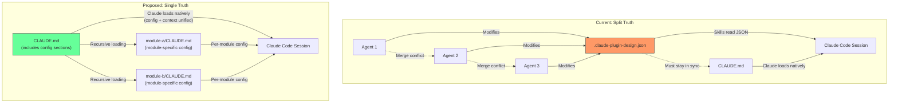

# ADR-0015: Markdown-Native Configuration — Eliminate `.claude-plugin-design.json`

## Context and Problem Statement

The SDD plugin currently stores runtime configuration in `.claude-plugin-design.json` — tracker choice, branch conventions, PR conventions, worktree settings, and review settings. This creates a split source of truth with `CLAUDE.md`, which already carries architecture context and instructions that Claude Code interprets natively. How should the plugin consolidate configuration into a single, conflict-resistant, human-readable format that leverages Claude Code's existing capabilities?

Three production projects (spotter, joe-links, claude-ops) exposed two concrete failures of JSON config:

1. **Split truth**: Developers had to keep `.claude-plugin-design.json` and `CLAUDE.md` synchronized. When they diverged, agent behavior became unpredictable — one source said "use GitHub Issues" while the other referenced Gitea.
2. **Merge conflict hotspot**: In claude-ops, `.claude-plugin-design.json` was modified by every single parallel PR in a sprint. It was the #1 merge conflict source across all three repos because every agent that ran `/sdd:work` or `/sdd:plan` updated shared fields in the same JSON file.

## Decision Drivers

* **Single source of truth**: Configuration and architectural context should live in one place, not two
* **Leverage existing platform capabilities**: Claude Code already recursively loads `CLAUDE.md` from subdirectories — multi-module/workspace support should come for free, not require a custom config resolver
* **Eliminate the #1 conflict source**: Parallel agents modifying a shared JSON file caused guaranteed merge conflicts in every production project
* **Human readability**: Configuration should be readable and editable by humans without tooling — markdown is universally understood
* **No false determinism**: JSON schema validation suggests machine-parseable precision, but Claude is interpreting the values as natural language regardless — the JSON structure adds ceremony without adding determinism
* **Migration simplicity**: Existing users need a clear, low-friction path from JSON to markdown

## Considered Options

* **Option 1**: Keep `.claude-plugin-design.json` with JSON Schema validation
* **Option 2**: YAML configuration file (`.claude-plugin-sdd.yml`)
* **Option 3**: TOML configuration file (`.claude-plugin-sdd.toml`)
* **Option 4**: Structured markdown sections in `CLAUDE.md` (chosen)

## Decision Outcome

Chosen option: "Option 4 — Structured markdown sections in CLAUDE.md", because Claude Code already loads and interprets `CLAUDE.md` natively, including recursive loading from subdirectories. Moving configuration into `CLAUDE.md` eliminates the split truth problem entirely, removes the #1 merge conflict source, and gives workspace/multi-module support for free through Claude Code's existing recursive `CLAUDE.md` resolution. The markdown format matches how Claude actually consumes the data — as natural language instructions — rather than pretending JSON adds machine precision to values that are interpreted by an LLM.

### Consequences

* Good, because single source of truth — all plugin configuration and architectural context live in `CLAUDE.md`
* Good, because recursive `CLAUDE.md` loading enables workspace and multi-module support without custom config resolution logic
* Good, because eliminates the #1 merge conflict source — `CLAUDE.md` is less likely to be modified by every parallel agent since it carries stable, rarely-changing configuration
* Good, because human-readable and editable without JSON tooling or schema knowledge
* Good, because Claude Code sessions automatically pick up configuration without requiring explicit config-loading logic in skills
* Good, because version-controlled and diffable — markdown diffs are cleaner than JSON diffs
* Bad, because less structured than JSON — there is no schema validation to catch typos in configuration keys (mitigated by Claude's natural language understanding, which tolerates minor variations like "branch prefix" vs "prefix")
* Bad, because migration is required for existing users who have `.claude-plugin-design.json` in their repos (mitigated by a one-time migration in `/sdd:init` that reads the JSON and writes equivalent CLAUDE.md sections)
* Neutral, because the configuration format is now coupled to Claude Code's `CLAUDE.md` convention — if Claude Code changes its file loading behavior, the plugin must adapt

### Confirmation

Implementation will be confirmed by:

1. All skills read configuration from `CLAUDE.md` sections instead of `.claude-plugin-design.json`
2. `/sdd:init` writes configuration as structured markdown sections in `CLAUDE.md` instead of generating a JSON file
3. `/sdd:init` detects existing `.claude-plugin-design.json` files and offers to migrate them to `CLAUDE.md` sections
4. Workspace projects with per-module `CLAUDE.md` files correctly resolve module-specific configuration
5. No skill references `.claude-plugin-design.json` for reading or writing configuration
6. Running `/sdd:work` with parallel agents no longer produces merge conflicts on the configuration file

## Pros and Cons of the Options

### Option 1: Keep `.claude-plugin-design.json` with JSON Schema Validation

Retain the JSON config file but add a formal JSON Schema for validation and editor autocompletion.

* Good, because JSON is a well-understood structured format with tooling support (schema validation, editor autocompletion)
* Good, because no migration needed — existing users keep their current setup
* Good, because structured format makes programmatic reading/writing straightforward
* Bad, because split truth persists — two config sources (`CLAUDE.md` + JSON) that must stay synchronized
* Bad, because JSON schema validation adds false determinism — Claude interprets values as natural language regardless of whether they pass schema validation
* Bad, because remains the #1 merge conflict source — every parallel agent still modifies the same JSON file
* Bad, because does not support workspaces — a single JSON file at the project root cannot express per-module configuration without inventing a custom module-resolution scheme

### Option 2: YAML Configuration File

Replace `.claude-plugin-design.json` with `.claude-plugin-sdd.yml` for more human-readable structured config.

* Good, because YAML is more human-readable than JSON (supports comments, less syntactic noise)
* Good, because structured format with established tooling and schema validation options
* Neutral, because slightly better merge behavior than JSON (YAML diffs are cleaner) but still a separate file that parallel agents would modify
* Bad, because still creates split truth with `CLAUDE.md` — two config sources instead of one
* Bad, because still a merge conflict target when multiple agents modify it concurrently
* Bad, because YAML has well-known footguns (implicit type coercion, the Norway problem, significant whitespace)
* Bad, because does not leverage Claude Code's recursive `CLAUDE.md` loading for workspace support

### Option 3: TOML Configuration File

Replace `.claude-plugin-design.json` with `.claude-plugin-sdd.toml`.

* Good, because TOML has clear, unambiguous syntax with explicit typing
* Good, because supports comments and is human-readable
* Good, because table-based structure maps cleanly to the existing config sections (tracker, branch, PR, review)
* Bad, because still creates split truth with `CLAUDE.md`
* Bad, because still a merge conflict target for parallel agents
* Bad, because TOML is less universally familiar than markdown or JSON — adds a learning curve
* Bad, because does not leverage Claude Code's recursive `CLAUDE.md` loading

### Option 4: Structured Markdown Sections in CLAUDE.md

Eliminate the config file entirely. Move all configuration into `### SDD Configuration` sections within `CLAUDE.md`, using markdown lists and tables.

* Good, because single source of truth — configuration lives alongside architectural context in `CLAUDE.md`
* Good, because Claude Code's recursive `CLAUDE.md` loading from subdirectories provides workspace support for free
* Good, because eliminates the merge conflict hotspot — `CLAUDE.md` carries stable configuration that does not change per-PR
* Good, because the format matches how Claude actually consumes the data — as natural language
* Good, because no additional tooling, schema files, or file format knowledge required
* Neutral, because configuration structure is conventional rather than enforced — relies on section headings and list formatting rather than schema validation
* Bad, because configuration mixed with other `CLAUDE.md` content could become cluttered in large projects (mitigated by using a dedicated `### SDD Configuration` section with clear subsection headings)
* Bad, because no programmatic validation of configuration values without parsing markdown (mitigated by Claude's tolerance for natural language variations)

## Architecture Diagram

## More Information

- The `CLAUDE.md` config structure uses a `### SDD Configuration` heading with subsections for Tracker, Branch Conventions, PR Conventions, and Review settings. Each subsection uses markdown lists with bold keys (e.g., `- **Type**: gitea`). See the plan document for the full example structure.
- Migration from `.claude-plugin-design.json` will be handled by `/sdd:init`, which will detect the JSON file, read its contents, write equivalent `CLAUDE.md` sections, and offer to delete the JSON file.
- This ADR enables ADR-0016 (Workspace Mode) — recursive `CLAUDE.md` loading for multi-module support depends on configuration living in `CLAUDE.md` rather than a single JSON file at the project root.
- Related: ADR-0016 (Workspace Mode), SPEC-0014 (Markdown-Native Configuration and Workspace Mode requirements).
- Evidence base: `.claude-plugin-design.json` was the worst file hotspot in claude-ops (all 7 parallel PRs modified it). In the parallel agent coordination analysis across three repos, it was the only file that was guaranteed to conflict in every sprint.
