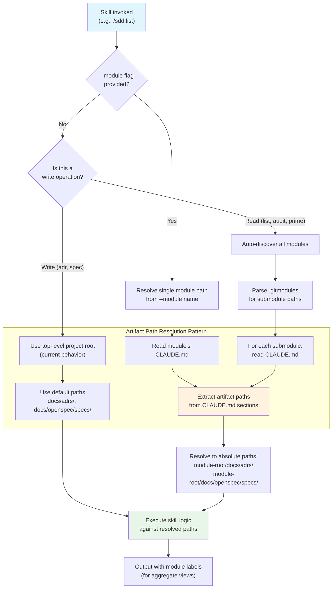

# ADR-0016: Workspace Mode for Multi-Module Projects

## Context and Problem Statement

Every skill in the SDD plugin hardcodes `docs/adrs/` and `docs/openspec/specs/` relative to a single project root. Users want to use a top-level project with git submodules where each submodule maintains its own ADRs and specs (e.g., a platform repo with `service-a/`, `service-b/`, and `shared-lib/` submodules, each with independent architectural decisions). Currently all 15 skills silently fail to find artifacts in submodules because path resolution never looks beyond the top-level project root. How should the plugin support multi-module projects where design artifacts are distributed across submodules?

## Decision Drivers

* **Real-world project structure**: Production projects (spotter, joe-links, claude-ops) are moving toward multi-service architectures with git submodules; single-root assumptions break immediately
* **Claude Code already recursively loads CLAUDE.md**: Subdirectory CLAUDE.md files are automatically loaded into session context, meaning workspace discovery infrastructure already exists
* **Per-module autonomy**: Each submodule should own its architectural decisions independently — a service team should not need to coordinate ADR numbering with unrelated modules
* **Aggregate views are still valuable**: Operations like `/sdd:audit`, `/sdd:list`, and `/sdd:docs` should be able to report across all modules in a single invocation
* **No new config format**: ADR-0015 (markdown-native configuration) eliminates `.claude-plugin-design.json` in favor of CLAUDE.md — workspace config should follow the same principle rather than introducing yet another config mechanism
* **Minimal migration burden**: Existing single-root projects should continue working without any changes

## Considered Options

* **Option 1**: Workspace configuration JSON file at the top level
* **Option 2**: Each submodule fully independent (no aggregation)
* **Option 3**: Monorepo path mapping in a single config file
* **Option 4**: Recursive CLAUDE.md with auto-discovery from `.gitmodules`

## Decision Outcome

Chosen option: "Option 4 — Recursive CLAUDE.md with auto-discovery from `.gitmodules`", because it leverages Claude Code's existing behavior of recursively loading CLAUDE.md files from subdirectories, requires no new configuration format (aligning with ADR-0015's markdown-native principle), gives each submodule autonomous control over its own design artifacts, and enables aggregate operations across modules through a simple scan of known module paths.

Skills gain a `--module <name>` flag to scope operations to a single submodule. When no `--module` flag is provided, skills that create artifacts (e.g., `/sdd:adr`, `/sdd:spec`) operate in the top-level project root as today, while skills that read artifacts (e.g., `/sdd:list`, `/sdd:audit`, `/sdd:prime`) aggregate across all discovered modules. The `references/shared-patterns.md` file gains an "Artifact Path Resolution" pattern that reads CLAUDE.md to resolve artifact directories instead of hardcoding `docs/adrs/` and `docs/openspec/specs/`.

### Consequences

* Good, because workspace support is effectively free — Claude Code already recursively loads CLAUDE.md from subdirectories, so each submodule's design config is automatically available in every session
* Good, because per-module CLAUDE.md is the natural place for module-specific configuration (tracker settings, branch conventions, artifact paths), keeping config co-located with the code it governs
* Good, because no new config format is introduced — this aligns with ADR-0015's decision to use CLAUDE.md as the single source of configuration truth
* Good, because single-root projects require zero migration — the absence of `.gitmodules` and submodule CLAUDE.md files means skills fall back to current behavior
* Good, because `.gitmodules` auto-discovery means users do not need to manually register submodules; adding a submodule to git automatically makes it visible to the plugin
* Bad, because all 15 skills must be updated to use the path resolver pattern instead of hardcoded artifact paths — this is a significant refactor across every SKILL.md
* Bad, because aggregate views (listing all ADRs across modules, cross-module audit) require scanning multiple directories, which is slower than single-root operations
* Bad, because ADR numbering may collide across modules (e.g., `service-a/docs/adrs/ADR-0001` and `service-b/docs/adrs/ADR-0001` are different decisions) — aggregate views must disambiguate with module prefixes
* Neutral, because the `--module` flag adds a new argument to every skill, but it is optional and only relevant in workspace contexts

### Confirmation

Implementation will be confirmed by:

1. A project with two git submodules, each containing their own `CLAUDE.md` and `docs/adrs/` directory, is correctly discovered by running `/sdd:list` at the top level — both modules' ADRs appear with module labels
2. `/sdd:adr --module service-a "some decision"` creates the ADR in `service-a/docs/adrs/`, not the top-level `docs/adrs/`
3. `/sdd:prime` in a workspace project loads ADRs and specs from all modules into session context
4. `/sdd:audit` in a workspace project reports drift per module and flags cross-module inconsistencies
5. `/sdd:check` with `--module service-b` scopes its drift check to only `service-b/` artifacts and code
6. A single-root project (no `.gitmodules`, no submodule CLAUDE.md files) continues to work identically to current behavior — zero regression
7. The "Artifact Path Resolution" pattern in `references/shared-patterns.md` is used by all skills instead of hardcoded paths

## Pros and Cons of the Options

### Option 1: Workspace Configuration JSON at Top Level

A top-level `workspace.json` or a `workspace` key in `.claude-plugin-design.json` that maps module names to paths and their artifact directories.

```json
{
  "workspace": {
    "modules": {
      "service-a": { "path": "service-a/", "adrs": "docs/adrs/", "specs": "docs/openspec/specs/" },
      "service-b": { "path": "service-b/", "adrs": "docs/adrs/", "specs": "docs/openspec/specs/" }
    }
  }
}
```

* Good, because explicit mapping gives full control over which submodules participate and where their artifacts live
* Good, because a single file provides a complete view of the workspace topology
* Bad, because it directly contradicts ADR-0015's decision to eliminate JSON configuration in favor of CLAUDE.md
* Bad, because it creates yet another config file that must be kept in sync with `.gitmodules` — adding a submodule requires editing two files
* Bad, because JSON is not natively understood by Claude the way CLAUDE.md is — it adds a parsing step that markdown does not require

### Option 2: Each Submodule Fully Independent (No Aggregation)

Each submodule is treated as a completely separate project. Users must `cd` into a submodule and run skills there. No cross-module operations.

* Good, because it requires zero changes to existing skills — each submodule is just a standalone project
* Good, because there is no ambiguity about which module an operation targets
* Bad, because cross-module operations (`/sdd:audit` across all services, `/sdd:docs` for the whole platform) are impossible
* Bad, because `/sdd:prime` cannot load architectural context from sibling modules, so an agent working in `service-a` has no visibility into decisions made in `service-b` that may affect shared interfaces
* Bad, because it forces users to maintain separate Claude Code sessions per submodule, losing the benefit of a unified project view

### Option 3: Monorepo Path Mapping in Single Config

A single CLAUDE.md at the top level contains explicit path mappings for all modules' artifact directories, without relying on per-module CLAUDE.md files.

```markdown
### Design Artifact Paths
| Module | ADRs | Specs |
|--------|------|-------|
| service-a | service-a/docs/adrs/ | service-a/docs/openspec/specs/ |
| service-b | service-b/docs/adrs/ | service-b/docs/openspec/specs/ |
```

* Good, because all configuration is in one place — easy to audit and understand
* Good, because it works for monorepos that are not using git submodules (just directories)
* Bad, because it centralizes control that should belong to each module — adding a service requires editing the top-level CLAUDE.md
* Bad, because it does not leverage Claude Code's recursive CLAUDE.md loading, wasting a built-in capability
* Bad, because module-specific configuration (tracker settings, branch conventions) would also need to live in the top-level file, making it grow unwieldy for large workspaces

### Option 4: Recursive CLAUDE.md with Auto-Discovery from `.gitmodules`

Each submodule carries its own CLAUDE.md declaring its design artifacts. The plugin auto-discovers submodules from `.gitmodules` and reads each submodule's CLAUDE.md for artifact paths and configuration. The top-level CLAUDE.md optionally includes a workspace summary table.

* Good, because it leverages Claude Code's existing recursive CLAUDE.md loading — no new infrastructure needed
* Good, because each module owns its own config, enabling autonomous team workflows
* Good, because `.gitmodules` auto-discovery eliminates manual registration of new modules
* Good, because it aligns perfectly with ADR-0015's markdown-native configuration decision
* Neutral, because the optional top-level workspace summary table is informational, not authoritative — the submodule CLAUDE.md files are the source of truth
* Bad, because skills must scan multiple directories for aggregate operations, adding latency
* Bad, because without a top-level manifest, discovering which modules exist requires parsing `.gitmodules` or scanning for CLAUDE.md files in subdirectories

## Architecture Diagram



## More Information

- This ADR depends on ADR-0015 (Markdown-Native Configuration), which establishes CLAUDE.md as the single source of configuration truth. Workspace config in CLAUDE.md is a direct application of that principle.
- The "Artifact Path Resolution" pattern added to `references/shared-patterns.md` is the central implementation artifact. Every skill must adopt this pattern to replace hardcoded `docs/adrs/` and `docs/openspec/specs/` paths.
- For the top-level CLAUDE.md workspace summary table format, see the plan.md "Workspace Mode" section which defines the expected markdown structure.
- ADR numbering collision across modules is handled at the display layer: aggregate views prefix ADR identifiers with the module name (e.g., `service-a/ADR-0001`). Within a single module, numbering remains sequential and independent.
- Related: ADR-0015 (markdown-native configuration), SPEC-0014 (requirements for configuration and workspace mode), plan.md "Workspace Mode" section.
