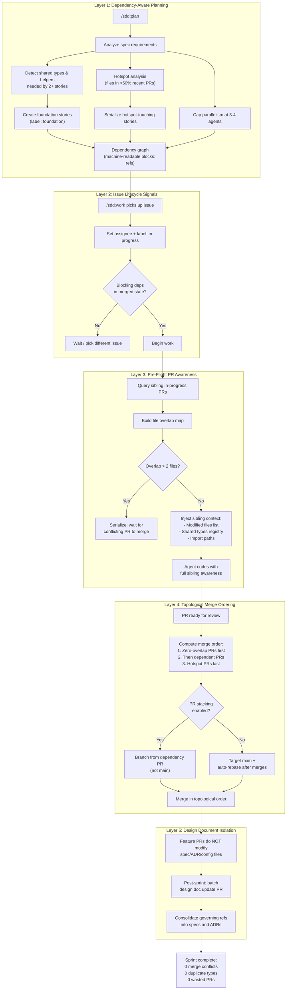

# ADR-0017: Parallel Agent Coordination and PR Stacking

## Context and Problem Statement

Review of three production projects built entirely with the SDD plugin (spotter, joe-links, claude-ops) revealed systemic coordination failures when multiple agents work in parallel. Across these repos, there were 11+ merge conflict commits, 6 PRs closed and recreated due to rebase failures, conflict markers merged directly into main, duplicate structs and helper functions implemented independently in concurrent PRs, zero assignees or in-progress labels on any issue in any repo, no pre-flight conflict detection, and `.claude-plugin-design.json` modified by every PR causing guaranteed conflicts. How should the plugin coordinate parallel agent work to eliminate duplicate code, merge conflicts, and wasted effort?

## Decision Drivers

* **Eliminate duplicate code across concurrent PRs**: Independent agents implementing identical types (`nopHandler`, `PublicLink`, `ChatRequest`/`ChatResponse`) and helper functions (`callOpenAI()`, `ParseIntParam()`) wastes effort and creates tech debt that requires follow-up cleanup PRs
* **Prevent merge conflicts before they happen**: Reactive conflict resolution (rebase, close/recreate PRs) is slower and more error-prone than proactive avoidance; conflict markers were actually merged into main in claude-ops
* **Maintain parallel throughput**: Sequential execution eliminates conflicts but sacrifices the primary benefit of multi-agent work; the solution must preserve meaningful parallelism while adding coordination
* **Foundation-first ordering**: Shared infrastructure (types, helpers, middleware, config fields) must be extracted and merged before feature PRs that depend on it, not duplicated across feature PRs
* **Observable agent state**: Zero assignees and zero lifecycle labels across all three repos means neither humans nor sibling agents can tell what work is in-progress, creating blind coordination
* **Design document isolation**: Spec files, ADR files, and `.claude-plugin-design.json` were modified by nearly every PR in every sprint, creating guaranteed merge conflicts on shared files that have nothing to do with the feature being built

## Considered Options

* **Option 1**: Simple sequential execution -- one agent at a time, no parallelism
* **Option 2**: Parallel with no coordination (current behavior)
* **Option 3**: File-locking system -- agents acquire locks on files before modifying them
* **Option 4**: Five-layer coordination system -- dependency-aware planning, lifecycle signals, pre-flight awareness, topological merge ordering, and design document isolation

## Decision Outcome

Chosen option: "Option 4 -- Five-layer coordination system", because the evidence from three production repos demonstrates that uncoordinated parallelism produces systemic failures (duplicate code, merge conflicts, wasted PRs), while sequential execution sacrifices the throughput advantage of multi-agent work. A layered approach addresses each root cause independently: planning prevents dependency violations, lifecycle signals enable agent awareness, pre-flight checks catch file conflicts before coding starts, topological ordering eliminates rebase churn, and design doc isolation removes the single largest source of guaranteed conflicts. The layers are additive -- each provides value independently, and together they eliminate the class of failures observed across spotter, joe-links, and claude-ops.

### The Five Layers

#### Layer 1: Dependency-Aware Planning (`/sdd:plan`)

During issue decomposition, identify **foundation stories** before feature stories:

- **Shared type detection**: Static analysis of spec requirements to find types, packages, and helper functions needed by 2+ stories. These become foundation stories with a `foundation` label that must merge before dependent stories begin.
- **Hotspot analysis**: Analyze recent git history for "god files" -- files modified by >50% of recent PRs. In spotter, `cmd/server/main.go` and `internal/config/config.go` were hotspots; in joe-links, `link_store.go` was touched by 6 concurrent PRs. Stories touching hotspot files SHOULD be serialized, not parallelized.
- **Config consolidation**: When multiple features add config fields and server wiring, create a single "wiring story" that stubs all config fields and route registrations. Feature stories then fill in implementations.
- **Parallelism cap**: Maximum 3-4 concurrent agents per sprint. Empirically, 8+ concurrent PRs caused failures in all three repos; claude-ops launched 78 concurrent PRs in one sprint.

#### Layer 2: Issue Lifecycle Signals (`/sdd:work`)

Structured status tracking so agents know what is in flight:

- **Labels**: Automatically apply `queued` -> `in-progress` -> `in-review` -> `merged` during work lifecycle
- **Assignees**: Set the agent/worker as assignee when picking up an issue
- **Machine-readable dependencies**: Use task list syntax in epic bodies: `- [ ] #272 (blocks: #273, #274)` instead of free-text "Depends on #141"
- **Dependency enforcement**: Refuse to start an issue if its blocking dependencies are not in `merged` state

#### Layer 3: Pre-Flight PR Awareness (`/sdd:work`)

Before an agent starts coding, inject context about sibling work:

- **Sibling PR manifest**: Query all `in-progress` issues from the current sprint and list their modified files, key types, and exports
- **File-level conflict prediction**: If a new issue's planned file changes overlap with >2 files already being modified by in-progress PRs, serialize instead of parallelize
- **Shared type registry**: List types and functions already created by foundation PRs or in-progress sibling PRs, so agents import them instead of recreating them

#### Layer 4: Topological Merge Ordering (`/sdd:work`, `/sdd:review`)

Compute optimal merge order by analyzing file overlap and dependency relationships:

- Merge PRs with zero overlapping files first
- Then merge PRs that depend on those changes
- **PR stacking option**: Instead of all PRs targeting `main`, offer stacked PRs where dependent changes branch from their dependency branch. Eliminates rebase entirely for dependent chains.
- **Auto-rebase orchestration**: After merging a PR, automatically trigger rebases for remaining open PRs in the sprint

#### Layer 5: Design Document Isolation

Stop every PR from modifying shared spec, ADR, and config files:

- **Batch design doc updates**: Instead of each agent updating spec files with governing references, create a single "design docs update" PR that runs after all feature PRs merge
- **Append-only governing references**: Each agent writes governing references to its own PR description or a per-PR file; a consolidation step merges them into specs post-sprint
- **Kill `.claude-plugin-design.json`**: This file was the #1 merge conflict source in claude-ops -- every PR modified it. Migrate to CLAUDE.md (see ADR-0015).

### Evidence from Production Repos

| Metric | spotter | joe-links | claude-ops |
|--------|---------|-----------|------------|
| Parallel batches identified | 8+ | 6+ | 5+ |
| Merge conflict commits | 4 | 6 | 1 |
| PRs closed/recreated | 0 | 5 | 1 |
| Confirmed duplicate implementations | 2 | 1 | 1 |
| Worst file hotspot | `sync.go` (3 concurrent PRs) | `link_store.go` (6 concurrent PRs) | `.claude-plugin-design.json` (all 7 PRs) |
| Conflict markers merged into main | No | No | Yes (`api_handlers.go`) |
| Issues with assignees set | 0 | 0 | 0 |
| Issues with "in-progress" labels | 0 | 0 | 0 |
| PR review comments catching duplicates | 0 | 0 | 0 |

**Specific failure incidents:**

- **spotter**: `nopHandler` struct implemented independently in `enrichers/openai/` and `vibes/generator.go`; cleaned up in PR 168. LLM client code (`ChatRequest`/`ChatResponse` types, `callOpenAI()` HTTP logic) duplicated across 4 packages; PR 171 extracted it, removing 181 lines of duplicate code.
- **joe-links**: `PublicLink` struct created independently in PRs 112 and 114; had to be manually unified at merge. PRs 142-144 all closed without merging and recreated as 145-147 after a dependency merged -- 100% wasted effort.
- **claude-ops**: Conflict markers (`<<<<<<<`, `=======`, `>>>>>>>`) actually merged into `main` in `api_handlers.go`; required a follow-up commit to remove 32 lines of conflict markers. `.claude-plugin-design.json` modified by every single PR in parallel sprints -- guaranteed merge conflicts.
- **spotter PR 144**: Required explicit merge-conflict-resolution commit after 5 other PRs merged. Commit fixed "missing AuthMiddleware function" and "missing closing brace" -- broken code from a bad rebase.

### Consequences

* Good, because foundation-first ordering eliminates the root cause of duplicate code -- shared types and helpers exist before feature PRs start
* Good, because lifecycle labels and assignees give both human operators and sibling agents visibility into what work is in-progress
* Good, because pre-flight conflict prediction prevents agents from starting work that will inevitably conflict, saving tokens and time
* Good, because topological merge ordering eliminates the rebase churn that caused 6 PRs to be closed/recreated in joe-links
* Good, because PR stacking eliminates rebase entirely for dependent chains -- each PR builds on its dependency's branch
* Good, because design document isolation removes the single largest source of guaranteed conflicts (`.claude-plugin-design.json` in claude-ops, spec files across all repos)
* Good, because the parallelism cap (3-4 agents) is empirically validated -- all three repos showed failures at 5+ concurrent PRs
* Bad, because the planning phase becomes more expensive -- foundation story detection, hotspot analysis, and dependency graphing add token cost before any code is written
* Bad, because lifecycle signal enforcement adds latency -- agents must wait for blocking dependencies to reach `merged` state before starting
* Bad, because the 3-4 agent cap reduces maximum theoretical throughput compared to unbounded parallelism
* Neutral, because PR stacking is offered as an option, not a default -- teams can choose between stacking (no rebase, more complex merge) and flat PRs (simpler merge, rebase required)

### Confirmation

Implementation will be confirmed by:

1. `/sdd:plan` identifies foundation stories and applies the `foundation` label; dependent stories have machine-readable `blocks:` references
2. `/sdd:plan` performs hotspot analysis and serializes stories that touch files modified by >50% of recent PRs
3. `/sdd:plan` enforces a maximum parallelism cap of 3-4 concurrent agents per sprint batch
4. `/sdd:work` applies lifecycle labels (`queued` -> `in-progress` -> `in-review` -> `merged`) and sets assignees on pickup
5. `/sdd:work` refuses to start an issue whose blocking dependencies are not in `merged` state
6. `/sdd:work` injects a sibling PR manifest as context before an agent begins coding, including files being modified and shared types available
7. `/sdd:work` detects file-level overlap with in-progress PRs and serializes when overlap exceeds 2 files
8. `/sdd:review` computes topological merge order and merges PRs with zero overlapping files first
9. `/sdd:review` offers PR stacking for dependent chains where each PR branches from its dependency
10. No agent modifies spec files, ADR files, or design config files in feature PRs -- design doc updates are batched post-merge
11. Running a full sprint on a test project produces zero merge conflict commits, zero duplicate type implementations, and zero PRs closed/recreated due to conflicts

## Pros and Cons of the Options

### Option 1: Simple Sequential Execution

Run one agent at a time. Each agent completes its PR and merges before the next agent starts. No parallelism.

* Good, because it completely eliminates merge conflicts -- there is only ever one PR in flight
* Good, because it eliminates duplicate code -- each agent sees all prior work
* Good, because it requires zero coordination infrastructure
* Bad, because it sacrifices the primary benefit of multi-agent work -- a 20-story sprint takes 20x the wall-clock time instead of 5-7x
* Bad, because it leaves compute capacity idle -- most of the time, the system is waiting for a single agent
* Bad, because it does not scale -- as projects grow, sequential execution becomes the bottleneck

### Option 2: Parallel with No Coordination (Current Behavior)

Launch all agents simultaneously. Each agent works from `main`, creates a PR, and hopes for the best at merge time.

* Good, because it maximizes theoretical throughput -- all agents run simultaneously
* Good, because it requires zero coordination infrastructure (the current state)
* Bad, because it produced 11+ merge conflict commits across 3 repos
* Bad, because it produced 6 PRs closed and recreated due to rebase failures
* Bad, because it merged conflict markers into main in claude-ops (`api_handlers.go`)
* Bad, because it duplicated `nopHandler`, `PublicLink`, and LLM client code across concurrent PRs
* Bad, because zero lifecycle signals (no assignees, no labels) made it impossible for agents or humans to know what was in-progress
* Bad, because `.claude-plugin-design.json` was modified by every PR, guaranteeing conflicts on a file unrelated to feature work

### Option 3: File-Locking System

Before modifying a file, an agent acquires an exclusive lock. Other agents wanting the same file must wait until the lock is released.

* Good, because it prevents merge conflicts at the file level with strong guarantees
* Good, because it is conceptually simple -- first-come, first-served
* Bad, because file-level locking is too coarse -- two agents modifying different functions in the same file do not actually conflict
* Bad, because lock contention on hotspot files (`main.go`, `config.go`, `link_store.go`) would serialize most work, approaching Option 1's throughput
* Bad, because it requires a central lock server or coordination file, adding infrastructure complexity
* Bad, because it does not address the root causes -- duplicate code still happens if agents create new files with identical types, and foundation ordering is not enforced
* Bad, because deadlocks are possible if agents acquire locks in different orders

### Option 4: Five-Layer Coordination System (Chosen)

Layered approach addressing each root cause: dependency-aware planning, lifecycle signals, pre-flight awareness, topological merge ordering, and design document isolation.

* Good, because each layer addresses a specific, observed root cause from production evidence
* Good, because layers are additive -- partial implementation still provides value (e.g., lifecycle signals alone improve visibility even without topological ordering)
* Good, because the parallelism cap is empirically derived from three production repos, not a theoretical guess
* Good, because foundation-first ordering prevents duplicate code at the planning stage, before any agent starts coding
* Good, because pre-flight awareness gives agents import paths for existing types instead of letting them recreate
* Good, because topological merge ordering and optional PR stacking eliminate rebase churn
* Good, because design document isolation removes guaranteed conflicts on shared files
* Neutral, because the five layers add complexity to the planning and work skills, but this complexity maps directly to observed failure modes
* Bad, because the full system is expensive to implement -- it touches `/sdd:plan`, `/sdd:work`, `/sdd:review`, and `shared-patterns.md`
* Bad, because dependency enforcement introduces wait times that reduce realized parallelism below the theoretical cap

## Architecture Diagram

## More Information

- This ADR addresses the highest-impact failure mode observed across all three production projects. The evidence table and specific incidents are drawn from detailed per-repo analysis of git history, PR timelines, and code review.
- The five layers are designed to be incrementally adoptable. Layer 2 (lifecycle signals) and Layer 5 (design doc isolation) can be implemented first with immediate impact, as they address the most visible symptoms (zero observability and guaranteed config conflicts). Layers 1, 3, and 4 build on that foundation.
- The parallelism cap of 3-4 is empirically derived: all three repos showed failures at 5+ concurrent PRs, and claude-ops's 78-PR sprint was catastrophic. This cap should be revisited as coordination layers mature.
- PR stacking (Layer 4) is offered as an option because it trades rebase complexity for merge complexity. Teams comfortable with stacked PRs can eliminate rebase entirely; teams preferring flat PRs get auto-rebase orchestration instead.
- Related: ADR-0015 (Markdown-Native Configuration -- eliminates `.claude-plugin-design.json`, the #1 conflict source), ADR-0008 (standalone sprint planning), ADR-0009 (project grouping and developer workflow conventions), ADR-0010 (parallel PR review), SPEC-0015 (Parallel Agent Coordination spec).
- The "design docs update" PR in Layer 5 replaces the current pattern where every agent adds `// Governing:` comments and updates spec completion status. This was the second-largest source of merge conflicts after `.claude-plugin-design.json`.
