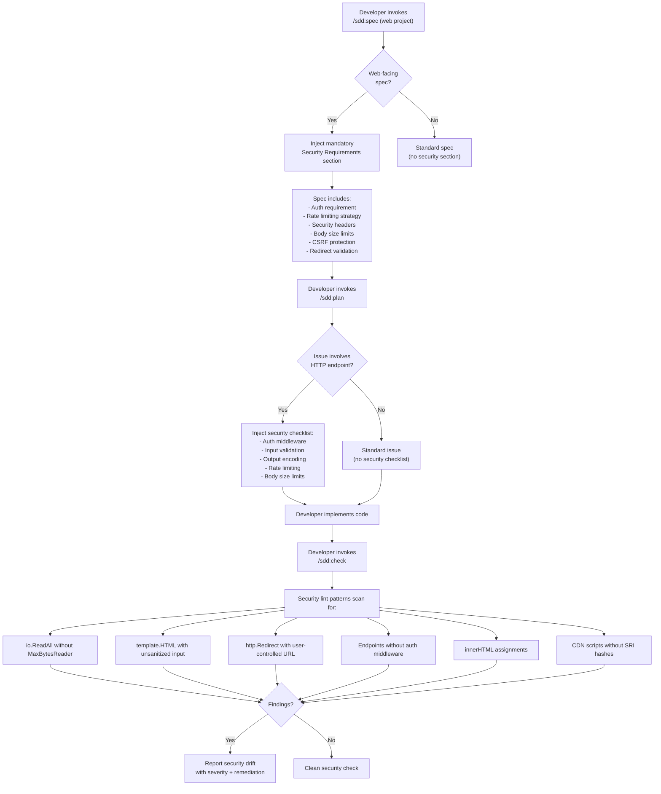

# ADR-0018: Security-by-Default for Web Specifications

## Context and Problem Statement

A review of three production projects built with the SDD plugin (spotter, joe-links, claude-ops) revealed that the plugin treats security as entirely opt-in. None of the existing skills prompt for security requirements, inject security checklists, or flag dangerous code patterns. The result is that security posture varies wildly across projects and depends entirely on whether someone remembers to ask for it.

How should the plugin ensure that web-facing specifications include security requirements by default, so that authentication, rate limiting, input validation, and other baseline protections are part of every web spec rather than an afterthought?

## Decision Drivers

* **Evidence from production failures**: claude-ops shipped an entirely unauthenticated dashboard where any network-adjacent user could make arbitrary configuration changes. joe-links has an open redirect vulnerability in its OIDC callback. All three repos use `io.ReadAll(r.Body)` without `MaxBytesReader`, allowing unbounded memory allocation from a single request.
* **Security should be a default, not a feature**: The plugin's strength is making good practices the path of least resistance. Security is the most consequential area where the plugin currently provides no guidance.
* **Spotter proves retrofitting works but is expensive**: Spotter has the best security posture of the three projects, but only because dedicated security audit issues (#94, #101, #107) were created and implemented after the initial build. The plugin should have prompted for these requirements from the start.
* **Minimal friction for spec authors**: Security sections should be injected automatically with sensible defaults, not require spec authors to remember a checklist.
* **Auth-by-default with explicit opt-out**: Public endpoints should be the exception that requires justification, not the default that happens when you forget authentication.

## Considered Options

* **Option 1**: Separate `/sdd:security` skill for security auditing and requirements
* **Option 2**: Post-hoc security audit only (add security checks to `/sdd:audit`)
* **Option 3**: Security checklist in CLAUDE.md that developers reference manually
* **Option 4**: Integrated into existing skills — `/sdd:spec`, `/sdd:plan`, and `/sdd:check` all gain security awareness (chosen)

## Decision Outcome

Chosen option: "Option 4 — Integrated into existing skills", because security is not a separate concern that lives in its own silo; it is a cross-cutting quality attribute that must be present at every stage of the design-to-implementation pipeline. Injecting security into the skills developers already use (spec, plan, check) ensures coverage without requiring anyone to remember to invoke a separate security skill. This mirrors how the plugin already handles traceability (governing comments are part of the normal workflow, not a separate step).

The integration touches four points in the plugin's workflow:

1. **`/sdd:spec`** injects a mandatory "Security Requirements" section into every web-facing specification. This section covers authentication, rate limiting, security headers, request body size limits, CSRF protection, and redirect validation. The spec author must explicitly justify any public (unauthenticated) endpoints rather than leaving them unauthenticated by default.

2. **`/sdd:plan`** adds a security checklist to every issue that involves an HTTP endpoint. The checklist covers authentication middleware, input validation, output encoding, rate limiting, and body size limits. This ensures developers see the security requirements at the point of implementation, not buried in a spec they may not re-read.

3. **`/sdd:check`** gains security lint patterns that flag known dangerous code constructs:
   - `io.ReadAll(r.Body)` without `http.MaxBytesReader` (unbounded memory allocation)
   - `template.HTML` with unsanitized user content (XSS via Go template bypass)
   - `http.Redirect` with user-controlled URLs (open redirect)
   - Endpoint registration without auth middleware (unauthenticated routes)
   - `json.NewDecoder` without `DisallowUnknownFields` (loose input parsing)
   - CDN `<script>` tags without `integrity` attributes (supply-chain risk)
   - `innerHTML` assignments in JavaScript (DOM-based XSS)

4. **Auth-by-default**: When generating web server specs, all endpoints require authentication. The spec author must explicitly declare which endpoints are public and provide justification for each (e.g., health checks, login pages, OAuth callbacks). This inverts the current default where endpoints are unauthenticated unless someone remembers to add auth.

### Evidence: Security Findings Across Production Projects

| Finding | Severity | spotter | joe-links | claude-ops |
|---------|----------|---------|-----------|------------|
| Unauthenticated endpoints | CRITICAL | None (all authenticated) | None (all authenticated) | **Dashboard entirely unauthenticated** — arbitrary config changes possible |
| Open redirect | HIGH | N/A | **OIDC callback vulnerable** — user-controlled redirect target | N/A |
| Rate limiting | HIGH | Login endpoint only | **None on any endpoint** | **None on any endpoint** |
| Security headers (CSP, X-Frame-Options, etc.) | MEDIUM | Present (post-audit retrofit) | **Missing entirely** | **Missing entirely** |
| Request body size limits | MEDIUM | **`io.ReadAll(r.Body)` unbounded** | **`io.ReadAll(r.Body)` unbounded** | **`io.ReadAll(r.Body)` unbounded** |
| CSRF protection | MEDIUM | SameSite=Lax cookies | SameSite=Lax cookies | **No CSRF protection** |
| Input validation | LOW | Strong | Moderate | Weak |

Spotter's security posture is the best of the three, but only because issues #94 (security headers), #101 (rate limiting), and #107 (auth hardening) were created and implemented as a dedicated security audit effort — the plugin itself never prompted for any of these requirements during the original spec or planning phases.

### Consequences

* Good, because every web-facing spec will have security requirements from day one, eliminating the class of "forgot to add auth" vulnerabilities that claude-ops shipped
* Good, because security checklists in plan issues surface requirements at the implementation point, not buried in a spec document developers may not re-read
* Good, because security lint patterns in `/sdd:check` catch dangerous code constructs before they reach production
* Good, because auth-by-default with explicit opt-out forces conscious decisions about public endpoints rather than accidental exposure
* Good, because the approach is language-aware — lint patterns can be extended for Go, Python, TypeScript, etc.
* Bad, because mandatory security sections add length to every web spec, including simple internal tools where the threat model may not warrant full coverage
* Bad, because false positives in security lint (e.g., `io.ReadAll` on a trusted internal body, `template.HTML` with pre-sanitized content) may create noise that developers learn to ignore
* Neutral, because spec authors can still write weak security requirements — the plugin ensures the section exists but cannot enforce the quality of the requirements within it

### Confirmation

Implementation will be confirmed by:

1. Running `/sdd:spec` for a web-facing project produces a spec with a "Security Requirements" section covering authentication, rate limiting, headers, body limits, CSRF, and redirect validation
2. The security section requires explicit justification for any endpoint marked as public (unauthenticated)
3. Running `/sdd:plan` on a spec with HTTP endpoints produces issues that include a security checklist
4. Running `/sdd:check` on code containing `io.ReadAll(r.Body)` without `MaxBytesReader` flags the pattern
5. Running `/sdd:check` on code with `innerHTML` assignments flags the pattern
6. Running `/sdd:check` on endpoint registration without auth middleware flags the pattern
7. Running `/sdd:check` on CDN `<script>` tags without `integrity` attributes flags the pattern

## Pros and Cons of the Options

### Option 1: Separate `/sdd:security` Skill

A standalone skill that generates security requirements, audits code for vulnerabilities, and produces security-focused reports. Invoked explicitly when security review is needed.

* Good, because it creates a dedicated, discoverable entry point for security concerns
* Good, because it keeps existing skills simple and unchanged
* Good, because security expertise is concentrated in one place, making it easier to maintain and update
* Bad, because it requires developers to remember to invoke it — the exact problem that led to claude-ops shipping an unauthenticated dashboard
* Bad, because it creates a false separation between "building the feature" and "securing the feature" — security is not a phase
* Bad, because it adds a 16th skill to the plugin, increasing discoverability burden

### Option 2: Post-Hoc Security Audit Only

Add security checks to `/sdd:audit` so that drift reports include a security posture section. No changes to spec or plan skills — security issues are caught during audits rather than prevented during design.

* Good, because it requires no changes to the spec or plan workflows
* Good, because `/sdd:audit` already has the infrastructure for findings, severity ratings, and remediation recommendations
* Bad, because it catches security issues after implementation rather than preventing them during design — exactly the pattern that required spotter's security retrofit
* Bad, because the remediation cost is much higher when vulnerabilities are found in working code vs. prevented in the spec
* Bad, because it provides no security guidance during implementation — developers writing code see no security checklists

### Option 3: Security Checklist in CLAUDE.md

Add a "Security Requirements" section to the CLAUDE.md template that `/sdd:init` generates. Developers and agents reference this checklist manually when writing specs and implementing features.

* Good, because it is the simplest implementation — just a markdown section
* Good, because CLAUDE.md is loaded into every session, so the checklist is always visible
* Neutral, because CLAUDE.md sections are advisory — nothing enforces that agents or developers follow the checklist
* Bad, because a static checklist cannot adapt to the specific technology stack or threat model of the project
* Bad, because compliance is entirely voluntary — agents may acknowledge the checklist exists without actually applying it
* Bad, because it does not integrate into the plan or check workflows, so there is no verification that the checklist was followed

### Option 4: Integrated into Existing Skills (Chosen)

Security requirements, checklists, and lint patterns are woven into `/sdd:spec`, `/sdd:plan`, and `/sdd:check` so that security is part of the normal workflow at every stage.

* Good, because security is present at every stage: design (spec), planning (plan), and verification (check)
* Good, because no new skills to discover or remember to invoke
* Good, because lint patterns provide automated verification, not just advisory guidance
* Good, because auth-by-default inverts the dangerous default of "unauthenticated unless someone remembers"
* Neutral, because the security patterns need to be maintained across three skills rather than one
* Bad, because it increases the complexity of three existing skills simultaneously
* Bad, because mandatory security sections may feel heavy-handed for internal-only tools with minimal threat models

## Architecture Diagram

## More Information

- This ADR addresses the "Security-by-Default" section of the v3.0 plan, which documented security findings across spotter, joe-links, and claude-ops.
- The security lint patterns in `/sdd:check` are intentionally conservative — they flag patterns that are dangerous in the majority of cases, accepting that some flags may be false positives (e.g., `io.ReadAll` on a body already wrapped in `MaxBytesReader` upstream). False positives can be suppressed with inline comments.
- Auth-by-default is inspired by the principle of least privilege: the safe default is "authenticated" and the developer must explicitly opt out with justification, rather than the reverse.
- The mandatory security section in `/sdd:spec` is triggered by detecting web-facing characteristics in the spec (HTTP endpoints, server routes, API definitions, browser UI). Purely internal library specs or CLI tool specs do not receive the section.
- Related: ADR-0001 (drift introspection skills), ADR-0019 (frontend quality standards, which covers CDN SRI and innerHTML from the frontend perspective), SPEC-0016 (security and quality guardrails spec).
