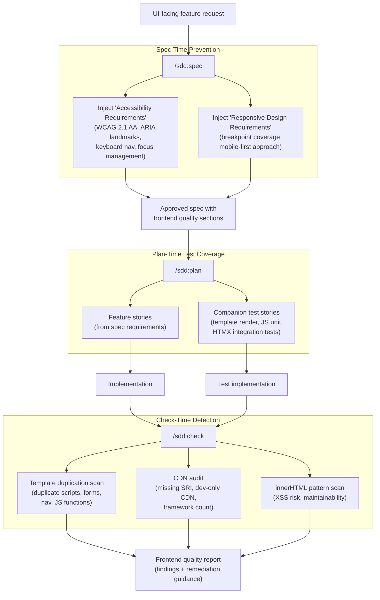

# ADR-0019: Frontend Quality Standards — Accessibility, Testing, and Template Quality Integrated into Existing Skills

## Context and Problem Statement

A review of three production projects built with the SDD plugin (spotter, joe-links, claude-ops) found zero frontend tests, near-absent accessibility, rampant template code duplication, and unsafe CDN practices across all repositories. The plugin produces well-structured backends with strong traceability, but has no guardrails for frontend quality — the skills never prompt for accessibility requirements, never scaffold frontend tests, and never detect template-level code smells. How should the plugin enforce frontend quality standards without introducing standalone tooling that fragments the existing skill workflow?

## Decision Drivers

* **Zero frontend tests across all 3 repos**: No template render tests, no JavaScript unit tests, no accessibility tests — the plugin never creates test stories for UI work
* **Accessibility is nearly absent**: spotter has 7 ARIA attributes, joe-links has 1, claude-ops has 4 — none have ARIA landmarks, keyboard navigation, or focus management
* **Template code duplication is rampant**: joe-links has `modal_form.html` with an identical JS function defined twice in the same file and 33 `innerHTML` occurrences; claude-ops renders navigation twice in separate templates
* **Unsafe CDN practices**: No SRI integrity hashes on any CDN `<script>` or `<link>` tag across all 3 repos; claude-ops uses the Tailwind CSS CDN Play script (explicitly marked "for development only") in production
* **Framework sprawl**: spotter loads 3 competing JS interaction frameworks (HTMX, Alpine.js, Hyperscript) with no ADR justifying the choices
* **Responsive design as afterthought**: joe-links has a fixed sidebar with no responsive breakpoints; claude-ops retrofitted responsive design after initial launch
* **Consistency with existing skill integration pattern**: ADR-0018 established the precedent of injecting mandatory spec sections and check-time lint patterns for security — frontend quality should follow the same integration approach

## Considered Options

* **Option 1**: Separate frontend linting tool (standalone CLI or external integration)
* **Option 2**: Post-hoc accessibility audit skill (`/sdd:a11y-audit`)
* **Option 3**: Integrate frontend quality standards into existing skills (`/sdd:spec`, `/sdd:plan`, `/sdd:check`)

## Decision Outcome

Chosen option: "Option 3 — Integrate frontend quality standards into existing skills", because it follows the same pattern established by ADR-0018 (security-by-default) and catches frontend quality issues at the point where they can be prevented (spec authoring, sprint planning) rather than only detected after the fact. This avoids adding new skills or external dependencies, keeps the plugin self-contained, and ensures every UI-touching spec automatically includes accessibility and testing requirements from the start.

### Integration Points

| Skill | Frontend Quality Addition |
|-------|--------------------------|
| `/sdd:spec` | Injects mandatory "Accessibility Requirements" section for UI specs (WCAG 2.1 AA, ARIA landmarks, keyboard navigation, focus management for modals, `aria-live` for dynamic content, `aria-label` on icon-only controls) |
| `/sdd:spec` | Injects "Responsive Design Requirements" section for UI specs (breakpoint coverage from the start, not as a retrofit) |
| `/sdd:plan` | Creates companion test stories for every UI-touching spec (template render tests, JS unit tests, HTMX swap integration tests) |
| `/sdd:check` | Detects template duplication (duplicate inline `<script>` blocks, same form structure in multiple templates, navigation rendered more than once, identical JS functions defined twice) |
| `/sdd:check` | CDN audit (missing SRI `integrity` attributes, dev-only CDN URLs like `cdn.tailwindcss.com`, more than 1 JS interaction framework per project) |
| `/sdd:check` | Flags `innerHTML` usage patterns as potential XSS vectors and maintainability concerns |

### Consequences

* Good, because accessibility requirements are injected at spec time — before any code is written — preventing the pattern of zero ARIA attributes seen in all 3 repos
* Good, because companion test stories in `/sdd:plan` ensure frontend tests are planned as first-class work items, not afterthoughts
* Good, because template duplication detection in `/sdd:check` catches the exact patterns found in joe-links (duplicate JS functions) and claude-ops (duplicate navigation)
* Good, because CDN audit catches both the missing SRI hashes (all 3 repos) and dev-only CDN usage (claude-ops Tailwind Play script)
* Good, because no new skills or external tools are added — existing skills gain frontend awareness
* Good, because the pattern mirrors ADR-0018's security integration, creating a consistent "quality by default" approach across security and frontend concerns
* Bad, because `/sdd:spec` now injects two mandatory sections for UI specs (accessibility + responsive), which adds length to specs for simple UI changes
* Bad, because companion test stories increase the total issue count per sprint, requiring teams to account for the additional testing workload
* Neutral, because the `innerHTML` lint is a heuristic — some `innerHTML` usage is safe (e.g., sanitized server-rendered content), so findings require developer judgment

### Confirmation

Implementation will be confirmed by:

1. Running `/sdd:spec` for a UI-facing feature produces an "Accessibility Requirements" section with WCAG 2.1 AA, ARIA landmarks, keyboard navigation, and focus management requirements
2. Running `/sdd:spec` for a UI-facing feature produces a "Responsive Design Requirements" section with breakpoint coverage
3. Running `/sdd:plan` on a UI-touching spec creates companion test stories (template render, JS unit, integration) alongside feature stories
4. Running `/sdd:check` on joe-links flags the duplicate JS function in `modal_form.html` and the 33 `innerHTML` occurrences
5. Running `/sdd:check` on claude-ops flags the duplicate navigation rendering and the Tailwind CDN Play script
6. Running `/sdd:check` on any repo flags CDN `<script>`/`<link>` tags missing `integrity` attributes
7. Running `/sdd:check` on spotter flags the 3 competing JS frameworks (HTMX, Alpine.js, Hyperscript)

## Pros and Cons of the Options

### Option 1: Separate Frontend Linting Tool

Run a standalone CLI tool (e.g., `axe-core`, `pa11y`, custom ESLint config) as a pre-commit or CI step that catches frontend quality issues.

* Good, because dedicated linting tools have mature, well-tested rule sets for accessibility (axe-core has 80+ WCAG rules)
* Good, because CI integration catches issues on every commit, not just when a developer remembers to run `/sdd:check`
* Good, because linting tools can auto-fix some issues (e.g., adding `alt` attributes, fixing ARIA roles)
* Bad, because it introduces external dependencies that must be installed, configured, and maintained per project
* Bad, because linting tools only catch issues after code is written — they cannot inject requirements at spec time or create test stories at planning time
* Bad, because it fragments the quality workflow: security checks are in `/sdd:check` but frontend checks are in a separate tool
* Bad, because server-rendered template projects (Go `html/template`, Django, Rails) are poorly supported by most frontend linting tools that assume SPA architectures

### Option 2: Post-Hoc Accessibility Audit Skill (`/sdd:a11y-audit`)

Create a new `/sdd:a11y-audit` skill that scans templates, CSS, and JS for accessibility issues and produces a remediation report.

* Good, because it provides a comprehensive, focused audit of accessibility across the entire project
* Good, because it could use browser-based testing (rendering templates and running axe-core) for higher accuracy than static analysis
* Bad, because it only detects issues after code is written — the same "retrofit" pattern that made claude-ops spend a sprint adding responsive design
* Bad, because it adds a 16th skill to the plugin, increasing discovery and maintenance burden
* Bad, because a post-hoc audit produces a remediation backlog (like spotter's security issues #94, #101, #107) instead of preventing the issues from occurring
* Bad, because template duplication and CDN issues are not accessibility concerns — they would still need to be detected elsewhere

### Option 3: Integrate Frontend Quality Standards into Existing Skills

Enhance `/sdd:spec`, `/sdd:plan`, and `/sdd:check` with frontend-specific quality checks that mirror the security integration pattern from ADR-0018.

* Good, because it catches issues at three stages: spec authoring (prevention), sprint planning (test coverage), and code review (detection)
* Good, because it follows the proven integration pattern from ADR-0018 — no new skills, no new tools, no new workflows to learn
* Good, because `/sdd:check` already has the infrastructure for pattern-based code scanning — adding template and CDN patterns is incremental
* Good, because companion test stories in `/sdd:plan` create accountability for frontend testing as planned work, not optional extras
* Neutral, because static template analysis has lower accuracy than browser-based testing, but catches the majority of issues found in the 3 repos
* Bad, because the spec and check skills grow in scope, which increases their SKILL.md complexity

## Architecture Diagram

## More Information

- This ADR is the frontend counterpart to ADR-0018 (security-by-default). Together they establish a "quality by default" pattern where `/sdd:spec` injects mandatory sections, `/sdd:plan` creates companion stories, and `/sdd:check` detects violations.
- The evidence table in the Context section is drawn from a systematic review of spotter, joe-links, and claude-ops — the same three repos that informed ADR-0017 (parallel agent coordination) and ADR-0018 (security-by-default).
- WCAG 2.1 AA was chosen as the accessibility target because it is the most widely adopted standard, required by law in many jurisdictions (ADA, EN 301 549, EAA), and achievable without specialized tooling.
- The `innerHTML` lint deserves special attention: joe-links has 33 occurrences, many used for HTMX swap targets. Not all are dangerous, but the pattern should be flagged for review since `innerHTML` bypasses DOM sanitization and is a common XSS vector.
- The "more than 1 JS interaction framework" check addresses spotter's 3-framework situation (HTMX + Alpine.js + Hyperscript). Multiple frameworks increase bundle size, create competing event handling models, and signal missing architectural decisions about frontend interaction patterns.
- Related: ADR-0018 (security-by-default), ADR-0001 (drift introspection skills), SPEC-0016 (security and quality guardrails).
