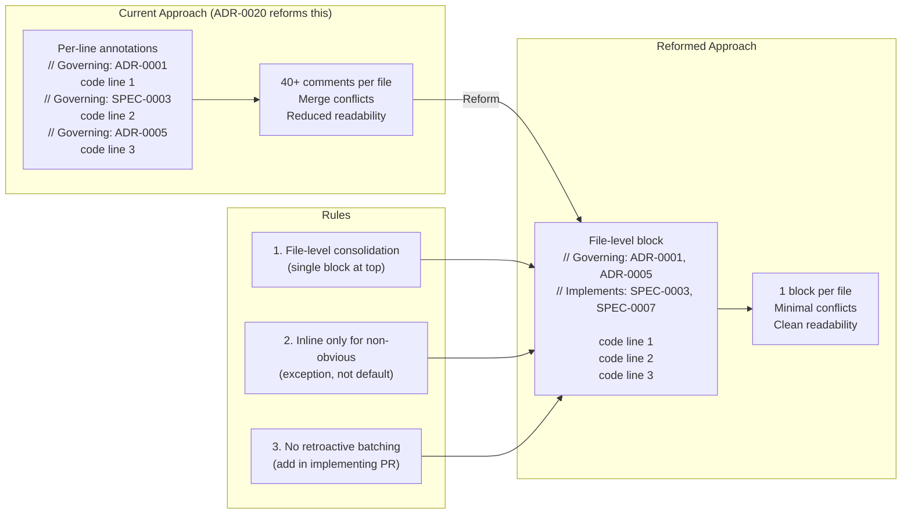

# ADR-0020: Governing Comment Reform

## Context and Problem Statement

The SDD plugin encourages inline governing comments throughout code (e.g., `// Governing: ADR-0001, SPEC-0003 REQ "Token Validation"`) to trace implementation back to architectural decisions. In practice, this approach has become excessive and counterproductive. How should the plugin reform governing comment practices to preserve traceability without degrading readability or creating merge conflicts?

Evidence from production projects reveals two concrete failures:

1. **Comment density exceeds usefulness**: Spotter's `main.go` has 40+ governing comments, with some files containing more comment lines than actual code. Per-line annotations on every 2-3 lines obscure the code they are meant to document.

2. **Retroactive batching creates chaos**: claude-ops launched approximately 78 concurrent PRs just to add governing comments to existing files. These PRs touched shared files and created merge conflicts on every overlapping target, wasting significant effort and polluting the git history.

## Decision Drivers

* **Readability over annotation density**: Governing comments should aid comprehension, not bury code under metadata
* **Co-location of traceability**: The connection between code and architectural decisions should live near the code, not in an external document
* **Conflict avoidance**: The comment strategy must not create merge conflicts when multiple agents work in parallel
* **Incremental adoption**: Comments should be added alongside the work they document, not as retroactive bulk operations
* **Minimal overhead for authors**: Developers (and agents) should not spend significant time crafting per-line annotations when a file-level summary suffices

## Considered Options

* **Option 1**: Keep the current per-line governing comment approach
* **Option 2**: External traceability matrix (separate document mapping code to decisions)
* **Option 3**: Remove governing comments entirely
* **Option 4**: File-level consolidation with selective inline annotations

## Decision Outcome

Chosen option: "Option 4 — File-level consolidation with selective inline annotations", because it preserves co-located traceability while eliminating the verbosity and conflict-proneness of per-line annotations. A single governing block at the top of each file provides the same traceability benefit at a fraction of the annotation cost, and the "no retroactive batching" rule prevents the kind of PR explosion that disrupted claude-ops.

The reform has three rules:

1. **File-level consolidation**: A single governing block at the top of each file lists all relevant ADRs and spec requirements, replacing scattered per-line annotations:
   ```go
   // Governing: ADR-0001 (JWT auth), ADR-0005 (graceful shutdown)
   // Implements: SPEC-0003 REQ "Auth Middleware", SPEC-0007 REQ "Shutdown"
   ```

2. **Inline only for non-obvious**: Inline governing comments are reserved for cases where the connection between code and the architectural decision is not apparent from the file-level block alone — e.g., a surprising implementation choice that would confuse a reader without context.

3. **No retroactive batching**: Governing comments MUST be added in the PR that implements the feature. Separate retroactive PRs that touch shared files solely to add governing comments are prohibited.

### Consequences

* Good, because file-level blocks are scannable — a developer can see all governing decisions for a file at a glance without reading through every function
* Good, because one block per file eliminates the merge conflict hotspot created by per-line annotations scattered throughout shared files
* Good, because the "no retroactive batching" rule prevents the kind of 78-PR explosion that disrupted claude-ops
* Good, because inline comments are still permitted where they add genuine value, preserving precision for non-obvious connections
* Bad, because file-level blocks are less precise than per-line annotations — a reader must infer which specific lines relate to which decision
* Bad, because existing codebases with per-line comments will have inconsistent styles until files are naturally touched by future PRs
* Neutral, because migration is organic — files adopt the new style when they are next modified, not through a dedicated cleanup sprint

### Confirmation

Implementation will be confirmed by:

1. All SDD plugin skills that generate or suggest governing comments (check, audit, work, spec) reference this ADR's file-level consolidation format
2. `/sdd:check` flags files with more than 5 inline governing comments as candidates for file-level consolidation
3. `/sdd:work` adds governing comments in the implementing PR, never as a separate retroactive PR
4. `/sdd:audit` reports governing comment density as an INFO-level finding when a file has more governing comment lines than a configurable threshold
5. The `shared-patterns.md` governing comment guidance is updated to reflect the file-level consolidation format

## Pros and Cons of the Options

### Option 1: Keep Current Per-Line Approach

Maintain the existing practice of annotating individual code lines or small blocks with governing comments referencing the relevant ADR or spec requirement.

* Good, because per-line annotations provide maximum precision — every line of code is explicitly linked to its governing decision
* Good, because the approach is already documented and understood by existing users
* Bad, because files become unreadable when annotations outnumber code lines (spotter `main.go`: 40+ governing comments)
* Bad, because every parallel agent touching a shared file must add its own annotations, creating guaranteed merge conflicts
* Bad, because retroactive annotation campaigns (claude-ops: ~78 concurrent PRs) waste effort and pollute git history

### Option 2: External Traceability Matrix

Replace inline comments with a separate document (e.g., `docs/traceability.md` or a structured JSON/YAML file) that maps source files and line ranges to ADRs and spec requirements.

* Good, because code files remain completely clean of governing metadata
* Good, because a single document is easier to query and analyze programmatically
* Bad, because the traceability matrix loses co-location — developers must cross-reference a separate document to understand why code exists
* Bad, because line numbers change with every edit, making the matrix perpetually stale unless tooling automatically updates it
* Bad, because a single traceability file becomes an even worse merge conflict hotspot than scattered inline comments

### Option 3: Remove Governing Comments Entirely

Rely on PR descriptions, commit messages, and spec documents for traceability. No inline comments referencing ADRs or specs.

* Good, because code is maximally clean and readable
* Good, because zero governing comments means zero governing-comment-related merge conflicts
* Bad, because traceability is completely lost at the code level — future developers (and agents) cannot determine why a piece of code exists without searching through PR history
* Bad, because `/sdd:check` and `/sdd:audit` lose their primary signal for verifying that code implements the intended decisions
* Bad, because it undermines the core value proposition of the SDD plugin — connecting decisions to implementation

### Option 4: File-Level Consolidation with Selective Inline Annotations

Single governing block at the top of each file listing all relevant ADRs and spec requirements. Inline comments reserved for non-obvious connections only. No retroactive batching.

* Good, because a single block per file provides the traceability benefit at ~90% less annotation volume
* Good, because one block per file is trivially mergeable — parallel agents adding different ADR references to the same block rarely conflict
* Good, because the "no retroactive batching" rule prevents PR explosions
* Good, because selective inline comments are still available for genuinely confusing code
* Neutral, because slightly less precise than per-line annotations, but the precision loss is rarely meaningful in practice
* Bad, because requires updating skill guidance and shared patterns to teach the new format

## Architecture Diagram



## More Information

- This ADR addresses findings from the v3.0 plan's "Governing Comment Reform" section, which identified comment density and retroactive batching as systemic problems across spotter, joe-links, and claude-ops.
- The "no retroactive batching" rule complements ADR-0017 (Parallel Agent Coordination), which addresses the broader problem of PR conflicts from concurrent agents. Governing comment batching was one of the worst offenders.
- Skills affected by this reform: `check` (density detection), `audit` (density reporting), `work` (comment placement in implementing PRs), `spec` (governing comment guidance), and `shared-patterns.md` (canonical format documentation).
- Migration is intentionally organic: existing per-line comments are not wrong, just suboptimal. Files adopt the new format when they are next modified for functional reasons — no dedicated cleanup sprint is needed.
