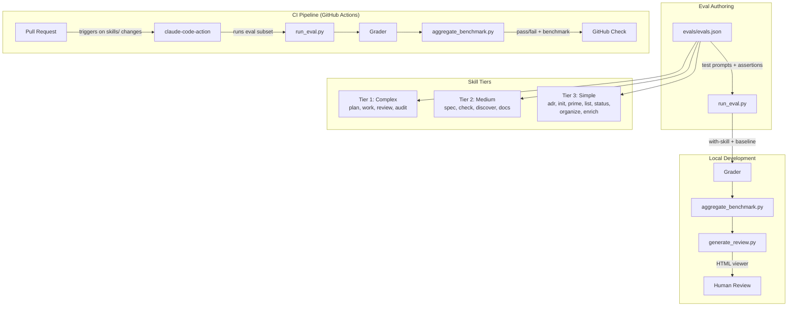

# ADR-0021: Skill Evaluation and CI Testing Framework

## Context and Problem Statement

The SDD plugin has 15 skills, zero test coverage, and just underwent a major overhaul (6 new ADRs, 3 new specs, config migration, workspace mode, security injection, worker protocols). How should we test these skills to catch regressions, validate behavior, and maintain quality as the plugin evolves?

The skill-creator plugin provides an eval framework (`evals.json`, `run_eval.py`, grading assertions, `aggregate_benchmark.py`, eval viewer), but it has never been applied to this plugin. The existing CI pipeline uses `claude-code-action` for PR code review but has no skill-level testing.

## Decision Drivers

* **Regression prevention** — skills are interconnected (plan creates issues that work implements that review merges); a change to one skill can break the pipeline
* **Non-deterministic outputs** — LLM-powered skills produce different outputs each run; testing must account for variance
* **CI integration** — tests should run automatically on PRs, not just locally
* **Cost awareness** — each eval run invokes Claude; tests should be targeted, not exhaustive
* **Developer experience** — test authoring should be straightforward; results should be easy to interpret
* **Cross-skill coverage** — some skills are simple (list, status) while others are complex multi-agent workflows (plan --scrum, work, review)

## Considered Options

* **Option 1**: Skill-creator eval framework with GitHub Actions
* **Option 2**: Custom test harness with deterministic assertions
* **Option 3**: Manual testing with documented test scripts
* **Option 4**: Property-based testing with output schema validation

## Decision Outcome

Chosen option: **Option 1 — Skill-creator eval framework with GitHub Actions**, because it leverages existing infrastructure (eval runner, grader, benchmark aggregation, HTML viewer), integrates with `claude-code-action` for CI, and handles non-deterministic outputs through assertion-based grading rather than exact-match comparison.

### Consequences

* Good, because the eval framework already exists and is maintained by the skill-creator plugin
* Good, because `aggregate_benchmark.py` provides quantitative pass rates, timing, and token usage across iterations
* Good, because the HTML eval viewer enables human review of qualitative outputs alongside automated assertions
* Good, because GitHub Actions integration via `claude-code-action` means tests run on every PR
* Bad, because each eval run costs API tokens — need to be strategic about which skills and how many prompts
* Bad, because non-deterministic outputs mean some test flakiness is inherent — need to run assertions 3x and use majority vote
* Neutral, because the framework is designed for single-skill evals, not cross-skill pipeline tests — pipeline testing requires custom orchestration

### Confirmation

* Every skill has at least 2 test prompts in `evals/evals.json`
* GitHub Actions workflow runs evals on PRs that touch `skills/` or `references/`
* Benchmark data (pass rates, timing) is tracked across releases
* The eval viewer is accessible for human review of qualitative outputs

## Pros and Cons of the Options

### Option 1: Skill-creator eval framework with GitHub Actions

Use `run_eval.py` for individual skill testing, `aggregate_benchmark.py` for metrics, and `claude-code-action` for CI integration.

* Good, because the framework handles non-deterministic outputs through assertion-based grading
* Good, because the eval viewer provides side-by-side comparison of with-skill vs baseline outputs
* Good, because `run_loop.py` can optimize skill descriptions for better triggering
* Good, because existing `claude-code-review.yml` shows the CI pattern works
* Bad, because each eval run invokes Claude (cost per run ~$0.10-$0.50 depending on skill complexity)
* Bad, because cross-skill pipeline testing (plan → work → review) isn't built into the framework

### Option 2: Custom test harness with deterministic assertions

Build a custom test runner that invokes skills and checks outputs against deterministic rules.

* Good, because deterministic tests are reproducible and fast
* Good, because no API cost for assertion checking
* Bad, because skills produce non-deterministic outputs — deterministic assertions would be too brittle or too loose
* Bad, because building and maintaining a custom harness is significant effort
* Bad, because it wouldn't leverage the existing eval infrastructure

### Option 3: Manual testing with documented test scripts

Write test scripts that humans run manually and evaluate.

* Good, because no infrastructure to build or maintain
* Good, because human evaluation handles non-deterministic outputs naturally
* Bad, because manual testing doesn't scale and isn't repeatable
* Bad, because no CI integration — regressions slip through
* Bad, because no quantitative tracking across releases

### Option 4: Property-based testing with output schema validation

Validate that skill outputs conform to expected schemas (e.g., ADR has all required sections, plan creates the right number of issues).

* Good, because schema validation is deterministic and cheap
* Good, because it catches structural regressions (missing sections, wrong format)
* Bad, because it only tests structure, not content quality
* Bad, because many skills produce side effects (create issues, push branches) that can't be schema-validated
* Neutral, because this could complement Option 1 as an additional assertion type

## Architecture Diagram

## More Information

### Eval Strategy by Skill Tier

**Tier 1 — Complex multi-agent skills** (plan, work, review, audit): 3-4 test prompts each, focusing on the happy path, edge cases (empty repos, missing specs), and flag variations (--scrum, --dry-run). These are the most expensive to test and most critical to get right.

**Tier 2 — Medium-complexity skills** (spec, check, discover, docs): 2-3 test prompts each, focusing on the happy path and the key conditional (e.g., web-facing vs non-web for spec, security lint detection for check).

**Tier 3 — Simple utility skills** (adr, init, prime, list, status, organize, enrich): 2 test prompts each, focusing on the happy path and one edge case. These are cheap to test and unlikely to regress.

### CI Integration

The GitHub Actions workflow should:
1. Trigger on PRs that modify `skills/**`, `references/**`, or `evals/**`
2. Run the Tier 3 eval suite (cheap, fast) on every PR
3. Run the full eval suite (all tiers) on PRs labeled `full-eval` or on release branches
4. Post benchmark results as a PR comment
5. Fail the check if any Tier 1 skill drops below 80% pass rate

### Cross-Skill Pipeline Testing

The skill-creator eval framework tests skills individually. For end-to-end pipeline testing (plan → work → review), create a dedicated `evals/pipeline/` directory with scenarios that invoke skills in sequence against a test repository. These are expensive and should run only on release branches or manually.

### Related
- Skill-creator eval framework: `scripts/run_eval.py`, `scripts/aggregate_benchmark.py`
- Existing CI: `.github/workflows/claude-code-review.yml` (code review), `.github/workflows/claude.yml`
- ADR-0017 (Parallel Agent Coordination) — worker protocols need integration testing
- ADR-0018 (Security-by-Default) — security injection needs eval coverage
