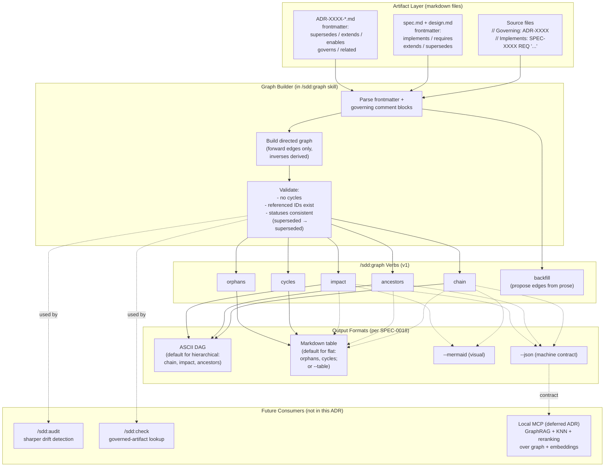
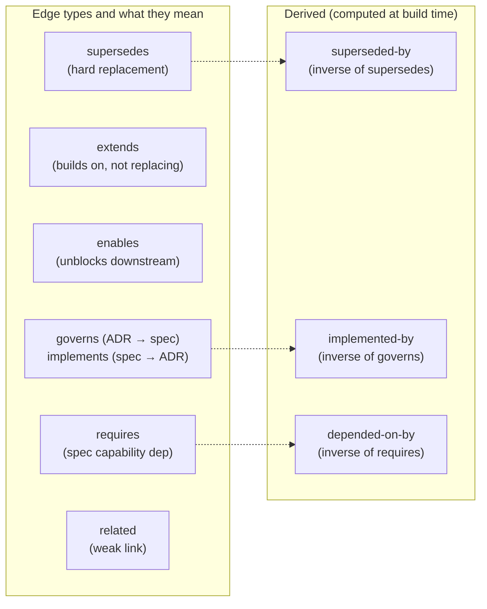

# ADR-0023: Frontmatter DAG and `/sdd:graph` Skill

## Context and Problem Statement

Relationships between SDD artifacts are real but invisible to tooling. ADRs reference each other through prose ("Related: ADR-0009, ADR-0011", "Supersedes ADR-0003"), specs name their governing ADRs in `## Overview` paragraphs, and the chain from decision → spec → requirement → code is reconstructed by humans reading multiple files. ADR-0020 already formalized the code-to-artifact direction via file-level governing comments, but the artifact-to-artifact direction remains unstructured prose. This blocks every higher-order capability we could want: impact analysis ("what breaks if I deprecate ADR-0008?"), orphan detection ("which specs have no implementing code?"), lineage queries ("show me the full chain from SPEC-0014 to its tests"), and any future semantic search or RAG layer that would need a parseable contract over the artifact graph.

How should the plugin make artifact relationships first-class so that they can be queried, traversed, and consumed by both humans and tooling — including any future local MCP for graph/RAG workflows?

## Decision Drivers

* **Markdown-native principle**: ADR-0015 already eliminated `.claude-plugin-design.json` in favor of CLAUDE.md sections. A new sidecar manifest for graph metadata would re-introduce the split-truth problem that decision was meant to fix.
* **Structured beats fuzzy at this scale**: The corpus is 23 ADRs and 18 specs with explicit, named relationships. A graph captures what's actually true; vector embeddings would synthesize what's only approximately true. The graph is the right primitive.
* **Foundation for future MCP**: Whether or not we eventually ship a local MCP with embeddings + reranking (the user's "GraphRAG + KNN + reranking" goal), that MCP needs a parseable graph as input. Building the graph layer now creates the contract; the MCP becomes a downstream consumer rather than a coupled rewrite.
* **Authoring ergonomics**: Authors already write these relationships — just in prose at the bottom of the file. Lifting them into frontmatter is a re-shape, not a new burden, and it's where MADR already puts machine-readable metadata.
* **Backfill path**: 23 ADRs and 18 specs encode their edges in "Related" / "More Information" / "Supersedes" prose today. Any solution that requires retroactive manual annotation across all of them will stall.
* **Complements ADR-0020**: Code-to-artifact edges already exist via governing comment blocks. Formalizing artifact-to-artifact edges completes the graph without re-litigating the code side.

## Considered Options

* **Option 1**: Frontmatter DAG + `/sdd:graph` skill (artifact→artifact edges in MADR/OpenSpec frontmatter, traversal via a new skill, code edges supplied by ADR-0020 governing comments)
* **Option 2**: Separate `.sdd-graph.yaml` manifest at the project root listing all edges
* **Option 3**: Status quo — relationships live in prose; humans grep and read
* **Option 4**: Jump straight to a local MCP with embeddings + GraphRAG + reranker, deriving relationships from semantic similarity

## Decision Outcome

Chosen option: **"Option 1 — Frontmatter DAG + `/sdd:graph` skill"**, because it puts the relationships exactly where MADR already locates structured metadata (the YAML frontmatter), preserves the markdown-native principle from ADR-0015, completes the graph started by ADR-0020, and produces the parseable contract that any future MCP layer (Option 4 territory) would consume — without forcing us to commit to that ML build today. Three sub-decisions are bundled into this ADR because they are tightly coupled to the schema and would otherwise resurface the next time someone touches the graph:

### Sub-decision 1: Edge schema (forward-only, artifact-level)

ADRs gain these optional frontmatter fields:

```yaml
supersedes: [ADR-0003]              # hard replacement; old artifact moves to status: superseded
extends: [ADR-0008, ADR-0009]       # builds on without replacing (e.g., ADR-0011 extends ADR-0008)
enables: [ADR-0016]                 # this decision unblocks another (ADR-0015 enables ADR-0016)
governs: [SPEC-0007, SPEC-0010]     # which specs this decision governs
related: [ADR-0010]                 # weak association, no semantic claim
```

Specs gain these optional frontmatter fields:

```yaml
implements: [ADR-0009, ADR-0011]    # which ADRs this spec realizes
requires: [SPEC-0007]               # capability dependency on another spec
extends: [SPEC-0007]                # behavioral extension (e.g., SPEC-0010 extends SPEC-0007)
supersedes: [SPEC-0XXX]
```

Reverse edges (ADR → implementing specs, SPEC → implementing code, ADR → dependent ADRs) are **derived** at graph-build time by inverting the forward edges. There is no `governed-by:` on specs or `implemented-by:` on ADRs — those are computed, not authored.

### Sub-decision 2: Granularity is artifact-level in v1

Edges link whole artifacts (ADR ↔ ADR, ADR ↔ spec, spec ↔ spec). Requirement-level edges (e.g., `SPEC-0014 REQ "Cross-Module Aggregation" governed-by ADR-0016`) are explicitly out of scope for v1. They would make `/sdd:check` and `/sdd:audit` sharper, but they multiply authoring overhead and are best added once the artifact-level graph proves its value.

### Sub-decision 3: Backfill is assisted, not manual

Backfilling 23 ADRs and 18 specs by hand will not happen. The `/sdd:graph` skill includes a `backfill` mode that parses existing prose ("Related:", "Supersedes", "More Information", `## Overview` references to ADR-XXXX/SPEC-XXXX) and proposes a per-file diff for human review. The author accepts, edits, or rejects each proposed edge. No edges are added without explicit consent.

### `/sdd:graph` skill shape (v1 verbs)

| Verb | Purpose |
|------|---------|
| `impact <id>` | Downstream artifacts and code affected if `<id>` changes |
| `ancestors <id>` | Upstream chain (what `<id>` depends on, transitively) |
| `chain <id>` | Full lineage: ADR → spec → requirement → code, both directions |
| `orphans` | Code with no governing artifact; specs with no implementing code; ADRs with no implementing spec |
| `cycles` | Detect circular dependencies (sanity check) |
| `backfill` | Propose edges from prose for human review |

Output formats: ASCII DAG (default for hierarchical traversal verbs `chain` / `impact` / `ancestors`), markdown table (default for flat results `orphans` / `cycles`, or via `--table`), `--mermaid` for visual graphs, `--json` for downstream tooling consumption (this is the contract a future MCP would call). See SPEC-0018 REQ "Output Formats" for the full layout rules and JSON schema.

### Consequences

* Good, because artifact relationships become parseable — impact analysis, lineage queries, and orphan detection are straightforward graph traversals
* Good, because the same schema serves `/sdd:graph` now and any future local MCP later — no rework when the MCP arrives
* Good, because it aligns with ADR-0015 (markdown-native config) by keeping metadata in the artifact rather than a sidecar file
* Good, because it complements ADR-0020 (governing comment reform) — code→artifact edges from comments plus artifact→artifact edges from frontmatter make the full graph
* Good, because `/sdd:audit` and `/sdd:check` get sharper: when an ADR changes, the audit can name exactly which specs and code paths are at risk
* Good, because the assisted backfill mode means existing artifacts can be lifted into the graph without a manual marathon
* Bad, because forward-only edges mean reading a spec's frontmatter does not directly show what governs it — `/sdd:graph ancestors` is required to answer that. Mitigated by the skill being cheap and by the markdown body still naming governing ADRs in the `## Overview`.
* Bad, because artifact-level granularity means `/sdd:check` cannot pinpoint *which specific requirement* a code file violates — only that the file's governing spec has drifted. Acceptable in v1; requirement-level edges are a deferrable v2.
* Bad, because every artifact that adds frontmatter edges becomes slightly noisier at the top. The noise is structured and bounded (5 edge types max, mostly empty) and is the price of parseability.
* Neutral, because this ADR does not commit to a future MCP — it only ensures that if/when one is built, the graph layer is already in place and the schema is the contract. The "GraphRAG + KNN + reranking" question is deferred until we know whether `/sdd:graph` is sufficient or whether fuzzy queries become a real pain.

### Confirmation

Implementation will be confirmed by:

1. The MADR template in `skills/adr/SKILL.md` documents the new optional frontmatter edge fields (`supersedes`, `extends`, `enables`, `governs`, `related`)
2. The OpenSpec template in `skills/spec/SKILL.md` documents the new optional frontmatter edge fields (`implements`, `requires`, `extends`, `supersedes`)
3. `skills/graph/SKILL.md` exists and follows the established SKILL.md format with YAML frontmatter
4. Running `/sdd:graph impact ADR-0008` returns a list of artifacts and code files that depend on ADR-0008
5. Running `/sdd:graph orphans` returns code files lacking governing comments and specs lacking implementing code
6. Running `/sdd:graph backfill` parses existing prose in the 23 ADRs + 18 specs in this repo and produces a per-file diff of proposed frontmatter edges for human review
7. The skill emits `--json` output that a future MCP could consume directly without re-parsing markdown
8. Cycle detection rejects any backfill proposal that would introduce a circular dependency

## Pros and Cons of the Options

### Option 1: Frontmatter DAG + `/sdd:graph` Skill (Chosen)

Edges live in YAML frontmatter on the artifacts themselves. A new `/sdd:graph` skill builds an in-memory graph at query time from frontmatter + ADR-0020 governing comments and serves traversal queries.

* Good, because the relationships live next to the content they describe — no split truth, no sync drift
* Good, because YAML frontmatter is already where MADR puts machine-readable metadata (`status`, `date`, `decision-makers`); this is a natural extension
* Good, because the schema is the contract — anything that wants to consume the graph (skill, MCP, IDE plugin, dashboard) reads the same fields
* Good, because the graph is built on demand from current files — there is no stale index to invalidate
* Good, because `/sdd:graph backfill` makes the migration tractable for the existing corpus
* Neutral, because building the graph at query time is fine for tens or low-hundreds of artifacts but would need a cache layer at thousands. Not a v1 concern.
* Bad, because authors must remember to add edges when they create or update artifacts. Mitigated by `/sdd:audit` flagging artifacts that reference other artifacts in prose without declaring the edge in frontmatter.
* Bad, because forward-only edges trade a small reading-time inconvenience for a meaningful authoring-time simplicity. Acceptable.

### Option 2: Separate `.sdd-graph.yaml` Manifest

A single project-root file enumerates all edges between all artifacts. The `/sdd:graph` skill reads only this file.

* Good, because the entire graph is visible in one place — easy to audit and version-control as a unit
* Good, because artifact files stay completely free of edge metadata
* Bad, because it directly recreates the split-truth problem ADR-0015 just eliminated — `.sdd-graph.yaml` and the artifact prose would drift
* Bad, because it becomes a guaranteed merge conflict hotspot for the same reason `.claude-plugin-design.json` was (per the evidence in ADR-0017): every parallel agent that adds an artifact also touches this file
* Bad, because workspace mode (ADR-0016) breaks the single-file model — multi-module repos would need either one file per module or a complex aggregation scheme
* Bad, because it duplicates information already on the artifact (the "Related:" section in prose), forcing authors to update two places

### Option 3: Status Quo — Prose + Grep

Keep relationships in `## Related` and `## More Information` sections. Use `grep` and human reading for traversal.

* Good, because zero new infrastructure, no schema, no backfill
* Good, because prose is more expressive than fields — it can explain *why* two ADRs are related, not just that they are
* Bad, because nothing can query the graph — no impact analysis, no orphan detection, no lineage, no MCP foundation
* Bad, because relationships are unreliable: some ADRs name their successors in prose, others don't, and there is no mechanism to enforce or verify
* Bad, because every higher-order goal in the user's GraphRAG vision is blocked at step zero — there is no graph to RAG over

### Option 4: Jump Straight to Local MCP with Embeddings

Skip the explicit graph entirely. Build a local MCP with embedding model + vector store + reranker, derive relationships from semantic similarity, and expose query tools to the LLM.

* Good, because it is the most powerful endpoint — fuzzy "find specs similar to this one" queries that no explicit graph can answer
* Good, because it requires no schema changes to MADR/OpenSpec and no backfill
* Bad, because it is a 2–4 week build with a real ML dependency footprint (embedding model, vector store, reranker, MCP server) on a plugin that is currently pure markdown
* Bad, because at this corpus size (~40 artifacts) embeddings actually underperform structured retrieval — there is not enough corpus for vector similarity to beat named edges
* Bad, because it cannot answer the structured questions a graph trivially answers ("what does ADR-0008 supersede?", "list all orphan specs"). Approximate similarity is the wrong tool for exact relationships.
* Bad, because even the eventual MCP would *want* the graph as input — building the MCP first and the graph second means the MCP has to bootstrap itself from prose, which is exactly the unparseable state we are trying to leave

## Architecture Diagram





## More Information

- This ADR depends on ADR-0015 (Markdown-Native Configuration), which establishes that structured plugin metadata belongs in markdown files rather than sidecar config. Frontmatter edges are a direct application of that principle to inter-artifact relationships.
- This ADR complements ADR-0020 (Governing Comment Reform). ADR-0020 formalized the code → artifact direction via file-level governing comment blocks. This ADR formalizes the artifact → artifact direction. Together they produce a complete graph.
- This ADR explicitly does not commit to a local MCP. The user's stated long-term goal — a local MCP using "GraphRAG + KNN + reranking" over ADRs, specs, code, tests, and backlog — is a future decision. That MCP would consume the JSON output of `/sdd:graph` rather than reparse markdown, so the schema established here is forward-compatible with that direction.
- The forward-only edge convention (`governs:` on ADRs, `implements:` on specs; not both) is borrowed from how relational databases model many-to-many relationships: store one direction, derive the other. Authoring discipline is lower; the graph builder handles inversion.
- Cycle detection is a hard error, not a warning. ADR/spec relationships are intrinsically a DAG — a cycle indicates a real authoring mistake (e.g., A supersedes B and B supersedes A) and should be fixed before the graph is queried.
- The `/sdd:graph backfill` mode is the migration story for the existing 23 ADRs and 18 specs in this repo. Without it, the schema would exist but go unused for months. The mode is read-only-by-default: it produces a diff that the user accepts in whole, in part, or not at all.
- Skills affected by this ADR: a new `skills/graph/SKILL.md`, additions to `skills/adr/SKILL.md` and `skills/spec/SKILL.md` (template documentation for the new frontmatter fields), and additions to `references/shared-patterns.md` (a "Graph Edge Resolution" pattern documenting forward-only conventions and inverse derivation).
- Related: ADR-0015 (markdown-native config), ADR-0020 (governing comment reform), ADR-0001 (drift introspection — beneficiary), ADR-0014 (audit triage — beneficiary), ADR-0016 (workspace mode — graph must aggregate across modules in workspace projects).
