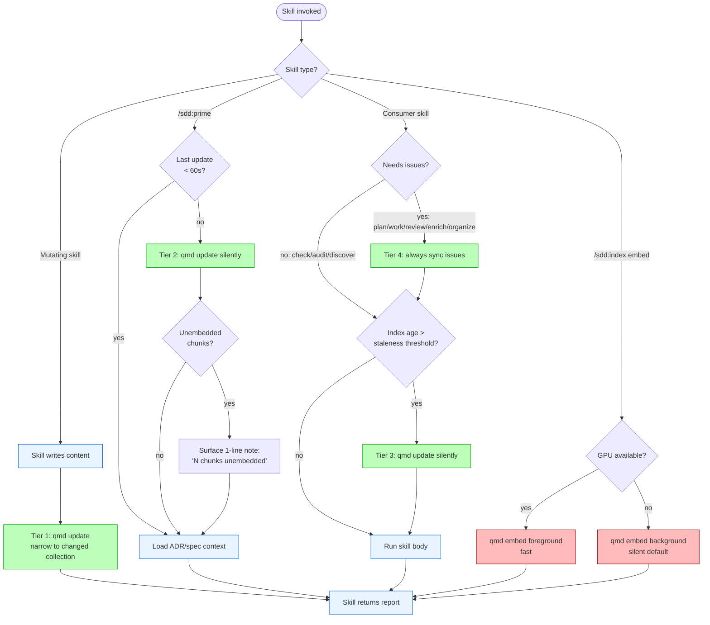

# ADR-0026: Tiered Index Freshness Strategy

## Context and Problem Statement

ADR-0024 makes qmd a hard dependency, so every qmd-aware skill assumes the index exists. ADR-0025 adds a tracker-issues collection that can change between every skill invocation. Neither ADR addresses *when* the indexes get refreshed, and a wrong answer here will silently degrade every consumer skill: stale code-collection results lead `/sdd:work` to recreate types that already exist; stale issue results lead `/sdd:plan` to schedule work that was just closed; stale ADR/spec results lead `/sdd:check` to miss governing artifacts written that morning.

A single-trigger answer ("always update on prime", "always update on every skill call") fails on cost-vs-freshness in opposite directions. The correct shape acknowledges that different content categories change at different rates, that `qmd update` (file scan) and `qmd embed` (vector generation) have wildly different costs, and that the most precise refresh signal is *which skill just finished mutating which collection*. The decision is how to compose those signals into a coherent, opinionated default behavior that consumer skills can rely on without having to think about freshness themselves.

## Decision Drivers

* **Cost asymmetry between update and embed.** `qmd update` is a file-mtime scan — cheap, sub-second on typical repos. `qmd embed` runs ~1s per chunk on CPU and ~10× faster on GPU. Conflating them produces either a sluggish UX (embed every time) or a stale index (update never).
* **Mutation precision beats periodic polling.** When `/sdd:adr` writes a new ADR, the *most* precise update signal is "this skill just wrote this file" — not a 5-minute timer. Mutation-aware updates eliminate staleness for the most common cause of staleness (the user's own work).
* **Session start is a natural sync moment.** `/sdd:prime` is when the user signals "I'm about to do work in this repo" — exactly when external changes (other devs, CI, branch switches) should land in the index.
* **Issues change faster than artifacts.** Tracker issues are edited in browsers, labelled by bots, closed by CI. The cadence is qualitatively different from ADRs/specs/code, which only change when *someone* in this repo writes code.
* **Embed prompts are friction.** Asking the user "embed now? y/n" every time a CPU-only machine has unembedded chunks is a tax on every workflow. Defaulting to background mode preserves the user's flow.
* **Auto mode discipline.** The plugin already operates in auto mode by default. Freshness behavior should also default to "do the cheap right thing silently and only escalate to a prompt when the right thing isn't obvious."

## Considered Options

* **Option 1**: Manual only — user runs `/sdd:index update` when they remember.
* **Option 2**: Single trigger via `/sdd:prime` — every session start runs full update + embed.
* **Option 3**: On every consumer skill call — each skill runs `qmd update` first.
* **Option 4**: Time-based staleness threshold — skills check timestamp, update only if older than threshold.
* **Option 5**: File-watching daemon — background process listens for fs events.
* **Option 6**: Tiered hybrid — mutation-aware (Tier 1) + session-start (Tier 2) + threshold (Tier 3) + per-collection cadence (Tier 4), with embed treated separately from update.

## Decision Outcome

Chosen option: **"Option 6 — Tiered hybrid"**, because each tier picks the cheapest mechanism for the staleness it actually addresses. The other options each fail on a specific axis: Option 1 leaks staleness into every skill; Option 2 makes every prime slow and still misses mid-session changes; Option 3 makes every consumer skill slow and embeds redundantly; Option 4 alone misses the high-fidelity mutation signals that Tier 1 captures for free; Option 5 requires an OS-level daemon that the plugin has no clean way to install or manage.

The strategy has four tiers and one cross-cutting embed policy, each with a clear owner skill and a clear trigger.

### Tier 1 — Mutation-aware updates (most precise, owned by mutating skills)

Skills that *write* indexed content trigger a narrow `qmd update` for the affected collection when they finish. No staleness ever for the most common case (the user's own work).

| Skill | Trigger | Affected collection |
|-------|---------|---------------------|
| `/sdd:adr` | After writing ADR file | `{repo}-adrs` |
| `/sdd:spec` | After writing spec.md or design.md | `{repo}-specs` |
| `/sdd:status` | After flipping status | The collection whose artifact changed |
| `/sdd:work` | After merging a PR | `{repo}-code` (for the changed paths) |
| `/sdd:plan`, `/sdd:enrich`, `/sdd:organize` | After mutating tracker issues | `{repo}-issues` (via sync layer from ADR-0025) |
| `/sdd:review` | After merging a PR | `{repo}-code` AND `{repo}-issues` |

Mutation updates run synchronously, before the skill returns its report. They are silent unless they fail (in which case a one-line warning lands in the report).

### Tier 2 — Session-start update via `/sdd:prime`

`/sdd:prime` runs `qmd update` (cheap file-mtime scan) on entry to catch changes from outside the current Claude session: other developers, CI bots, branch switches, manually edited files. Specifically:

1. If the qmd index was touched within the last 60 seconds, skip — back-to-back primes are common enough to optimize for.
2. Otherwise, run `qmd update` silently. Print one line in the report header: "Refreshed index ({N} added, {M} updated, {R} removed across all collections)" only when there were changes; print nothing when the index was already current.
3. After the update, count unembedded chunks across this repo's collections via `qmd status`. If non-zero, surface a one-line note in the prime output: "{N} chunks unembedded — run `/sdd:index embed` (≈{seconds}s on this machine, foreground; or wait for the next mutation skill to backfill)." Do NOT prompt.

`/sdd:prime` does not trigger embed — that is opt-in via `/sdd:index embed` or piggybacks on Tier 1 mutations. Embedding on session start would slow every prime and surprise users on CPU.

### Tier 3 — Staleness-threshold opportunistic updates inside consumer skills

Read-only consumer skills (`/sdd:check`, `/sdd:audit`, `/sdd:plan`, `/sdd:work`, `/sdd:review`, `/sdd:discover`) check the qmd index timestamp on entry. If older than the staleness threshold, run a silent `qmd update` first. Print a one-line note in the report: "Index was {age} stale — refreshed before running."

The threshold default is **120 minutes (2 hours)** and is configurable in CLAUDE.md `### SDD Configuration`:

```markdown
### SDD Configuration

#### Index Freshness
- **Staleness Threshold**: 120m
```

Two hours strikes the right balance for the typical workflow: short enough that index never lags a half-day of work, long enough that back-to-back skill calls within a focused work session do not trigger redundant updates. Users with high tracker churn or large teams can shorten it (e.g., `30m`); users on slow disks or huge repos can lengthen it (e.g., `4h`).

### Tier 4 — Issues collection always syncs at consumer entry

Tracker issues change qualitatively faster than ADRs/specs/code (browser edits, bot labels, CI status flips). Skills whose correctness depends on fresh issue state ALWAYS sync the issues collection on entry, regardless of staleness threshold:

| Skill | Sync requirement |
|-------|------------------|
| `/sdd:plan` | Sync before requirement grouping (avoid duplicating recently-closed issues) |
| `/sdd:work` | Sync before building Sibling PR Manifest (ADR-0017) |
| `/sdd:review` | Sync before computing Topological Merge Order |
| `/sdd:enrich`, `/sdd:organize` | Sync before iterating issues |

Tier 4 overrides Tier 3 for the issues collection only — other collections still respect the threshold. The override is justified by the cadence asymmetry; treating issues like ADRs would let stale work-state silently corrupt sprint planning.

### Embed Policy: CPU-only defaults to background, no prompt

`/sdd:index embed` (and any internal call to qmd embed from another skill) follows this policy:

1. Detect GPU via `qmd status`. If GPU is present, run synchronously — embedding is fast enough that asking would be friction.
2. If CPU-only, default to **background mode** without prompting. Run as a backgrounded Bash command, log to `/tmp/qmd-embed-{repo}.log`, return the report immediately. The harness emits a completion notification when the backgrounded command exits.
3. The user MAY override with explicit subcommand args:
   - `/sdd:index embed --foreground` — block the session (right when the user wants to verify chunk counts inline)
   - `/sdd:index embed --skip` — no-op (right when the user is about to run an expensive multi-step that should not race with embed)

This replaces the AskUserQuestion-based three-way prompt in the original `/sdd:index` design. Prompting CPU users every time was a tax that produced the same answer 95% of the time. Background-by-default is the right default; explicit flags handle the long tail.

### Consequences

* Good, because mutation-aware updates eliminate staleness for the most common case (the user's own work) at zero perceptible cost.
* Good, because consumer skills get fresh data on entry without per-call user friction.
* Good, because the embed/update split prevents the slow-step from coupling to the cheap-step.
* Good, because issues stay fresh under high tracker churn without burdening ADR/spec/code consumers with the same cadence.
* Good, because CPU-only users get embeddings done in the background without recurring prompts.
* Good, because the staleness threshold is a single configuration knob users can tune to their workflow.
* Bad, because four tiers is more behavior to document and reason about than a single trigger.
* Bad, because the staleness check adds a small (~50ms) overhead to every consumer skill entry.
* Bad, because background embeds can be killed mid-flight (machine sleep, terminal close), leaving a partial index. Mitigated by the log file location and the fact that re-running embed picks up where the previous run left off.
* Bad, because Tier 4's "always sync issues" can be slow on huge backlogs (5,000+ issues). Mitigated by the incremental cursor in ADR-0025 sub-decision 3.

### Confirmation

Compliance is confirmed by:

1. Each mutating skill (`/sdd:adr`, `/sdd:spec`, `/sdd:status`, `/sdd:work`, `/sdd:plan`, `/sdd:enrich`, `/sdd:organize`, `/sdd:review`) calls `qmd update` after writing files but before returning. Verified by reading each SKILL.md and grepping for the `qmd update` invocation in the appropriate step.
2. `/sdd:prime` calls `qmd update` (or skips with the 60-second short-circuit) and surfaces the unembedded-chunk count when non-zero. Verified by an integration test that adds a file, runs prime, and asserts the chunk delta is reflected.
3. Read-only consumer skills check the index timestamp and trigger `qmd update` when staleness exceeds the configured threshold. Verified by integration tests that artificially set the index timestamp to "stale" and assert the update runs.
4. The `Staleness Threshold` configuration key is documented in `references/shared-patterns.md` § "Config Resolution" and accepted by `/sdd:init` Step 3.
5. `/sdd:index embed` on a CPU-only machine defaults to background without prompting. Verified by a sandbox test that mocks `qmd status` to report no GPU and asserts no AskUserQuestion call.
6. The four-tier model is documented in `references/shared-patterns.md` as the canonical "Index Freshness" pattern that consumer skills reference rather than re-implement.

## Pros and Cons of the Options

### Option 1: Manual only

User runs `/sdd:index update` when they remember to.

* Good, because zero implicit behavior — every refresh is explicit.
* Good, because predictable performance for every other skill call.
* Bad, because real users routinely forget. Stale indexes silently degrade every retrieval-based skill.
* Bad, because no good signal exists to remind the user (we have no daemon, no cron).

### Option 2: Single trigger via `/sdd:prime`

Every session start runs `qmd update` and `qmd embed`.

* Good, because one trigger to remember.
* Good, because aligns with "I'm starting work" intent.
* Bad, because not all sessions begin with prime — many start with `/sdd:check` or `/sdd:work` directly.
* Bad, because embed is slow; conflating it with prime makes session start unbearable on CPU.
* Bad, because mid-session changes (a CI bot closing an issue, a teammate pushing) go stale until the next prime.

### Option 3: Update on every consumer skill call

Each consumer skill runs `qmd update` first.

* Good, because freshness is automatic.
* Bad, because every skill becomes 50–500ms slower on entry, even when it does not need fresh data.
* Bad, because back-to-back skill calls re-update redundantly.
* Bad, because still does not address embed cost.

### Option 4: Time-based staleness threshold alone

Skills check timestamp; update only if older than threshold.

* Good, because amortizes update cost across multiple skill calls.
* Good, because configurable per workflow.
* Bad, because misses Tier-1 mutation signals — when the user just wrote an ADR, the index could be updated for ~free, but a threshold-only model waits for the next staleness check.
* Bad, because the threshold is an arbitrary number that will never be right for everyone.

### Option 5: File-watching daemon

Background process listens for fs events and runs `qmd update` on changes.

* Good, because freshness is continuous and automatic.
* Bad, because requires installing and managing a daemon — outside the plugin's clean install model.
* Bad, because OS-specific (inotify on Linux, fsevents on Mac, polling on Windows) — adds platform complexity.
* Bad, because does not address tracker issues, which change in remote APIs the daemon cannot watch.
* Reconsider, when Claude Code itself ships a fs-watch primitive plugins can hook into.

### Option 6: Tiered hybrid (chosen)

Mutation-aware (T1) + session-start (T2) + threshold (T3) + per-collection cadence (T4) + embed policy.

* Good, because each tier picks the cheapest mechanism for the staleness it addresses.
* Good, because T1 captures the highest-fidelity signal (skills mutating their own collections) at zero cost.
* Good, because T4 handles the cadence asymmetry of issues without affecting ADRs/specs/code.
* Good, because the embed policy removes a recurring prompt for CPU users.
* Bad, because four tiers is more to document and reason about than a single trigger.
* Bad, because the staleness threshold is still arbitrary (mitigated by being configurable).

## Architecture Diagram



## More Information

* This ADR extends ADR-0024 by specifying *when* qmd is invoked, complementing ADR-0024's *whether* qmd is required.
* This ADR works with ADR-0025 by treating issues as a special-cadence collection (Tier 4) — issues sync at consumer entry while other collections respect the staleness threshold.
* The tiered model is documented in `references/shared-patterns.md` as the canonical "Index Freshness" pattern. Consumer skills reference this pattern by section name rather than reimplementing the logic per skill.
* The 60-second prime short-circuit and the 120-minute default threshold are tuning constants chosen for the typical claude-plugin-sdd workflow. Both are configurable; both should be reviewed after the qmd-native skills land and produce real telemetry.
* Tier 5 (scheduled background sync via Claude Code's `schedule` skill) is deliberately out of scope for v5. It will be reconsidered in a follow-up ADR after V1 ships and the Tier 1–4 baseline produces evidence about the long-tail staleness cases that scheduling would address.
* Background embed jobs can be interrupted (machine sleep, terminal close). The recovery story is "re-run `/sdd:index embed` and it picks up where it left off" — qmd already handles this by tracking unembedded chunks at the database level. No special recovery logic is needed in the plugin.
