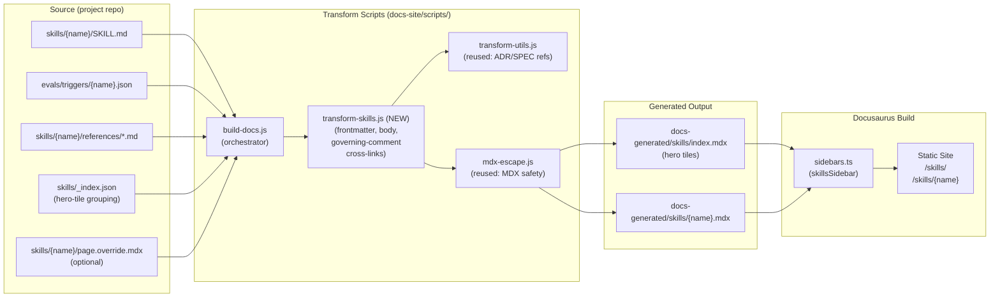

# ADR-0029: Auto-Generate Docusaurus Skill Pages from `skills/*/SKILL.md`

## Context and Problem Statement

The SDD plugin's user-facing docs site (per ADR-0004) renders ADRs and specs from their source markdown via the `docs-site/scripts/build-docs.js` transform pipeline. Skill documentation, by contrast, is hand-authored in a single monolithic file, `docs-site/content/guides/commands.mdx`, which currently inlines 15+ skills (`/sdd:adr`, `/sdd:spec`, `/sdd:plan`, `/sdd:work`, `/sdd:review`, …) into one ~500-line page. Each `skills/{name}/SKILL.md` already carries the canonical frontmatter (`name`, `description`, `argument-hint`, `allowed-tools`) plus structured body sections (`## Process`, `## Rules`, governing comments) that Claude Code itself loads as the source of truth at runtime.

This produces two concrete failures:

1. **Drift.** Every change to a `SKILL.md` requires a parallel hand-edit to `commands.mdx`. PR #131 (v5 user docs) is currently patching ~15 skills' worth of accumulated drift by hand — proof that the synchronization burden is too high.
2. **Discoverability.** Inlining 15 skills on one page means there are no per-skill deep-links (only fragment anchors), no per-skill sidebar entries, and no hero-tile landing surface. Users searching for `/sdd:work` land in a wall of text.

How should the plugin generate skill documentation so that the source of truth is the skill itself (per ADR-0015 markdown-native philosophy), the published site stays aligned without manual sync, and each skill gets a stable, deep-linkable page?

## Decision Drivers

* **Source-of-truth alignment with ADR-0015.** `SKILL.md` is what Claude Code loads at runtime. Anything user-facing should derive from the same file, not a parallel hand-maintained copy.
* **Discoverability and deep-linking.** Each skill needs a stable URL (`/skills/{name}`) suitable for sharing in PR descriptions, GitHub issues, and Slack.
* **Per-skill maintenance independence.** A change to `skills/work/SKILL.md` should regenerate only `/skills/work` — not require touching a 500-line monolith that other skills also live in.
* **Build-script complexity ceiling.** The transform pipeline already has 9 scripts under `docs-site/scripts/`. Adding a 10th is acceptable; adding five more is not. Keep the new transform simple and orthogonal to the existing ADR/spec transforms.
* **Editorial freedom for prose.** Some skills want hand-tuned overview prose, examples, or screenshots that don't fit the SKILL.md schema. The generator must not preclude editorial enrichment.
* **Hero-tile index is non-negotiable.** The landing surface for skills must be a clickable tile grid sourced from frontmatter — not a bullet list, not a table.
* **Cross-link governing artifacts.** Per ADR-0020, `<!-- Governing: ADR-XXXX, SPEC-XXXX REQ "..." -->` comments in `SKILL.md` carry the ADR/spec lineage. The generator should turn these into rendered cross-links.

## Considered Options

* **Option 1**: Status quo — keep the monolithic `commands.mdx`, hand-edit on every skill change.
* **Option 2**: Hand-author per-skill MDX pages — split the current `commands.mdx` into 15 files, one per skill, but keep them hand-maintained.
* **Option 3**: Auto-generate per-skill pages and a hero-tile index from `SKILL.md` frontmatter + structured body sections (proposed).
* **Option 4**: Hybrid — auto-generate a scaffold page per skill, and let authors override any section via a sibling `skills/{name}/page.override.mdx` that, if present, replaces the generated content for that section.

## Decision Outcome

Chosen option: **"Option 4 — Hybrid auto-generation with optional per-skill overrides"**, because it captures the alignment and zero-drift benefits of Option 3 while preserving the editorial escape hatch needed for the small number of skills (e.g., `/sdd:plan --scrum`, `/sdd:work`) whose user-facing prose materially exceeds what the SKILL.md schema can carry. In practice 95% of skills will use the pure auto-generated path; the override hatch exists so the docs aren't held hostage to the SKILL.md schema for the remaining 5%.

### Sub-decisions

**1. Schema extracted from `SKILL.md`.** The new transform script (`transform-skills.js`) reads each `skills/{name}/SKILL.md` and extracts:

| Source | Becomes |
|--------|---------|
| Frontmatter `name` | Page title, sidebar label, URL slug (`/skills/{name}`) |
| Frontmatter `description` | Page subtitle, hero-tile description, `<meta>` description |
| Frontmatter `argument-hint` | "Usage" code block |
| Frontmatter `allowed-tools` | Collapsed "Required Tools" detail block (advanced/debug) |
| `# {Title}` and intro paragraph | Page overview (first paragraph after H1, before `## Process`) |
| `<!-- Governing: ... -->` comments | "Governing Artifacts" sidebar with cross-links to ADR/spec pages |
| `## Process` body | "Process" section, headers demoted by one level so the page H1 is unique |
| `## Rules` body | "Rules" section |
| `evals/triggers/{name}.json` (where `should_trigger: true`) | "Example Invocations" section, up to 5 representative queries |
| `references/*.md` (sibling files in skill dir, if any) | "Reference" appendix, one collapsible section per file |

**Section ordering and non-canonical H2 sections.** The generator emits sections in this fixed order:

1. Title (H1, from frontmatter `name`)
2. Subtitle (from frontmatter `description`)
3. Usage (from frontmatter `argument-hint`)
4. Overview (intro paragraph after the H1, before the first H2)
5. Process (from `## Process`)
6. Rules (from `## Rules`)
7. **Extra H2 sections** — any H2 sections in the source `SKILL.md` other than `## Process` and `## Rules` are appended here, **verbatim** through `mdx-escape.js`, in **source order**. This applies to sections like `## MADR Template`, `## Verbs`, `## Architecture`, `## Error Handling`, `## Graph Edge Frontmatter`, `## Why git worktree add Instead of EnterWorktree`, etc., that real `SKILL.md` files use.
8. Reference (from `references/*.md`, if any)
9. Example Invocations (from `evals/triggers/{name}.json`, if any) — see Edge Cases
10. Governing Artifacts (from aggregated `<!-- Governing: ... -->` comments) — see Edge Cases

This order replaces the earlier draft of this ADR which listed only `Title → Subtitle → Usage → Overview → Example Invocations → Process → Rules → Reference → Governing Artifacts` and described the body as "transformed verbatim." Those two statements were inconsistent: a closed canonical list cannot also be a verbatim passthrough. The rule above resolves that inconsistency: **canonical sections (Title through Rules) appear in fixed positions; non-canonical H2 sections from the source SKILL.md are appended in source order between Rules and Reference; the auto-generated Reference, Example Invocations, and Governing Artifacts sections are appended last.** This preserves the "95% pure auto-generation" property even for skills like `adr`, `graph`, `index`, and `work` that carry substantial extra H2 content today.

**2. Hero-tile index (`/skills/`).** The transform also generates `docs-generated/skills/index.mdx`, a landing page rendering one `<SkillTile>` per skill. Each tile carries: skill name, `description` (truncated to ~140 chars), and `argument-hint`, linking to `/skills/{name}`. Tiles are grouped by the workflow stage that already exists in `commands.mdx` (Creating Artifacts, Sprint Planning, Implementation, Drift Detection, Discovery, Documentation, Session Management, Lifecycle Management) — the grouping is encoded in a small `skills/_index.json` manifest committed alongside the skills, not via per-skill frontmatter (which would couple the source of truth to a UI concern).

**3. Governing-comment cross-linking.** Each `<!-- Governing: ADR-XXXX (note), SPEC-YYYY REQ "name" -->` comment becomes part of a single "Governing Artifacts" pill list rendered at the top of the page (before the Overview). ADR-XXXX renders as `[ADR-XXXX](/decisions/ADR-XXXX-slug)`, SPEC-YYYY renders as `[SPEC-YYYY](/specs/{slug}/spec#req-anchor)`. The generator reuses `transform-utils.js` `transformAdrReferences` and `transformSpecReferences` to keep link resolution consistent with the rest of the pipeline.

Real `SKILL.md` files contain multiple governing comments — `skills/work/SKILL.md` has five, `skills/adr/SKILL.md` has four, both at file scope and inline within `## Process`. The generator aggregates them as follows: scan the entire file (frontmatter excluded), collect every `<!-- Governing: ... -->` comment, parse each into ADR and SPEC references, **deduplicate by reference** (e.g., two comments mentioning `ADR-0023` collapse to one pill), and **sort the deduped set by artifact kind then number** (ADRs ascending, then SPECs ascending). The result is a single pill list. `<!-- Implements: ... -->` comments (per ADR-0020) are treated as a synonym of `<!-- Governing: -->` for this aggregation — both are surfaced in the same pill list because both express artifact lineage; the distinction is meaningful at runtime/lint time, not in user-facing docs.

**4. Example invocations from `evals/triggers/{name}.json`.** Eval triggers (per ADR-0021) already curate realistic user phrasings. The generator picks the first 5 entries with `should_trigger: true` (or all of them if fewer than 5) and renders them as a code block. This gives every skill a "what does someone say to invoke this?" surface without authoring duplicate examples.

**5. Override hatch with build-time staleness check.** If `skills/{name}/page.override.mdx` exists, the transform skips generation for that skill and copies the override into `docs-generated/skills/{name}.mdx` directly. This is the override file's full content — it does not merge with the generated content. The ADR explicitly recommends *against* using overrides as a default; they exist for the prose-heavy edge cases.

To prevent the override from drifting silently when the underlying `SKILL.md` is updated, the override file MUST carry a header comment of the form:

```mdx
{/* Governing-SKILL: skills/{name}/SKILL.md@<sha256-of-SKILL.md-bytes> */}
```

`transform-skills.js` computes the SHA-256 of the current `skills/{name}/SKILL.md` byte content during the build and compares it against the pinned hash in the override. If they disagree, the build **fails** with an error naming the override file, the expected hash, and the current hash, and instructs the author to either (a) re-review the override against the new SKILL.md and update the pin, or (b) delete the override to fall back to auto-generation. Authors update the pin by running `npm run docs:refresh-overrides` (a small helper script added alongside `transform-skills.js`) which rewrites the pin in place after the author has confirmed the override is still accurate. This replaces the earlier hand-waved "reviewer norms + `/sdd:check`" mitigation, which is unworkable because `/sdd:check` does not currently understand override files and extending it is out of scope for this ADR.

**6. Pipeline integration.** A new script `docs-site/scripts/transform-skills.js` is added and wired into `docs-site/scripts/build-docs.js` after `transform-openspecs` (so spec mappings are available for governing-comment cross-links) and before `generate-graph` (so generated skill pages can participate in the artifact graph if we ever extend the graph to skills). No new external dependencies. No changes to `.github/workflows/deploy-docs.yml` — the workflow already runs `npm run build` on every push to main, which will pick up the new transform automatically.

**7. Sidebar / route shape.** A new `skillsSidebar` is added to `docs-site/sidebars.ts` and exposed in `docusaurus.config.ts` navbar between "Guides" and "ADRs". Routes:

* `/skills/` — hero-tile index
* `/skills/{name}` — per-skill page

**8. Migration plan for `commands.mdx`.** The current `docs-site/content/guides/commands.mdx` is **not deleted in this ADR's implementation PR**. Instead:

* **Step 1** (the implementing PR for this ADR): generate `/skills/*` alongside the existing `commands.mdx`. Both routes resolve. The implementing PR MUST also install `@docusaurus/plugin-client-redirects` and wire it into `docusaurus.config.ts`. This is **not optional** — Step 3 depends on it.
* **Step 2** (a follow-up PR): replace the body of `commands.mdx` with a single redirect-style page ("This page has moved to [/skills/](/skills/). Per-skill pages are at [/skills/{name}](/skills/adr).") and **audit and update all inbound references**, not just navbar/footer. The known inbound surfaces that MUST be checked and rewritten: `docusaurus.config.ts` navbar/footer entries, the project root `README.md`, the project root `CLAUDE.md`, the marketplace listing in `.claude-plugin/plugin.json` (and any external marketplace metadata), prior blog posts in `docs-site/blog/`, and any inbound deep links from sibling docs pages discovered by `npm run build`'s broken-link checker.
* **Step 3** (a later PR, after one release cycle): delete `commands.mdx` entirely. Inbound links are then handled by `@docusaurus/plugin-client-redirects` (installed in Step 1), which MUST contain explicit per-anchor redirect entries for every fragment anchor present in the deleted `commands.mdx`. The current set of fragment anchors in `commands.mdx` corresponds to one per skill (`#prime`, `#work`, `#adr`, `#spec`, `#plan`, `#review`, `#audit`, `#check`, `#discover`, `#docs`, `#init`, `#list`, `#status`, `#organize`, `#enrich`, `#graph`, `#index`, `#report-friction`); the implementing PR for Step 3 MUST enumerate the actual anchor set from HEAD of `commands.mdx` at the time of removal and add a redirect entry for each, mapping `/guides/commands#{anchor}` → `/skills/{anchor}`. Docusaurus's built-in 404 fallback is **not** a sufficient substitute, because external inbound links (PR descriptions, blog posts, GitHub issues) would otherwise silently break.

This staged migration keeps the v5 PR #131 work shippable without blocking on the autogen rollout.

### Edge Cases

The reviewer correctly flagged that the original draft validated only the happy path. The transform's specified behavior for edge inputs is:

| Edge case | Specified behavior |
|-----------|--------------------|
| `evals/triggers/{name}.json` is missing or has zero entries with `should_trigger: true` | Omit the "Example Invocations" section entirely. No placeholder, no warning. New skills without curated triggers are common; this is not an error. |
| Skill has zero `<!-- Governing: -->` and `<!-- Implements: -->` comments | Omit the "Governing Artifacts" pill list entirely. Some leaf skills genuinely have no governing artifacts; this is not an error. |
| Skill directory exists in `skills/` but the skill is not listed in `skills/_index.json` | **Fail the build** with an error naming the unregistered skill (e.g., `skills/foo: not registered in skills/_index.json — add it to a group or remove the directory`). The manifest is authoritative for tile grouping and order; silent fallback to a default group would let registration drift go unnoticed. |
| `skills/_index.json` references a skill name that has no corresponding `skills/{name}/SKILL.md` | **Fail the build** with an error naming the stale entry (e.g., `skills/_index.json references "foo" but skills/foo/SKILL.md does not exist`). Silent drop would let renames or deletions leave dangling tile references. |
| Skill has multiple `<!-- Governing: -->` comments referencing overlapping ADRs/SPECs | Aggregate, dedupe by reference, sort ADRs ascending then SPECs ascending, render as a single pill list (see Sub-decision 3). Note from inline-vs-file-scope: comments inside the body of `## Process` (or any other section) are still scanned and aggregated; their pills surface at the top of the page, not inline next to the comment site. |
| Override file (`page.override.mdx`) exists but the pinned `Governing-SKILL: ...@<sha>` does not match the current SKILL.md hash | **Fail the build** (see Sub-decision 5). |
| Override file exists but has no `Governing-SKILL: ...` pin header | **Fail the build** with an error explaining the requirement and pointing to `npm run docs:refresh-overrides`. |
| Override file exists but the corresponding `skills/{name}/SKILL.md` does not exist | **Fail the build** with an error naming the orphan override. |
| `## Process` or `## Rules` H2 is missing from the source SKILL.md | Omit the corresponding section. The non-canonical-section append rule (Sub-decision 1) means the page still renders the rest of the body; this is not an error. |

The schema-validation strategy for `skills/_index.json` is a JSON Schema file at `docs-site/scripts/schemas/skills-index.schema.json`, validated by `transform-skills.js` at the start of the build. A schema violation fails the build with the specific Ajv error message.

### Consequences

* Good, because skill docs always reflect `SKILL.md` source-of-truth — drift becomes structurally impossible
* Good, because each skill gets a stable, deep-linkable URL (`/skills/work`) suitable for sharing
* Good, because hero-tile landing surface aligns the docs site with how users actually discover skills (browse, then drill in)
* Good, because per-skill maintenance independence — touching one SKILL.md regenerates only that skill's page
* Good, because governing-comment cross-links surface ADR/spec lineage on every skill page (per ADR-0020), making the artifact graph visible from the skill side
* Good, because example invocations are reused from `evals/triggers/*.json`, eliminating a second authoring surface
* Good, because the override hatch (`page.override.mdx`) preserves editorial freedom for the few skills that need it
* Good, because no new CI workflow is required — the existing `.github/workflows/deploy-docs.yml` runs `npm run build` on every push to `main`, which now includes the skill transform
* Bad, because the `transform-skills.js` script must handle MDX-unsafe content in `SKILL.md` body (curly braces in `${}` examples, angle brackets in `<tool>` tags) — mitigated by reusing `mdx-escape.js`
* Bad, because a new `skills/_index.json` manifest is introduced for hero-tile grouping; this is an additional source-of-truth file (mitigated by keeping it small and lint-checkable in CI)
* Bad, because the override hatch creates a temptation to forgo SKILL.md updates and just edit the override — mitigated by the build-time `Governing-SKILL: ...@<sha>` pin check in Sub-decision 5, which fails the build whenever an override drifts from the SKILL.md it was authored against, plus the ADR explicitly framing overrides as edge-case-only
* Neutral, because `commands.mdx` lives on temporarily during the staged migration; not deleted in this ADR's implementing PR

### Confirmation

Implementation will be confirmed by:

**Happy path**

1. `npm run build` (in `docs-site/`) emits one `.mdx` file per skill in `docs-generated/skills/` plus an `index.mdx` hero-tile landing page.
2. The route `/skills/{name}` resolves for every skill present in `skills/`.
3. The `/skills/` index page renders one tile per skill with the correct `description` and `argument-hint`.
4. Removing `docs-site/content/guides/commands.mdx` does not break the deployed site — all inbound nav/footer links and audited inbound references (README, CLAUDE.md, marketplace metadata, blog posts) resolve to `/skills/` or a per-skill page, with `@docusaurus/plugin-client-redirects` providing per-anchor redirects from `/guides/commands#{name}` → `/skills/{name}`.
5. A `<!-- Governing: ADR-0023, SPEC-0018 REQ "..." -->` comment in any `SKILL.md` renders on the corresponding skill page as cross-links to the ADR and spec pages.
6. Editing `skills/work/SKILL.md` and re-running the build updates `/skills/work` and only `/skills/work`.
7. Creating `skills/example/page.override.mdx` (with a valid `Governing-SKILL` pin) causes the generator to use the override verbatim, ignoring the auto-generated scaffold for that skill.
8. A skill with non-canonical H2 sections (e.g., `skills/adr/SKILL.md` with `## MADR Template`, `## Architecture Diagram`, `## Graph Edge Frontmatter`) renders all of those sections on its generated page, in source order, between Rules and Reference.

**Edge cases (per the Edge Cases table above)**

9. A skill with no `evals/triggers/{name}.json` builds successfully and renders its page without an "Example Invocations" section.
10. A skill with no `<!-- Governing: -->` or `<!-- Implements: -->` comments builds successfully and renders its page without a "Governing Artifacts" pill list.
11. Adding a new directory `skills/foo/` with a SKILL.md but **without** registering `foo` in `skills/_index.json` fails the build with a clear, named error.
12. Editing `skills/_index.json` to reference a non-existent skill `bar` fails the build with a clear, named error.
13. A SKILL.md with multiple governing comments referencing the same ADR (e.g., two `<!-- Governing: ADR-0023 -->` lines) renders a single deduped pill, sorted with other ADRs in ascending order.
14. Editing the body of `skills/{name}/SKILL.md` while leaving an existing `page.override.mdx` with a stale `Governing-SKILL` SHA pin fails the build with an error naming the override and the expected vs. current hashes.
15. An override file lacking a `Governing-SKILL` pin header fails the build.
16. A `skills/_index.json` that violates the JSON schema fails the build with the specific Ajv error.

## Pros and Cons of the Options

### Option 1: Status Quo (monolithic `commands.mdx`)

* Good, because zero new build-pipeline complexity
* Good, because authors retain full editorial control over the skill docs
* Bad, because every change to a `SKILL.md` requires a parallel hand-edit — drift is the default state
* Bad, because no per-skill deep links — only fragment anchors in a 500-line page
* Bad, because no hero-tile discoverability surface
* Bad, because PR #131 already proves the maintenance burden is unsustainable at 18 skills

### Option 2: Hand-Authored Per-Skill MDX Pages

* Good, because per-skill deep links and per-skill maintenance independence
* Good, because zero new build-pipeline complexity
* Bad, because still requires hand-sync between `SKILL.md` and the per-skill MDX page — drift is still structurally possible
* Bad, because doubles the surface area to maintain (one SKILL.md + one MDX per skill)
* Bad, because the hero-tile index either becomes another hand-maintained file or requires a generator anyway

### Option 3: Pure Auto-Generation (no override hatch)

* Good, because zero drift — `SKILL.md` is the only source
* Good, because per-skill deep links and hero-tile index for free
* Good, because changes to one skill regenerate only that skill's page
* Bad, because skills with prose needs that exceed the SKILL.md schema have no escape valve
* Bad, because pushes editorial concerns into `SKILL.md`, which is consumed by Claude Code at runtime — bloating runtime context with editorial prose is a real cost

### Option 4: Hybrid Auto-Generation with Override Hatch (chosen)

* Good, because zero drift for 95% of skills, with an editorial escape valve for the rest
* Good, because per-skill deep links and hero-tile index without coupling editorial concerns to runtime context
* Good, because the override hatch is opt-in per skill — the default path stays simple
* Bad, because two paths (auto-generated and override) increase mental overhead — mitigated by ADR-level guidance that overrides are edge-case-only
* Bad, because the override hatch could be abused to skip SKILL.md updates — mitigated by a build-time `Governing-SKILL: ...@<sha>` pin check (Sub-decision 5) that fails the build whenever an override is stale relative to its SKILL.md, rather than relying on reviewer norms or out-of-scope `/sdd:check` extensions

## Architecture Diagram



## More Information

### Why now

The v5 user-docs PR (#131) is patching ~15 skills' worth of drift in `commands.mdx` by hand. That PR is the proof that the current model doesn't scale. This ADR proposes the structural fix; the implementing PR will follow once this ADR is accepted, at which point #131's hand-patched content can be retired in favor of the generated pages.

### Relationship to existing ADRs

* **Extends ADR-0004** (Docusaurus for Documentation Site Generation): adds a third transform alongside ADRs and specs.
* **Extends ADR-0015** (Markdown-Native Configuration): applies the same source-of-truth-is-markdown principle to user-facing docs that already governs runtime config.
* **Related to ADR-0020** (Governing Comment Reform): the generator depends on the canonical `<!-- Governing: ... -->` comment shape to render artifact cross-links.
* **Related to ADR-0023** (Frontmatter DAG): future work could add skills as a fourth artifact kind in the graph — not in scope for this ADR.

### Out of scope for this ADR

* The actual implementation of `transform-skills.js` — that is a separate spec/PR.
* Adding skills to the artifact graph (ADR-0023). Skills participate via governing comments today; first-class graph nodes would be a separate ADR.
* Internationalization of generated skill pages.
* Versioned skill docs (Docusaurus versioning is unused project-wide; not introducing it for skills alone).
