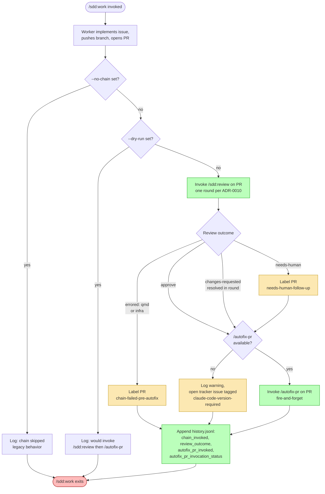
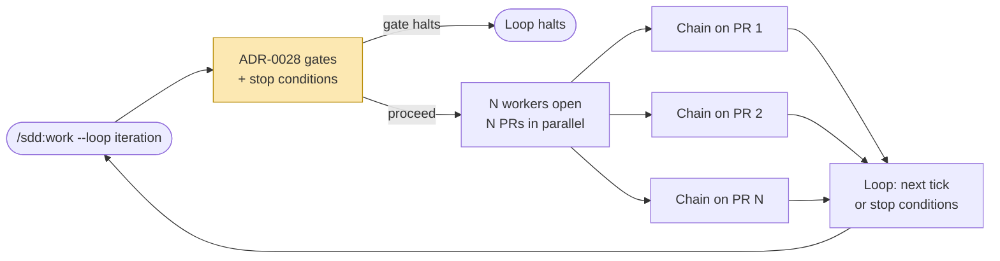

# ADR-0030: Post-PR Chain Pattern in /sdd:work — Trigger /sdd:review and /autofix-pr

## Context and Problem Statement

When `/sdd:work` finishes implementing an issue, it pushes a branch, opens a PR, transitions the issue's lifecycle label to `in-review`, and stops. Everything that happens to that PR after the open — spec-aware architectural review, CI failures, merge conflicts as sibling PRs land, drift from review feedback — falls back on a human (or on a separate, manually-invoked `/sdd:review` run). The user has been driving this loop by hand: open the session, `/sdd:work` produces N PRs, then the user babysits each one through review, CI churn, and merge.

Two recently-stable primitives change the calculus:

1. **`/sdd:review`** (this plugin, ADR-0010) is a one-architectural-round reviewer-responder pair check against spec acceptance criteria. It is bounded: at most one review-response cycle per PR per invocation. Outcomes are APPROVE, REQUEST_CHANGES (responder fixes, reviewer re-evaluates within the round), or "needs human follow-up" if the round closes unresolved.
2. **`/autofix-pr`** is a Claude Code built-in slash command (verified: not provided by any installed plugin; surfaced by `/help` as "Monitor and autofix any issues with the current PR"). It runs continuously in the background, watching CI failures, review comments, and merge conflicts, and pushing corrective commits until the PR merges or is closed. It is open-ended, not bounded.

Together these primitives compose into a natural shape: a bounded architectural pass first (does this PR satisfy the governing spec?), then an open-ended maintenance loop (keep CI green, resolve conflicts, address review comments) until the PR is done. The user wants `/sdd:work` to drive that chain automatically once a PR is open, so a `/sdd:work` invocation produces *merged* code rather than *open* PRs.

How should `/sdd:work` integrate this chain? Specifically: does it run on every PR or only with `--loop`? What happens when `/sdd:review` requests changes? What happens when `/autofix-pr` is unavailable (older Claude Code version)? How does it interact with ADR-0028's loop iteration budgets and ADR-0010's one-round invariant?

## Decision Drivers

* **Autonomy after PR creation.** The user's stated intent is "I open a PR, it should get to merge without me." `/sdd:work` should hand off to the chain rather than stop.
* **Separation of concerns: bounded architectural review vs. open-ended CI maintenance.** Spec compliance is a one-shot judgment; CI flakes, merge conflicts, and post-review nits are an ongoing maintenance loop. Conflating them into one tool either overruns the architectural pass or undercaps the maintenance loop.
* **Graceful degradation if `/autofix-pr` is unavailable.** The built-in is a function of the user's Claude Code version. `/sdd:work` MUST NOT block PR creation on its presence; missing builtin should produce a warning and a tracked follow-up, not a hard failure.
* **Interaction with `/sdd:work --loop`** (ADR-0028). `--loop` already iterates over backlog issues, opening one PR per iteration. The chain must run *per iteration's PR*, not just on the last one.
* **Cost/budget visibility.** Chaining doubles the per-PR token cost (architectural pass + ongoing monitoring). Users on `--loop` already track spend via ADR-0028's `dollars_estimate`; the chain must surface itself in that telemetry surface, not hide costs.
* **Preservation of ADR-0010's one-round invariant.** A chain that wraps `/sdd:review` MUST NOT amount to "infinite review rounds." Exactly one architectural round per PR per chain invocation.
* **Opt-out path.** Users running tightly-scoped one-off `/sdd:work` calls (e.g., to produce a draft PR for human review) deserve a flag to skip the chain entirely.

## Considered Options

* **Option 1**: Status quo — `/sdd:work` opens the PR and stops. Review and CI maintenance are entirely the user's problem.
* **Option 2**: Chain into `/sdd:review` only — `/sdd:work` invokes `/sdd:review` after PR open; CI failures, conflicts, and post-review drift remain manual.
* **Option 3**: Chain into `/autofix-pr` only — skip the architectural pass; rely entirely on `/autofix-pr`'s built-in maintenance loop.
* **Option 4**: Chain into `/sdd:review` then `/autofix-pr` (proposed) — bounded architectural pass first, open-ended monitoring after.
* **Option 5**: Conditional chain — chain only when `--loop` is set; without `--loop`, behavior is the status quo.

## Decision Outcome

Chosen option: **"Option 4 — Chain into `/sdd:review` then `/autofix-pr`"**, because it is the only option that captures both the bounded-architectural-judgment shape and the open-ended-maintenance shape without duplicating either. Option 1 punts the user's stated problem. Option 2 leaves CI/conflict drift on the user. Option 3 skips spec-compliance review (the entire point of an SDD plugin). Option 5 makes single-shot `/sdd:work` invocations second-class — the user explicitly framed the chain as part of the natural post-PR follow-up, not as a `--loop`-only feature.

The chain is: PR open → `/sdd:review` (one round, ADR-0010-bounded) → `/autofix-pr` invoked once (open-ended, runs in its own lifecycle) → `/sdd:work` exits. `/sdd:work` does NOT wait on `/autofix-pr` to merge the PR; the built-in handles that asynchronously.

### Sub-decisions

#### Sub-decision 1: Chain runs unconditionally with an opt-out flag

Every PR that `/sdd:work` opens triggers the chain. The opt-out is `--no-chain`, which restores the legacy "open PR, stop" behavior. Rationale: the chain *is* the new default contract of `/sdd:work`; making it opt-in via `--chain` would leave the existing user base on the legacy path and never realize the autonomy gain. Users who genuinely want a draft for human review pass `--no-chain` (and typically also `--draft`).

#### Sub-decision 2: `/sdd:review` runs first, exactly one architectural round

The chain invokes `/sdd:review` against the PR immediately after PR open. ADR-0010's one-round invariant is preserved verbatim: the reviewer evaluates, the responder addresses (if REQUEST_CHANGES), the reviewer re-evaluates. After that round closes, `/sdd:review` exits with one of three outcomes:

* **APPROVE** — proceed to `/autofix-pr`.
* **CHANGES_REQUESTED** with the responder pair handling fixes inside the round; the reviewer re-evaluates and either approves (proceed) or marks "needs human follow-up" per ADR-0010 (proceed *anyway* — see Sub-decision 4).
* **NEEDS_HUMAN_FOLLOW_UP** — proceed to `/autofix-pr` regardless, with a `needs-human-follow-up` label applied to the PR. The responder's "needs human" comment stands as the trail for the human reviewer.

The chain does NOT loop `/sdd:review`. A second architectural round on the same PR is forbidden by ADR-0010 and forbidden here. If the user wants another round, they invoke `/sdd:review` directly.

#### Sub-decision 3: `/autofix-pr` invocation contract

`/autofix-pr` is invoked **once per PR**, with the PR number/URL as the target, immediately after `/sdd:review` exits. Important properties:

* `/sdd:work` does NOT wait for `/autofix-pr` to terminate. `/autofix-pr` runs in its own background lifecycle managed by Claude Code; it watches the PR and pushes commits until the PR merges or is closed. `/sdd:work` returns once the invocation is *accepted* (i.e., the command was parsed and the lifecycle started).
* `/autofix-pr` is invoked exactly once. `/sdd:work` does NOT re-invoke it within the same iteration or across iterations. Re-invocation on the same PR is `/autofix-pr`'s own concern (it is already a maintenance loop).
* The PR's eventual merge is not `/sdd:work`'s responsibility. The chain hands off; `/sdd:work` exits cleanly.
* `/autofix-pr` invocations are NOT serialized across the workers in a single `/sdd:work` iteration — N workers opening N PRs invoke `/autofix-pr` N times, in parallel, each scoped to its own PR.

#### Sub-decision 4: Failure-mode handling

| Failure mode | Behavior |
|--------------|----------|
| `/autofix-pr` not available (Claude Code version too old; command unrecognized) | Log a one-line warning to the run output, open a tracker issue tagged `claude-code-version-required` referencing the PR and the missing command, and exit cleanly. PR creation is NOT blocked. The architectural review still ran. |
| `/sdd:review` returns NEEDS_HUMAN_FOLLOW_UP | Proceed to `/autofix-pr` anyway. Apply a `needs-human-follow-up` label to the PR. The responder's existing "needs human" comment is the audit trail. Rationale: `/autofix-pr` may still resolve CI flakes or conflicts independently of the architectural concern, and the human reviewer can disambiguate. |
| `/sdd:review` itself errors (e.g., qmd unreachable per ADR-0024 sub-decision 2) | Surface the error, label the PR `chain-failed-pre-autofix`, do NOT invoke `/autofix-pr`. The PR still exists; the user can rerun `/sdd:review` after fixing qmd. |
| User passed `--no-chain` | Skip both invocations. PR open is the terminal action of this iteration. (Legacy behavior.) |
| `/sdd:work` is in `--dry-run` mode | The chain is also dry-run: log "would invoke /sdd:review on PR #N, then /autofix-pr" and skip both. |

#### Sub-decision 5: Interaction with `/sdd:work --loop` (Governing: ADR-0028)

Each `--loop` iteration's per-PR chain is a self-contained unit:

* `--loop` iterates over backlog issues (per ADR-0028), opening one PR per worker per iteration. The chain runs after each PR within that iteration, in parallel across workers (one chain per PR).
* ADR-0028's iteration budget, gate evaluations, and `AskUserQuestion` prompts fire **before** the chain. The gates decide whether to *start* the iteration; once an iteration runs and a PR is opened, the chain follows automatically. The gate flow does NOT include a "should I chain this PR?" gate — the chain is part of normal iteration body, not a budget or gate decision.
* The chain invocations are NOT separately budget-tracked beyond the surfaces already provided by ADR-0028. Token costs accumulate in `tokens_in`/`tokens_out`/`dollars_estimate` from each invoked tool's own tracking; `/sdd:work` does not double-count.
* `/sdd:work --loop --no-chain` is a valid combination: each iteration opens its PR and stops, no chain runs. This is the migration path for users who installed an older Claude Code without `/autofix-pr`.

#### Sub-decision 6: Cost visibility and telemetry

The chain reports its invocations in `/sdd:work`'s iteration telemetry per ADR-0028's `history.jsonl` schema. Each iteration's JSON line gains the following fields under the per-PR record:

```json
{
  "pr": "#152",
  "chain_invoked": true,
  "review_outcome": "approve",
  "autofix_pr_invoked": true,
  "autofix_pr_invocation_status": "accepted"
}
```

* `chain_invoked` — `true` unless `--no-chain` was set or `--dry-run` skipped it.
* `review_outcome` — one of `"approve"`, `"changes-requested"`, `"needs-human"`, `"errored"`.
* `autofix_pr_invoked` — `true` if the command was attempted, `false` if `--no-chain`/`--dry-run`/review-errored skipped it.
* `autofix_pr_invocation_status` — `"accepted"` (command parsed and lifecycle started), `"unavailable"` (built-in not present), `"errored"` (other failure).

Token costs continue to flow through ADR-0028's `tokens_in`/`tokens_out`/`dollars_estimate` per the existing schema. The 80% budget-escalation gate from ADR-0028 fires on the same dollar/token thresholds — the chain is a *consumer* of that budget, not a separate ceiling.

For non-loop (`/sdd:work` without `--loop`) invocations, the same per-PR fields are emitted to a single-iteration `history.jsonl` line so single-shot chain telemetry is preserved on the same shape.

### Consequences

* **Good**, because PR follow-up is autonomous after PR creation — the user's stated goal is realized end-to-end.
* **Good**, because ADR-0010's one-round invariant is preserved verbatim — the chain wraps `/sdd:review` but does not loop it.
* **Good**, because `/autofix-pr` (built-in) handles the open-ended CI/conflict/comment drift that `/sdd:review` deliberately does NOT handle, giving each tool a single, well-scoped job.
* **Good**, because the chain composes cleanly with `/sdd:work --loop` — each iteration's PRs each get their own chain, in parallel across workers.
* **Good**, because failure modes are explicit and graceful — missing builtin produces a warning + follow-up issue, not a blocked PR.
* **Bad**, because per-PR token cost roughly doubles (one architectural round + ongoing monitoring tokens). Mitigated by ADR-0028's existing dollar budget and 80% gate; users with tight budgets pass `--no-chain` or lower `--max-dollars`.
* **Bad**, because the chain requires a Claude Code version that ships `/autofix-pr`. The minimum version gate is to be specified in the implementation PR; the failure mode is documented (Sub-decision 4).
* **Neutral**, because `--no-chain` preserves legacy behavior for users who don't want the chain (one-off draft PRs for human review).

### Confirmation

Compliance is confirmed by:

1. `/sdd:work` opens a PR and invokes `/sdd:review` on it before exiting (verifiable in run output and `history.jsonl`).
2. After `/sdd:review` exits with any outcome (approve, changes-requested, needs-human, errored), `/sdd:work` invokes `/autofix-pr` *unless* the review erroring is due to qmd unreachability or another infrastructure failure documented in Sub-decision 4. APPROVE, CHANGES_REQUESTED, and NEEDS_HUMAN_FOLLOW_UP all proceed to `/autofix-pr`.
3. `/sdd:work --no-chain` skips both invocations, restoring legacy behavior. Verifiable by integration test asserting no `/sdd:review` or `/autofix-pr` invocation in the history.
4. With `/autofix-pr` unavailable (sandboxed test removes the built-in from the session), `/sdd:work` logs a warning, opens a tracker issue tagged `claude-code-version-required`, and exits cleanly. PR creation succeeds.
5. `/sdd:work --loop` runs the chain *per iteration's PR*, not just the final one. Verifiable by integration test with two backlog issues asserting two `chain_invoked: true` records in `history.jsonl`.
6. `history.jsonl` per-iteration entries capture `chain_invoked`, `review_outcome`, `autofix_pr_invoked`, and `autofix_pr_invocation_status` in the documented shape.
7. ADR-0010's one-round invariant remains intact — `/sdd:check` against ADR-0010 finds no second architectural round per PR per chain invocation. `/sdd:review` is invoked exactly once by `/sdd:work` per PR.

## Pros and Cons of the Options

### Option 1: Status quo — open PR, stop

* Good, because zero plugin changes; the existing `/sdd:work` shape is unchanged.
* Bad, because the user's stated goal (autonomous PR follow-up) is not met.
* Bad, because every PR requires manual human follow-up to merge — the bottleneck ADR-0010 was designed to remove returns once the PR is open.
* Bad, because `--loop` produces N PRs that all need babysitting, undercutting the loop's autonomy promise from ADR-0028.

### Option 2: Chain into `/sdd:review` only

* Good, because spec-compliance review is automated end-to-end.
* Good, because preserves ADR-0010's bounded model directly.
* Bad, because CI flakes, merge conflicts, and post-review nits all stop the PR after one round. The user is back to babysitting CI.
* Bad, because `/autofix-pr` exists and is purpose-built for the maintenance loop; ignoring it leaves capability on the table.

### Option 3: Chain into `/autofix-pr` only

* Good, because PRs reach merge autonomously; `/autofix-pr`'s monitoring loop handles everything until done.
* Good, because the simplest possible chain — one invocation, no review wrapping.
* Bad, because spec-compliance review is skipped — the entire SDD-plugin value proposition (architectural judgment against governing artifacts) is bypassed.
* Bad, because `/autofix-pr` does not know about ADRs and specs; it can fix CI but cannot tell you "this PR violates ADR-0017's parallelism cap." The architectural pass is non-substitutable.

### Option 4: Chain into `/sdd:review` then `/autofix-pr` (chosen)

* Good, because separation of concerns: bounded architectural review (one tool) + open-ended maintenance (another tool), each doing the job it was designed for.
* Good, because ADR-0010's invariant is preserved by construction — `/sdd:review` is invoked exactly once.
* Good, because `/autofix-pr` invocation is fire-and-forget; `/sdd:work` does not block on long-running maintenance.
* Good, because composes with `/sdd:work --loop` without modifying ADR-0028's gate or budget surfaces.
* Bad, because per-PR token cost doubles (mitigated by ADR-0028's dollar ceiling).
* Bad, because depends on a Claude Code version that ships `/autofix-pr`; documented failure mode (Sub-decision 4) handles older versions.

### Option 5: Conditional chain (chain only with `--loop`)

* Good, because preserves single-shot `/sdd:work` as exactly today's behavior.
* Good, because limits the new dependency surface (`/autofix-pr`) to the autonomous mode where users are already opting in to budget tracking.
* Bad, because makes single-shot `/sdd:work` second-class — users who run `/sdd:work 42` to fix one issue lose the autonomy benefit even though their PR has the same review/CI/conflict needs.
* Bad, because the user's framing was "as part of looping on review/response," but the natural reading is broader: the chain is the right shape regardless of loop. Hiding it behind `--loop` over-couples two orthogonal concerns.

## Architecture Diagram





## More Information

* **Extends ADR-0028** (Loop Autonomous Mode) by defining the per-PR follow-up shape inside each loop iteration. ADR-0028 governs *whether* an iteration runs (gates, budgets, stop conditions); this ADR governs *what happens to the PR after it opens* within an iteration. The two compose without contradiction: ADR-0028's gates fire before the iteration body; this ADR's chain runs as part of the iteration body.
* **Related to ADR-0010** (Parallel PR Review and Response Skill). The chain invokes `/sdd:review` exactly once per PR; ADR-0010's one-round invariant is preserved by construction. This ADR does NOT modify `/sdd:review`'s internal contract.
* **Related to ADR-0024** (qmd as Hard Dependency), Sub-decision 2 framing. The "missing dependency" failure mode for `/autofix-pr` follows ADR-0024's pattern: surface the missing dependency clearly, document the user-facing remediation (in this case, "upgrade Claude Code"), do NOT silently degrade. The remediation differs from ADR-0024's qmd case (no install command — the user must update their Claude Code) but the failure-mode shape is the same.
* **`/autofix-pr` is a Claude Code built-in.** Verified absent from all installed plugins. Surfaced by `/help` as: "Monitor and autofix any issues with the current PR." It is not part of this plugin and is not a dependency the plugin installs; it is a runtime capability the plugin assumes when present and warns about when absent.
* **Implementation will land in a separate spec** translating Sub-decisions 1–6 into RFC-2119 requirements, plus PRs that modify `skills/work/SKILL.md` to invoke the chain after PR open and update the post-PR step in the worker protocol. SPEC-0020 (loop autonomous mode) will be amended in parallel to reference the chain inside loop iteration body — that amendment is a peer PR, not part of this ADR.
* **Out of scope for this ADR:**
  * Modifying `/sdd:review`'s internal flow. The chain is a wrapper.
  * Modifying `/autofix-pr`. It is upstream of this plugin.
  * Replacing the chain with a different post-PR shape per-skill (e.g., a custom monitoring loop). Future ADRs may add such variants; v1 is the chain.
  * Cross-PR coordination during `/autofix-pr`'s lifecycle (e.g., serializing autofix on stacked PRs). `/autofix-pr` handles its own concurrency.
* **Open questions** (deferred to the implementing spec):
  * Exact Claude Code version gate at which `/autofix-pr` is reliably present. Pending — the implementing PR will document the minimum version.
  * Whether the `claude-code-version-required` follow-up issue should be opened once per session or once per PR. Default proposal: once per `/sdd:work` invocation (deduped).
