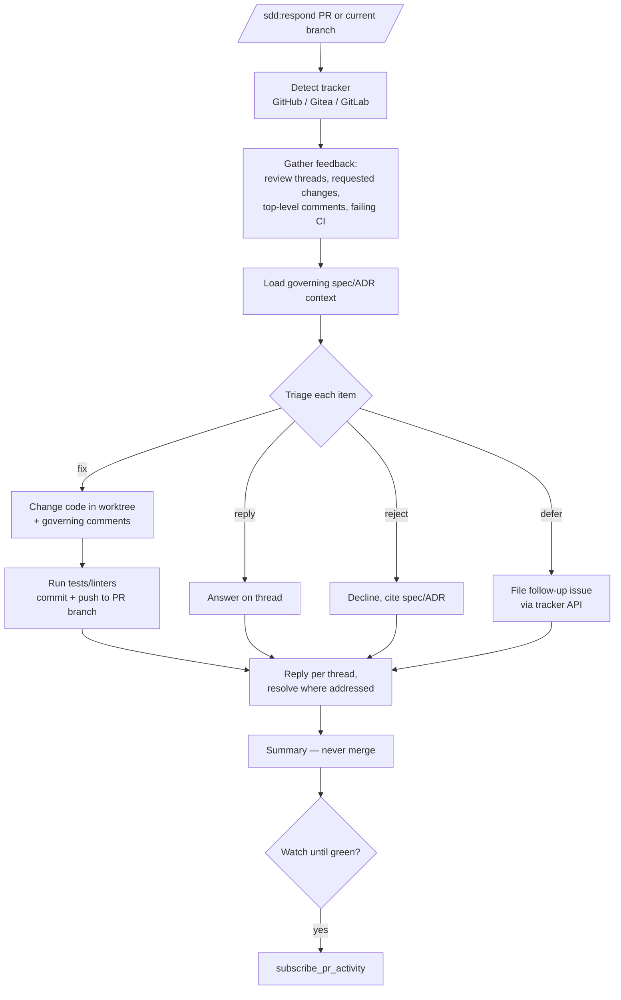

# ADR-0034: Author-Side PR Response Skill (`/sdd:respond`)

## Context and Problem Statement

ADR-0010 closed the spec-to-merge pipeline with `/sdd:review`, which spawns reviewer-responder pairs and runs one bounded review-response round on PRs produced by `/sdd:work`. But that responder only exists as an internal agent reacting to its own paired reviewer. When a **human** (or an external bot like Copilot) leaves review feedback on a PR, nothing in the plugin addresses it — the author must manually read each comment, make the fixes, push, and reply.

How should the plugin let a PR author work through review feedback that already exists on a PR — making the code fixes, pushing, and replying to each thread — without reaching for the reviewer-driven `/sdd:review`?

## Decision Drivers

* **Pipeline gap**: `/sdd:review` is reviewer-driven (it generates the feedback it responds to). There is no author-driven entry point for feedback that originated outside the plugin — the common case for human review.
* **Separation of concerns**: Responding to feedback is a distinct activity from reviewing-and-merging. Overloading `/sdd:review` with an author mode muddies a skill that is already large and loop-capable.
* **Bounded iteration**: Like ADR-0010, a single complete pass over current feedback keeps the process predictable; new feedback means a new invocation.
* **Spec traceability**: A responder should judge requested changes against governing ADRs/specs and decline (with a sourced explanation) changes that would violate them, not comply blindly.
* **Capture, don't drop**: Legitimate-but-out-of-scope feedback should become tracked work rather than vanishing into a resolved thread.
* **Don't auto-merge**: Responding to feedback is not approving it; merge authority stays with the reviewer or the human.

## Considered Options

* **Option 1**: A new standalone `/sdd:respond` skill — author-driven, gathers existing feedback (comments, requested changes, failing CI), fixes, pushes, and replies in one bounded round.
* **Option 2**: Extend `/sdd:review` with a `--respond-only` flag that runs only the responder half against a PR.
* **Option 3**: Do nothing — document that users should run `/sdd:review` (which contains a responder) or address feedback by hand.
* **Option 4**: A single broad "PR assistant" skill that reviews, responds, and merges behind one command with modes.

## Decision Outcome

Chosen option: "Option 1 — a new standalone `/sdd:respond` skill", because the author-side response is a coherent, separable activity with its own inputs (feedback that already exists) and outputs (fix commits + replies + captured follow-ups), and a dedicated skill keeps both `/sdd:respond` and `/sdd:review` focused. It reuses the established responder protocol from ADR-0010 (worktree reuse, push, reply) but starts from external feedback rather than a paired reviewer, and it never merges.

### Consequences

* Good, because the pipeline now has an author-driven entry point for the most common review case (a human left comments on a PR).
* Good, because `/sdd:review` stays focused on reviewing-and-merging; neither skill grows a second personality.
* Good, because deferred feedback is captured as tracked issues instead of being lost, keeping the backlog honest.
* Good, because spec-aware triage lets the responder decline changes that violate a governing artifact with a cited reason rather than silently complying or silently ignoring.
* Bad, because two skills now touch PR responses (`/sdd:respond` and the responder inside `/sdd:review`), which must be kept conceptually aligned to avoid drift.
* Bad, because a single bounded round may not fully resolve complex reviews — follow-up invocations or human help are still needed.
* Neutral, because issue creation for deferred items is outward-facing; it is gated by `--no-defer-issues` and confirmed interactively.

### Confirmation

Implementation is confirmed by:

1. `skills/respond/SKILL.md` exists and follows the established SKILL.md format with YAML frontmatter.
2. Running `/sdd:respond <PR>` gathers the PR's review threads, requested-changes reviews, top-level comments, and failing CI; makes the code fixes on the PR branch; pushes; and replies to each thread.
3. The skill triages each item as `fix` / `reply` / `reject` / `defer`, declines `reject` items with a citation to the governing spec/ADR, and never merges the PR.
4. `defer` items are captured as tracked issues via the tracker's issue API (not `/sdd:plan`), linked back to the PR/thread, unless `--no-defer-issues` is set.
5. `--dry-run`, `--reply-only`, `--fix-only`, and `--no-push` behave as documented.
6. SPEC-0035 formalizes the requirements and `/sdd:respond` satisfies them.

## Pros and Cons of the Options

### Option 1 — Standalone `/sdd:respond` skill

A dedicated skill that takes a PR (or infers it from the current branch), gathers existing feedback, fixes/pushes/replies in one bounded round, captures deferrals as issues, and never merges.

* Good, because inputs and outputs are coherent and distinct from review-and-merge.
* Good, because it keeps `/sdd:review` small and avoids a flag that flips its whole orientation.
* Good, because it mirrors how the SDD plugin already factors work into single-purpose skills.
* Neutral, because it shares the responder protocol with `/sdd:review` — a reference to keep aligned.
* Bad, because it adds another skill to the catalog and another eval surface to maintain.

### Option 2 — `/sdd:review --respond-only`

Reuse `/sdd:review`'s machinery, exposing the responder half via a flag.

* Good, because it reuses existing responder code paths directly.
* Bad, because `/sdd:review` is reviewer-driven and loop-capable; a flag that makes it skip reviewing and act as the author inverts its mental model and complicates its already-large surface.
* Bad, because discovery suffers — users looking for "respond to my PR" do not naturally reach for a review-and-merge command.

### Option 3 — Do nothing

Point users at the responder inside `/sdd:review` or manual work.

* Good, because zero new surface area.
* Bad, because the responder inside `/sdd:review` cannot be invoked on its own against human feedback — the gap remains.
* Bad, because the most common review workflow (human comments on a PR) stays manual.

### Option 4 — One broad "PR assistant" skill

Fold review, response, and merge into one multi-mode command.

* Good, because a single entry point for "do something with my PR."
* Bad, because it concentrates unrelated responsibilities and modes into one skill, the opposite of the plugin's single-purpose factoring.
* Bad, because it would subsume ADR-0010's `/sdd:review` and force a larger refactor for little benefit.

## Architecture Diagram

## More Information

- Extends ADR-0010 (Parallel PR Review and Response Skill) — reuses the responder protocol (worktree reuse, push, reply) but is author-driven and non-merging.
- Related to ADR-0009 (developer workflow conventions) — branch and PR conventions inform how the responder commits and links work.
- Formalized by SPEC-0035 (Respond to PR Review Feedback).
