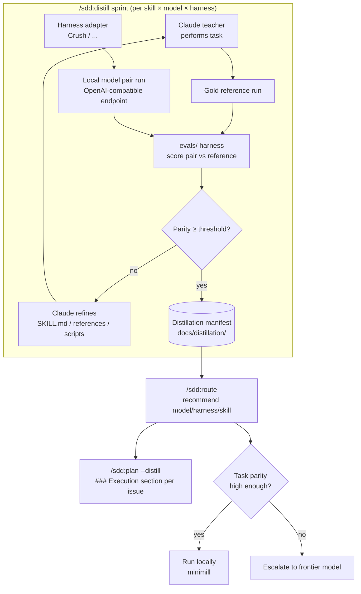

# ADR-0034: Skill Distillation for Local Models

## Context and Problem Statement

Most SDD work is routine, repetitive, and structurally constrained — authoring an ADR, breaking a spec into issues, running drift checks. Running every one of these against a frontier model is expensive, rate-limited, and often overpowered for the task. Tomasz Tunguz's "skill distillation" technique (see *More Information*) shows that a frontier model can act as a **teacher** that iteratively authors and refines markdown `SKILL.md` files which a cheap **local** model — running in an open harness — then executes at near-frontier quality, with most work staying on the laptop and only the hardest tasks escalating to the cloud (the "minimill" pattern).

How should the SDD plugin let Claude "train" cheaper, locally-hosted models to run its skills well enough to be trusted, and surface those recommendations at planning time?

## Decision Drivers

* **Cost and rate limits** — running routine SDD skills against a frontier model on every invocation is wasteful and throttles throughput; routine procedural work should run locally and cheaply.
* **Existing substrate** — the plugin is already a skill-authoring system (`skills/`), already has a parity-capable evaluation harness (`evals/`, ADR-0021), and already produces planning artifacts (`/sdd:plan`). Distillation is a recombination of primitives we already own, not a new subsystem.
* **Measurable, not vibes** — "good enough to run locally" must be a number, not a hunch. We need a repeatable way to measure how close a local model's output is to Claude's on the same task.
* **Harness and model churn** — open harnesses (Crush, OpenCode, Goose, Codex CLI) and local models (Qwen, Gemma, GPT-OSS) move fast. The design must not hard-couple to any one of them.
* **Planning visibility** — the value only lands if `/sdd:plan` tells an operator which model/harness/skill can do a given issue locally and when to fall back to the cloud.

## Considered Options

* **Option A — Skill distillation loop** (teacher authors/refines markdown skills; student executes in an open harness; the evals harness measures Claude-relative parity; routing is surfaced at plan time)
* **Option B — Weight distillation / fine-tuning** (log Claude Code sessions, build a training set, fine-tune or prompt-optimize a local model with DSPy/GEPA)
* **Option C — Static prompt porting** (hand-write per-model prompt variants once, no measurement or iteration loop)
* **Option D — Do nothing** (cloud-only; every skill always runs against a frontier model)

## Decision Outcome

Chosen option: **Option A — Skill distillation loop**, because it reuses the plugin's existing skill, evaluation, and planning primitives; produces durable, inspectable, version-controlled markdown artifacts (not opaque weights); and keeps the iteration loop fully inside the SDD lifecycle the plugin already practices. It is the most direct mechanical translation of Tunguz's method onto what this plugin already is.

The decision has four structural commitments, formalized in SPEC-0035:

1. **A new `/sdd:distill` skill** runs a *distillation sprint* for a `{skill, model, harness}` triple: Claude performs the task to produce a gold **reference run**, the same task is dispatched to the local model via the harness adapter (the **pair run**), the **existing `evals/` harness** scores the pair run against the reference to produce a **parity score**, Claude then **refines** the `SKILL.md` / `references/` / helper `scripts/` to close the gap, and the loop repeats until parity converges past a threshold.
2. **A new `/sdd:route` skill** reads the distillation manifest and, given a task or issue, recommends `{harness, model, skill}` plus a "fall back to cloud when…" condition.
3. **Harness-agnostic adapters with a runner-agnostic model layer.** Harnesses are abstracted behind an adapter contract (install-skill, dispatch-task, capture-output); **Crush** is the reference adapter, others plug in later. The model layer targets a generic **OpenAI-compatible endpoint**, so Ollama / llama.cpp / vLLM serving Qwen/Gemma/GPT-OSS are all interchangeable and configured in the manifest.
4. **`/sdd:plan` integration.** Behind a `--distill` flag (default off, mirroring `--no-branches`), each issue body gains an `### Execution` section populated by `/sdd:route`: suggested model, suggested harness, required distilled skills, and the cloud-escalation condition.

Option B (weight distillation / DSPy/GEPA) is explicitly deferred to a **later, optional second track** layered on top of A — it is heavier, pulls in a Python optimizer dependency, and produces opaque artifacts. The skill-distillation loop is a prerequisite for it (it produces the logged pair sessions a training track would consume).

### Consequences

* Good, because routine SDD work can run on a cheap local model at measured, Claude-relative parity, cutting cost and dodging rate limits.
* Good, because the distilled artifacts are markdown in the repo — inspectable, diffable, reviewable through the same SDD flow as everything else.
* Good, because parity is a number from the existing evals harness, so "ready to run locally" is gated, not guessed.
* Good, because the adapter + OpenAI-compatible-endpoint abstraction insulates the plugin from harness/model churn.
* Bad, because the loop requires a working local harness + model endpoint in the environment, which not every operator will have — distillation must degrade gracefully when the endpoint is unreachable.
* Bad, because refining a single `SKILL.md` to satisfy a weaker student risks diluting it for the frontier teacher; the design must keep distilled guidance additive (references/scripts) rather than dumbing down the core skill.
* Neutral, because parity is *relative to Claude*, not absolute correctness — a high parity score inherits Claude's own variance on that task and must be read as such.

### Confirmation

* The presence and eval coverage of the `/sdd:distill` and `/sdd:route` skills under `skills/`, tracked by the existing `evals/` framework (ADR-0021).
* Parity benchmarks persisted under `evals/benchmarks/` per `{skill, model, harness}` triple, with a documented convergence threshold.
* `/sdd:plan --distill` issues containing a populated `### Execution` section, validated by a plan eval assertion.
* A markdown-native distillation manifest (per ADR-0015) under `docs/distillation/` registering harnesses, model endpoints, and per-triple parity scores.

## Pros and Cons of the Options

### Option A — Skill distillation loop

Teacher (Claude) authors and iteratively refines markdown skills; student (local model) executes them in an open harness; the evals harness measures Claude-relative parity; routing surfaces at plan time.

* Good, because it reuses three primitives the plugin already owns (skills, evals, planning).
* Good, because artifacts are version-controlled, human-readable markdown.
* Good, because it is the faithful mechanical translation of the source technique.
* Good, because it is the data-producing prerequisite for an optional later fine-tuning track.
* Neutral, because parity is Claude-relative, not absolute.
* Bad, because it needs a live local harness + endpoint and must degrade when absent.

### Option B — Weight distillation / fine-tuning (DSPy/GEPA)

Log sessions, build a training set, optimize or fine-tune a local model.

* Good, because it can push tool-calling parity high (Tunguz reports ~93% on GPT-OSS 20B).
* Bad, because it produces opaque weights/prompts that don't fit the SDD review flow.
* Bad, because it adds a heavy Python optimizer dependency and training infrastructure.
* Bad, because it presupposes the logged pair sessions that Option A produces — wrong layer to start at.

### Option C — Static prompt porting

Hand-write per-model prompt variants once.

* Good, because it is simple and dependency-free.
* Bad, because there is no measurement, so quality is unknown and unmaintained.
* Bad, because it rots immediately as skills and models change, with no loop to catch drift.

### Option D — Do nothing

Every skill always runs against a frontier model.

* Good, because zero new surface area.
* Bad, because it forgoes the entire cost/rate-limit/sovereignty win that motivated the request.

## Architecture Diagram

## More Information

* Tomasz Tunguz, *Skill Distillation* — https://tomtunguz.com/the-pi-agent-skill-distillation/
* Tomasz Tunguz, *Teaching Local Models to Call Tools Like Claude* — https://tomtunguz.com/distilling-claude-into-local-models/
* Tomasz Tunguz, *The Minimill of AI* — https://tomtunguz.com/using-local-ai-to-work-faster/
* ADR-0021 (Skill Evaluation and CI Testing Framework) — the parity-measurement substrate this decision reuses.
* ADR-0028 (Loop Autonomous Mode) and ADR-0015 (Markdown-Native Configuration) — the autonomous-loop and config-format patterns this decision builds on.
* Realized by SPEC-0035 (Skill Distillation).
