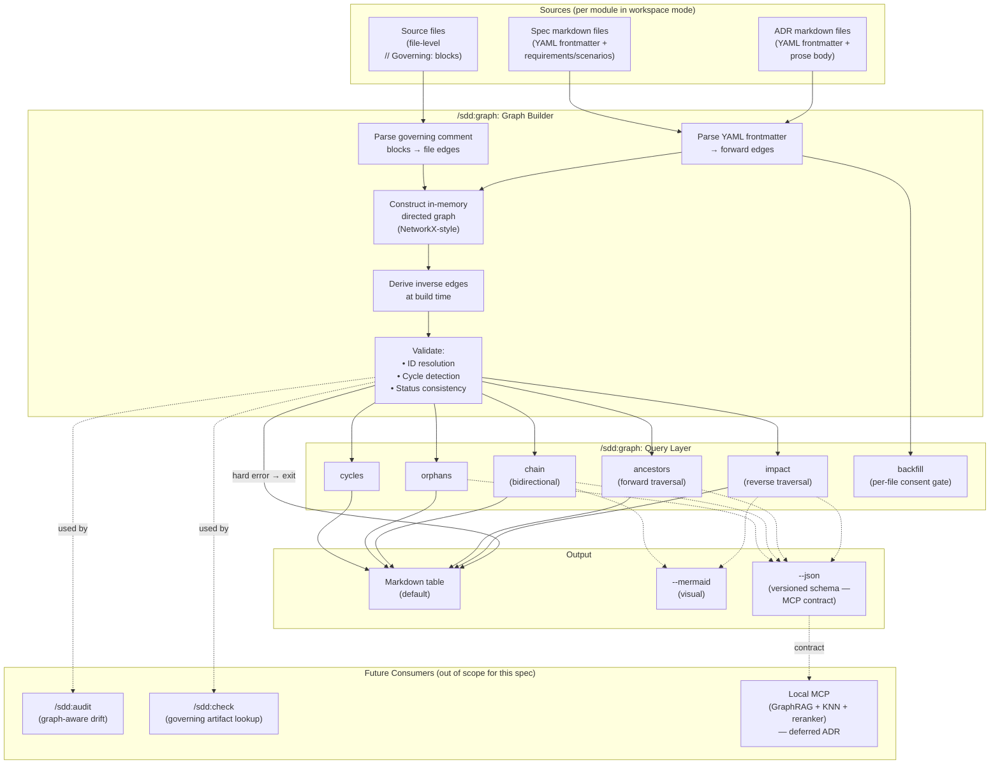

# Design: Artifact Graph

## Context

The SDD plugin currently encodes artifact relationships in prose: ADRs reference each other in `## Related` and `## More Information` sections, specs name their governing ADRs in `## Overview` paragraphs, and the chain from decision → spec → requirement → code is reconstructed by humans reading multiple files. ADR-0020 formalized the code-to-artifact direction via file-level governing comment blocks, but the artifact-to-artifact direction remains unstructured.

This spec realizes ADR-0023 by making artifact relationships first-class: edges live in YAML frontmatter on the artifacts themselves, a `/sdd:graph` skill builds and queries the graph, and the JSON output format becomes the stable contract that any future local MCP (graph/RAG over ADRs + specs + code + tests + backlog) would consume rather than re-parsing markdown.

The corpus this serves is small today (22 ADRs and 17 specs in this repo, similar order of magnitude in the user's other SDD-governed projects), which is why a graph-first design beats a vector-search-first design — relationships are explicit and structured, not fuzzy.

## Goals / Non-Goals

### Goals

- Make artifact-to-artifact relationships parseable so they can be queried and traversed
- Establish a stable, versioned JSON contract that any future MCP, IDE plugin, or dashboard can consume without re-parsing markdown
- Make `/sdd:audit` and `/sdd:check` graph-aware over time (they evolve in their own spec updates)
- Provide an assisted backfill path so existing prose-encoded relationships can be migrated without a manual marathon
- Honor ADR-0015 (markdown-native config) and ADR-0016 (workspace mode) by living in frontmatter and aggregating across modules

### Non-Goals

- A local MCP with embeddings, vector search, GraphRAG, or reranking — that is a future, separately-decided ADR. This spec only ensures the graph is ready to be consumed when that decision is made.
- Requirement-level edges (sub-artifact granularity) — deferred to a future v2 spec or extension to this one
- Persistent graph storage, indexes, or caches — query-time rebuild from current files is sufficient at this corpus size
- Author-side ergonomics for inverse edges — inverses are derived, never authored
- Modifying `/sdd:audit` or `/sdd:check` themselves — those are downstream consumers and evolve in updates to SPEC-0001 and SPEC-0016

## Decisions

### Forward-only edges, derived inverses

**Choice**: Frontmatter declares only forward edges (`governs:` on ADRs, `implements:` on specs); the graph builder derives the reverse direction at build time. There is no `governed-by:` field or `implemented-by:` field on artifacts.

**Rationale**: Storing one direction and deriving the other is the standard relational-graph pattern. It eliminates the "which side is canonical when they disagree?" question, halves the authoring burden, and means a relationship change touches exactly one file. The mild downside — reading a spec's frontmatter doesn't directly show what governs it — is mitigated by the spec's `## Overview` body still naming governing ADRs in prose, and by `/sdd:graph ancestors` being a one-line query.

**Alternatives considered**:
- *Both directions, with the graph builder dedup'ing*: Doubles authoring overhead, creates a "which is canonical when they disagree?" question, and forces every relationship change to touch two files.
- *Backward-only on specs (`governed-by:` instead of `governs:`)*: Backward at decision-write time feels unnatural — when you write an ADR, you know what it governs; you don't yet have the spec saying "I'm governed by this."

### Artifact-level granularity in v1

**Choice**: Edges link whole artifacts (ADR ↔ ADR, ADR ↔ spec, spec ↔ spec). Requirement-level edges (e.g., a single requirement inside a spec declaring it is governed by a specific ADR) are explicitly out of scope for v1.

**Rationale**: Requirement-level edges would make `/sdd:check` and `/sdd:audit` measurably sharper (drift could be pinpointed to a specific requirement), but they would multiply authoring overhead by ~5–10x per spec and complicate the schema. Artifact-level edges deliver most of the value (lineage, impact, orphan detection) for far less authoring discipline. Requirement-level can be added as a non-breaking extension once the artifact-level graph proves its value in production use.

**Alternatives considered**:
- *Requirement-level from day one*: Sharper drift detection but front-loads complexity; we don't yet have evidence the precision matters for v1 use cases.
- *Optional requirement-level mixed with artifact-level*: Schema becomes "either or both," which complicates traversal and reporting. Cleanest to ship one granularity, then add the second.

### Query-time graph construction (no persisted index)

**Choice**: The graph is rebuilt in-memory on every `/sdd:graph` invocation by parsing all artifact frontmatter and all governing comment blocks. There is no `.sdd-graph.cache` or `.sdd-graph.json` index file.

**Rationale**: For tens to low-hundreds of artifacts plus a few hundred source files, a full rebuild takes well under a second and eliminates the entire class of stale-index bugs (graph says X depends on Y; reality has changed). Caching is a real concern at thousands of artifacts; we are nowhere near that, and a cache layer can be added behind the same skill interface without changing the spec.

**Alternatives considered**:
- *Persisted index file*: Faster cold-start but introduces invalidation logic, sync issues with concurrent file edits, and yet another file to commit/gitignore.
- *Cache with file-mtime invalidation*: Reasonable optimization but premature — defer until benchmarks show query latency is a real pain.

### Hard error on cycles, warning on status mismatch

**Choice**: Cycles in any non-symmetric edge type cause `/sdd:graph` to refuse to answer queries (hard error, exit non-zero). A `supersedes` declaration that references an artifact whose status is not `superseded` produces a warning but lets queries proceed.

**Rationale**: A cycle (e.g., A `supersedes` B `supersedes` A) is necessarily an authoring mistake — the graph can't be a DAG, and traversal results would be misleading. Status mismatches, by contrast, are typically migration artifacts (someone added the `supersedes` edge but forgot to flip the old artifact's status); they should be visible but shouldn't block useful work.

**Alternatives considered**:
- *All warnings*: Cycles would silently produce confusing query results — users would lose trust in the tool.
- *All hard errors*: Status mismatches would block queries on minor janitorial work, defeating the point of the warning level.

### Backfill is per-file consent, not bulk

**Choice**: `/sdd:graph backfill` parses prose to propose edges, presents a per-file diff, and writes only after the user accepts that file. Rejected proposals are remembered (no re-prompting) until `--reset`.

**Rationale**: Prose-to-frontmatter parsing is heuristic and will produce wrong proposals (e.g., misreading "ADR-0001 is referenced for context" as `extends: [ADR-0001]`). A bulk auto-apply mode would commit those mistakes silently. Per-file consent is the only mode that is safe enough to actually run on 22 ADRs and 17 specs.

**Alternatives considered**:
- *Auto-apply with `--dry-run` first*: Two-step UX is more confusing than one-step diff-and-confirm; users would skip dry-run and regret it.
- *Manual-only (no backfill mode)*: Won't happen. The 22 ADRs + 17 specs in this repo would stay in prose forever, defeating the schema's point.

### JSON output is the future MCP contract

**Choice**: The JSON output format is versioned (`schema_version` field), documented in the spec, and treated as a stable interface. Breaking changes require bumping the version and a versioned addendum to this spec.

**Rationale**: Whatever future consumers exist (local MCP, IDE plugin, web dashboard, CI checks), they will be far cheaper to build and maintain if they read structured JSON than if they re-parse markdown. Treating the JSON as a contract — not an implementation detail — is what makes "graph layer first, MCP later" actually pay off.

**Alternatives considered**:
- *No JSON output, MCP re-parses markdown*: Defeats the point of the graph layer; every future consumer reinvents the parsing.
- *Custom binary format*: Massively over-engineered for this corpus size and inspection-hostile.

## Architecture

## Risks / Trade-offs

- **Forward-only edges reduce frontmatter informativeness on the receiving side** → Mitigated: `## Overview` prose still names governing ADRs, and `/sdd:graph ancestors <id>` answers the inverse question in one command. The trade is a small reading-time cost for a meaningful authoring-time simplification.

- **Artifact-level granularity blurs `/sdd:check` precision** → Mitigated: v1 sharpens drift to "this file's governing spec changed" (better than today's "something changed somewhere"). Requirement-level granularity is a deferrable v2; we'll add it if real use shows the precision gap matters.

- **Backfill heuristics produce wrong proposals** → Mitigated: per-file consent gate is the entire safety mechanism. The mode is read-only by default; nothing is committed without explicit user accept on each file.

- **Query-time rebuild becomes slow at scale** → Mitigated: rebuild benchmarks on the current corpus complete in milliseconds; the cache layer is a behind-the-interface optimization that can ship later without changing the spec.

- **Cross-module ID syntax (`[module]/SPEC-0001`) adds parser complexity** → Mitigated: only matters in workspace projects; the parser falls back to plain IDs in single-module mode (the common case).

- **The JSON schema being a "contract" creates ongoing maintenance pressure** → Accepted: this is the price of giving downstream consumers a stable interface. Versioned addenda allow controlled evolution.

- **The "forward only" rule is enforceable only by the builder warning when it sees a derived field name** → Accepted: this is consistent with how the rest of the SDD plugin handles convention enforcement (lint-and-warn, not block).

## Migration Plan

1. **Templates first**: Update `skills/adr/SKILL.md` and `skills/spec/SKILL.md` to document the optional edge fields in the MADR/OpenSpec templates. New artifacts get the schema for free; existing artifacts are unaffected until step 4.

2. **Skill implementation**: Build `skills/graph/SKILL.md` implementing all v1 verbs (`impact`, `ancestors`, `chain`, `orphans`, `cycles`, `backfill`) with all three output formats. The skill is read-only by default; only `backfill` can write, and only with per-file consent.

3. **Shared patterns**: Add a "Graph Edge Resolution" section to `references/shared-patterns.md` documenting the forward-only convention, the inverse derivation table, and the cross-module ID syntax.

4. **Backfill the SDD repo itself**: Run `/sdd:graph backfill` against this repo's 22 ADRs and 17 specs. Review and accept per-file diffs. This dogfoods the skill and lifts the existing prose-encoded relationships into the schema. SPEC-0018 (this spec) and ADR-0023 already include their edges, so they serve as the seed.

5. **Downstream skill updates** (separate spec updates, not part of this spec): Update `/sdd:audit` to consume the graph for impact analysis on drift findings, and update `/sdd:check` to look up governing artifacts via the graph rather than re-parsing source. These changes are properly scoped to SPEC-0001 / SPEC-0016 updates, not this spec.

6. **MCP decision** (deferred ADR): Once the graph is in production use across the SDD-governed projects (this repo plus spotter, joe-links, claude-ops, runtime-ai), evaluate whether fuzzy queries justify the GraphRAG + embeddings + reranker build. If yes, that ADR specifies the MCP that consumes this spec's JSON contract.

## Open Questions

- **Should `related` allow cross-type edges (ADR ↔ spec)?** The schema currently scopes `related` to ADR ↔ ADR. Allowing ADR-related-to-spec or spec-related-to-spec would require a fifth derived inverse pattern and broaden the meaning of "weak association." Defer until a real use case appears.

- **Backfill rejection state persistence (resolved):** A single `.sdd-graph-backfill-skip` file at the project root will hold rejected proposals as line-delimited `{file}:{edge-field}:{target-id}` records. This is operational state, not configuration, so it does not violate ADR-0015's markdown-native principle (which targets configuration). The file is gitignored by default but versioned if the user opts in. `--reset` clears the file. SPEC-0018 REQ "Backfill Mode" already mandates the rejection-memory behavior; this resolves the persistence mechanism.

- **Does requirement-level granularity merit its own future spec, or is it best handled by extending this spec?** Probably extension (additive frontmatter at the requirement level), but defer the answer until v2 evidence demands it.

- **Should the JSON output include an `embedding_hint` field** (e.g., the artifact's title and `## Overview` text concatenated) **to make MCP integration cheaper?** Probably yes, but the field shape belongs in the future MCP ADR, not this spec. Adding it later is a non-breaking schema extension.

- **What is the right behavior for an artifact whose `status` is `superseded` but which is still referenced by other artifacts' edges?** Current behavior: include in the graph normally. Alternative: warn that downstream artifacts reference a superseded artifact. The warning case is probably the right default, but defer the decision to implementation time.
