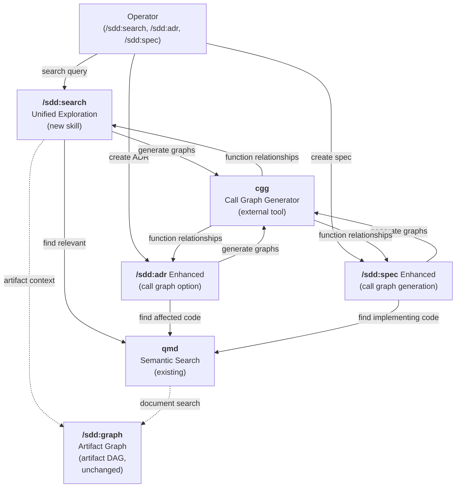
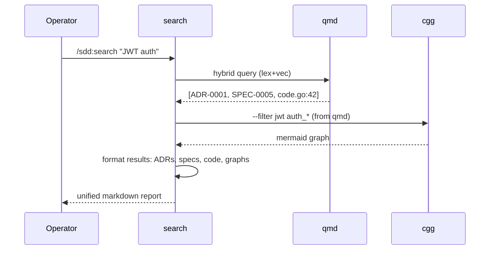
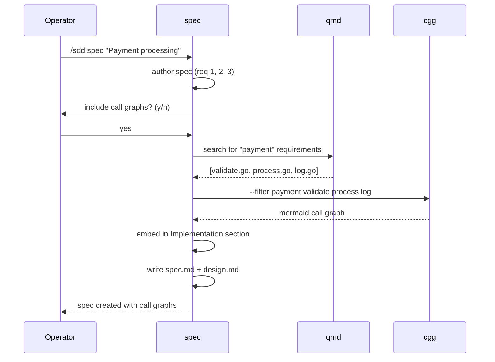

# Design: cgg Call Graph Integration into SDD Workflow

## Context

The SDD plugin provides architecture governance through ADRs (decisions) and specs (formal requirements), plus drift detection skills (`/sdd:check`, `/sdd:audit`). However, design documents are disconnected from the code they govern—readers cannot see "where in the codebase does this decision apply?" or "which functions implement this requirement?" without manually inspecting source files.

Additionally, when operators explore architecture to understand a codebase (before implementing changes with `/sdd:work` or reviewing code with `/sdd:review`), they must choose between:
- qmd semantic search (finds relevant ADRs/specs but not code structure)
- `/sdd:graph` (shows artifact relationships but not function-level dependencies)
- `/cgg` directly (shows call graphs but requires knowing which functions to query)

This design unifies these tools and embeds call graphs into design documents, making architecture and code structure visible together.

## Goals / Non-Goals

### Goals
- Operators can ask natural language questions ("show me JWT auth") and get both architecture (ADRs/specs) and code structure (call graphs) in one unified result
- Design documents (ADRs, specs) are self-documenting: readers can see which functions implement a requirement or decision
- Refactoring impact is visible: before/after call graphs show structural changes
- Existing workflows (creating ADRs/specs without call graphs) continue to work unchanged
- cgg is reused as-is; the plugin does not build its own call graph generator
- All three skill enhancements (search, adr, spec) share a common call graph generation path via cgg

### Non-Goals
- Do NOT modify `/sdd:graph` (artifact graph) — it handles ADR/spec relationships independently
- Do NOT build language-specific parsers — cgg handles all languages
- Do NOT require cgg to be pre-installed — gracefully degrade if unavailable
- Do NOT change spec/ADR authoring workflows for users who don't want call graphs
- Do NOT embed call graphs by default for every spec/ADR — make it optional
- Do NOT try to auto-detect "which functions implement this requirement" with 100% accuracy — call graph matching is best-effort (operator can refine via `--filter`)

## Decisions

### Decision 1: Create /sdd:search as Unified Entry Point (Not Separate /sdd:callgraph)

**Choice**: Single `/sdd:search <query>` skill combining qmd semantic search + cgg call graphs, instead of two separate `/sdd:callgraph` and `/sdd:search` skills.

**Rationale**: Operators should ask one question ("show me everything about X") and get architecture + code structure together. A single entry point is cognitively simpler than choosing between tools. Users with advanced needs can still invoke `/cgg` directly.

**Alternatives considered**:
- **Separate `/sdd:callgraph` and `/sdd:search`**: More granular but forces operators to choose which tool fits their question. Rejected: cognitive load and duplication.
- **Enhance existing `/sdd:graph` to include cgg**: Conflates artifact graph (ADR/spec relationships) with function graphs (code structure). Rejected: different semantics, would clutter the artifact graph skill.

### Decision 2: Make Call Graph Embedding in ADRs/Specs Optional

**Choice**: Enhance `/sdd:adr` and `/sdd:spec` to optionally include call graphs via user prompt, not by default.

**Rationale**: Existing workflows must continue unchanged. Users who don't want call graphs aren't disrupted; those who do get a clear prompt. Call graphs are valuable for future readers and refactoring, but authoring should never be forced.

**Alternatives considered**:
- **Always embed call graphs**: Disrupts existing workflows; overly opinionated.
- **Add `--with-graphs` flag**: Still requires user awareness; prompt is more discoverable.

### Decision 3: Use cgg Under the Hood With Automatic Filtering

**Choice**: `/sdd:search` and authoring skills call cgg internally with smart filtering (e.g., `--filter auth` based on qmd matches), not raw unfiltered graphs.

**Rationale**: Raw call graphs for large codebases can be 100+ nodes—unreadable in Mermaid. Filtering based on qmd matches (e.g., "user authentication" → match functions named auth_*, validate_*, token_*) produces readable diagrams under ~20 nodes.

**Alternatives considered**:
- **No filtering**: Produces unwieldy Mermaid diagrams for large codebases. Rejected: poor UX.
- **Manual operator filtering**: Operator must learn cgg `--filter` syntax. Rejected: defeats "easy exploration" goal.

### Decision 4: Integrate Call Graphs Into Spec `## Implementation` Section

**Choice**: Enhanced `/sdd:spec` embeds call graphs in a new `## Implementation` section showing which functions implement each requirement.

**Rationale**: Specs define WHAT; implementation section shows WHERE in code. This couples requirements to code structure, making specs actionable for implementers. New section keeps spec.md clean (not mixed into requirements section).

**Alternatives considered**:
- **Embed in `## Requirements` directly**: Clutters requirements; separating concerns is cleaner.
- **Embed in design.md instead**: design.md is architecture; implementation mapping belongs in spec (the requirement source).

### Decision 5: Graceful Degradation When cgg Is Unavailable

**Choice**: `/sdd:search` and authoring skills return qmd results with a clear note if cgg is not installed; no failure.

**Rationale**: cgg is an optional enhancement. Teams without cgg should still benefit from qmd semantic search. Clear messaging tells users how to install cgg if they want call graphs.

**Alternatives considered**:
- **Require cgg**: Makes cgg mandatory; some teams may not have Rust toolchain. Rejected: limits adoption.
- **Silently skip call graphs with no message**: Confusing; user doesn't know if graphs are unavailable or just not found.

### Decision 6: Call Graphs Are Readable Mermaid, Not JSON by Default

**Choice**: Default output is Markdown with embedded Mermaid diagrams; JSON available via `--output json` for tool integration.

**Rationale**: Operators read Markdown in terminals and docs sites; Mermaid renders naturally. JSON supports tool integration (CI, dashboards) without forcing every human operator into JSON parsing.

**Alternatives considered**:
- **JSON only**: Forces human operators to interpret raw JSON. Rejected: poor UX.
- **Multiple formats by default**: Too verbose; choice defaults are clearer than listing all options.

## Architecture

### Component Diagram

### Data Flow: /sdd:search Execution

### Data Flow: /sdd:spec Call Graph Embedding

### Architecture: Call Graph Filtering Strategy

When `/sdd:search` or authoring skills generate call graphs:

1. **Identify relevant functions** via qmd matches and requirement keywords (e.g., "JWT" → find auth_*, jwt_*, token_*, validate_*)
2. **Apply cgg filter**: `cgg ... --filter "auth_.*|jwt_.*|token_.*"`
3. **Limit to ~20 nodes** via Mermaid rendering (omit internal helper functions if >20 nodes)
4. **Include legend** in Mermaid diagram explaining filtered scope (e.g., "Showing entry points + main flow, omitted internal helpers")

This keeps diagrams readable while staying true to actual code structure.

## Risks / Trade-offs

- **Risk: cgg unavailability** → Mitigation: graceful degradation to qmd-only results with clear install instructions
- **Risk: Call graphs in large codebases are still unwieldy even with filtering** → Mitigation: provide `--unfiltered` flag and direct users to `/cgg` for advanced scoping; auto-filtering handles 80% of use cases
- **Risk: qmd matches wrong functions for spec requirements** → Mitigation: call graph matching is best-effort; operator can refine via `--filter` or manually add/edit graphs
- **Risk: Mermaid rendering issues in some markdown renderers** → Mitigation: test against Docusaurus, GitHub, GitLab rendering; include fallback text descriptions if diagram fails
- **Risk: Embedding call graphs increases spec/ADR file sizes and git diffs** → Mitigation: inline Mermaid (no large assets); encourage operators to commit call graphs only when significant (avoid on every edit)

## Migration Plan

**Phase 1: Implement /sdd:search (Story 1)**
- Create new `/sdd:search` skill combining qmd + cgg
- Test across multiple query types and codebases
- Document in CLAUDE.md with examples

**Phase 2: Enhance /sdd:adr (Story 2)**
- Add optional call graph generation to `/sdd:adr`
- User is prompted: "Include call graphs of affected code? (y/n)"
- Test with various ADR types (routing, auth, data model)

**Phase 3: Enhance /sdd:spec (Story 3)**
- Add auto call graph generation to `/sdd:spec`
- Embed in new `## Implementation` section
- Update design.md to reflect implementation guidance

**Phase 4: Integration with downstream skills (Story 4)**
- Update `/sdd:discover` to optionally use `/sdd:search` results
- Document integration with `/sdd:plan`, `/sdd:work`, `/sdd:review`

**Phase 5: Advanced features (Story 5–6)**
- Add `--focus <artifact>` flag to `/sdd:search`
- Support before/after call graphs in refactoring workflows

## Open Questions

- Should `/sdd:search` results be cached? (For repeated queries on the same codebase, avoid re-running cgg)
- Should call graphs in specs be versioned separately (e.g., `spec-name.callgraph.mermaid`) or embedded inline?
- How should call graphs handle cross-module boundaries in workspace mode?
- Should call graph filtering be configurable (e.g., `--max-nodes 30` to control diagram size)?
- Should `/sdd:audit` also use `/sdd:search` to show code context alongside drift findings?

## References

- **ADR-0033**: Integration of cgg call graphs into SDD plugin design (decision drivers, options analysis)
- **cgg Repository**: https://github.com/NeuralNotwerk/cgg
- **cgg SKILL.md**: https://github.com/NeuralNotwerk/cgg/blob/main/skills/cgg/SKILL.md
