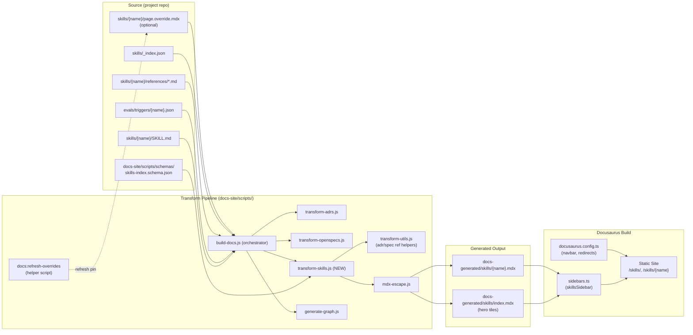

# Design: Docusaurus Skill Page Generation

## Overview

ADR-0029 chose hybrid auto-generation with an editorial override hatch as the long-term shape of skill documentation. This design realizes that decision: a new `docs-site/scripts/transform-skills.js` script reads each `skills/{name}/SKILL.md` (the same file Claude Code's runtime loads), aggregates sibling inputs (`evals/triggers/{name}.json`, `references/*.md`, `skills/_index.json`, optional `page.override.mdx`), and emits one MDX file per skill plus a hero-tile index. SPEC-0021 formalizes the schema, ordering, manifest, override pin, and migration so the implementation can be planned, sized, and executed without re-deriving design decisions in every PR.

The *why* is simple: SKILL.md is the source of truth Claude Code already loads at runtime, so any user-facing rendering should derive from the same file. The *how* matters because real SKILL.md files (especially `skills/work/SKILL.md`, `skills/adr/SKILL.md`, `skills/graph/SKILL.md`, `skills/index/SKILL.md`, `skills/plan/SKILL.md`) carry substantial non-canonical H2 content that the generator must handle without losing fidelity. The override hatch exists to absorb the small fraction of cases where prose needs exceed what SKILL.md can carry; the SHA-256 pin keeps overrides honest.

## Architecture



`transform-skills.js` slots between `transform-openspecs.js` (so spec mappings exist for governing pills) and `generate-graph.js` (so skill pages can later become graph nodes). It reuses `transformAdrReferences` and `transformSpecReferences` from `transform-utils.js` and runs all body content through `mdx-escape.js`.

## Source File Schema

| Source | Output position | Notes |
|---|---|---|
| Frontmatter `name` | H1 title, sidebar label, URL slug `/skills/{name}` | Authoritative for routing |
| Frontmatter `description` | Subtitle line, hero-tile description (truncated ~140 chars), `<meta>` description | Untruncated on the per-skill page |
| Frontmatter `argument-hint` | "Usage" code block | Rendered as `/sdd:{name} {argument-hint}` |
| Frontmatter `allowed-tools` | "Required Tools" `<details>` block | Collapsed by default |
| Frontmatter `disable-model-invocation: true` | "Manual-Invocation Only" badge near title | Omitted when absent or falsey |
| Other frontmatter keys | Ignored at render | Preserved in source |
| Body intro (after H1, before first H2) | "Overview" section | Identifies the first paragraph cluster |
| Body `## Process` | "Process" section, headers demoted by 1 | Optional; omitted silently if missing |
| Body `## Rules` | "Rules" section, headers demoted by 1 | Optional; omitted silently if missing |
| Body any other H2 | Appended verbatim in source order between Rules and Reference, headers demoted by 1 | Verbatim through `mdx-escape.js` |
| Sibling `references/*.md` | "Reference" appendix, one `<details>` per file | Filename → details summary; body verbatim |
| `evals/triggers/{name}.json` `should_trigger: true` entries | "Example Invocations" code block, first 5 only | Omitted silently when missing or zero matches |
| All `<!-- Governing: ... -->` and `<!-- Implements: ... -->` comments | "Governing Artifacts" pills above Overview | Aggregated, deduped, sorted ADRs first then SPECs ascending |

The schema covers every H2 section observed in current SKILL.md files: `## Process`, `## Rules`, `## MADR Template`, `## Architecture Diagram`, `## Architecture`, `## Graph Edge Frontmatter`, `## Verbs`, `## Workspace mode`, `## Output formats`, `## Output`, `## What `validate` reports`, `## Cross-references`, `## Error Handling`, `## Why \`git worktree add\` Instead of \`EnterWorktree\``, `## Scrum Mode Ceremony (\`--scrum\`)`, `## Sprint Report — ...`, `## Team Handoff Protocol (only for \`--review\` mode)`, `## QMD Index Created for {repo}`, `## QMD Index Updated for {repo}`, `## QMD Embeddings ...`, `## QMD Status for {repo}`, `## QMD Collections Removed for {repo}`, `## Architecture Context Loaded`. The non-canonical-H2 pass-through is what keeps the schema "95% pure auto-generation" honest for real skills like `adr`, `work`, `graph`, `plan`, `index`, and `prime`.

## Section Ordering Algorithm

For each registered skill (no override present), the transform emits the page in this order:

1. **H1 Title** (from frontmatter `name`).
2. **Subtitle** (from frontmatter `description`).
3. **Governing Artifacts pills** (if any aggregated comments exist).
4. **Usage** code block (from frontmatter `argument-hint`).
5. **Required Tools** `<details>` block (from frontmatter `allowed-tools`).
6. **Overview** (intro paragraph between H1 and first H2 in the source).
7. **Process** (from `## Process`, headers demoted by one; omitted silently if absent).
8. **Rules** (from `## Rules`, headers demoted by one; omitted silently if absent).
9. **Non-canonical H2 sections**, appended in source order, headers demoted by one. The set is `H2s in body − {Process, Rules}`. No re-sorting; the author's source order is preserved verbatim.
10. **Reference** appendix (one `<details>` per `references/*.md`, filename-sorted; section omitted entirely if there are no references).
11. **Example Invocations** code block (first 5 `should_trigger: true` triggers; section omitted silently if missing).

This resolves the inconsistency in earlier ADR-0029 drafts that listed both a closed canonical order and a "verbatim passthrough." Canonical sections occupy fixed slots; non-canonical H2s occupy a single slot (between Rules and Reference) but are otherwise verbatim. Auto-generated sections (Governing Artifacts, Usage, Required Tools, Reference, Example Invocations) are always last in their respective slots.

## Hero-Tile Index

`/skills/index.mdx` renders one `<SkillTile>` per skill, grouped by the keys of `skills/_index.json` in declaration order. Within each group, tiles render in the order listed in the manifest. Each tile displays the skill name (linked to `/skills/{name}`), a description (truncated to ~140 chars at a word boundary, ellipsis-suffixed), and the `argument-hint`.

The grouping schema deliberately lives in `skills/_index.json` (a small committed JSON file) rather than in per-skill frontmatter. The decision matches ADR-0029's reasoning: tile grouping is a UI concern, and putting UI metadata in SKILL.md would couple the runtime-loaded source-of-truth file to the docs-site layout. Re-grouping at the docs site can land without touching skills.

The default groups are inherited from the structure already present in the legacy `commands.mdx` for continuity: Creating Artifacts, Sprint Planning, Implementation, Drift Detection, Discovery, Documentation, Session Management, Lifecycle Management. The implementing PR encodes these as the initial manifest.

## Manifest (`skills/_index.json`)

Schema location: `docs-site/scripts/schemas/skills-index.schema.json`. Schema shape:

```json
{
  "$schema": "https://json-schema.org/draft/2020-12/schema",
  "type": "object",
  "minProperties": 1,
  "additionalProperties": {
    "type": "array",
    "items": { "type": "string", "pattern": "^[a-z0-9][a-z0-9-]*$" },
    "uniqueItems": true,
    "minItems": 1
  }
}
```

Beyond the schema, `transform-skills.js` enforces two cross-file invariants on top of Ajv validation:

1. **Every skill on disk MUST appear in the manifest.** The set of `skills/{name}/SKILL.md` files defines the complete enumeration. A directory present without a manifest entry fails the build with an explicit error naming the unregistered skill (so renames or new directories can't drift silently into a default group).
2. **Every manifest entry MUST resolve to a `skills/{name}/SKILL.md`.** A stale entry fails the build by name (so renames/deletions can't leave dangling tile references).

The schema additionally forbids duplicate skill names across or within groups, removing ambiguity about which group "owns" the tile when a skill is mistakenly listed twice.

## Override Pin Mechanism

When `skills/{name}/page.override.mdx` exists, `transform-skills.js` skips auto-generation for `{name}` and copies the override verbatim to `docs-generated/skills/{name}.mdx`. To prevent the override from drifting silently when SKILL.md changes, the override MUST carry a header pin as its first non-blank line:

```mdx
{/* Governing-SKILL: skills/{name}/SKILL.md@<sha256-of-SKILL.md-bytes> */}
```

The hash is the SHA-256 of the raw byte content of `skills/{name}/SKILL.md` — no normalization, no trimming. Raw bytes keep the check trivial to compute and impossible to game by reformatting whitespace.

At build time:

1. `transform-skills.js` reads the override file.
2. It extracts the pinned hash from the `Governing-SKILL` header.
3. It computes the SHA-256 of the current SKILL.md byte content.
4. If the hashes match, the override is used verbatim.
5. If they differ, the build fails with an error naming the override path, the expected (pinned) hash, the current hash, and the remediation: re-review the override against the new SKILL.md and run `npm run docs:refresh-overrides` to update the pin, or delete the override to fall back to auto-generation.
6. If no header is present, the build fails with the same remediation pointer.
7. If the override exists but `skills/{name}/SKILL.md` does not, the build fails with an "orphan override" error.

`npm run docs:refresh-overrides` is a small helper added alongside `transform-skills.js`. It rewrites the `Governing-SKILL` line in place with the current SKILL.md hash without touching any other line. The author's responsibility is to *first* re-review the override against the new SKILL.md; the helper exists to avoid hand-typed hashes, not to bypass review.

This replaces ADR-0029's earlier hand-waved mitigation (reviewer norms + `/sdd:check`). `/sdd:check` does not currently understand override files; building that into `/sdd:check` is out of scope for this spec.

## Edge Case Handling

| Edge case | Behavior | Rationale |
|---|---|---|
| `evals/triggers/{name}.json` missing or zero `should_trigger: true` entries | Omit "Example Invocations" silently | New skills frequently lack curated triggers; surfacing this as a warning would be noise |
| Zero `<!-- Governing: -->` and `<!-- Implements: -->` comments | Omit "Governing Artifacts" pills silently | Some leaf skills (e.g., `/sdd:list`) genuinely have no governing artifacts |
| Multiple comments referencing overlapping artifacts | Aggregate, dedupe by reference, sort ADRs ascending then SPECs ascending | One pill per artifact; predictable order |
| Skill directory exists but missing from `_index.json` | Fail build by name | Manifest is authoritative; silent fallback would mask drift |
| Manifest references missing `SKILL.md` | Fail build by name | Same as above; rename/delete safety |
| Override exists with stale pin | Fail build with expected/current hashes and helper instruction | The whole point of the pin is to refuse drift |
| Override exists without pin header | Fail build with remediation pointer | Pin is mandatory for overrides |
| Override exists but SKILL.md missing | Fail build with "orphan override" error | Renames/deletes shouldn't leave dangling overrides |
| `## Process` or `## Rules` H2 missing | Omit silently | Section omission ≠ build error; non-canonical H2 pass-through still renders the rest |
| Manifest violates JSON schema | Fail build with the specific Ajv error | Schema is authoritative |

Silent omission is the default for inputs that are *expected* to be missing for some skills (triggers, governing comments, Process, Rules, references). Build failure is reserved for *registration* mistakes (unregistered skill, stale manifest entry, orphan override) and for *integrity* failures (stale or missing pin, malformed manifest), where silent fallback would actively mask the problem.

## Migration Plan

Three PRs, each shippable independently. PR 1 must precede PR 2; PR 2 must precede PR 3.

**PR 1 — Coexist.** Lands `transform-skills.js`, the manifest, the schema, the helper, the `skillsSidebar`, the navbar entry, and the per-skill MDX generation. Installs `@docusaurus/plugin-client-redirects` (registered with an empty redirects array as a placeholder). Does **not** touch `commands.mdx`. After this PR, both `/guides/commands` and `/skills/{name}` resolve. This is the largest of the three; it carries the entire generation story.

**PR 2 — Audit and Redirect.** Replaces the body of `commands.mdx` with a single redirect-style page pointing at `/skills/`. Audits and updates every inbound reference: `docusaurus.config.ts` navbar/footer entries, project-root `README.md`, project-root `CLAUDE.md`, the marketplace listing in `.claude-plugin/plugin.json` (and any external marketplace metadata), prior posts in `docs-site/blog/`, and every link surfaced by Docusaurus's broken-link checker. Configures `@docusaurus/plugin-client-redirects` with one entry per fragment anchor to-be-deleted (mapping `/guides/commands#{anchor}` → `/skills/{anchor}`). The full anchor enumeration is performed at PR-time against HEAD.

**PR 3 — Delete.** Removes `commands.mdx` entirely. Confirms (via review) that the redirects from PR 2 cover every anchor present in HEAD's `commands.mdx` at deletion time. Docusaurus's built-in 404 fallback is **not** a substitute; external inbound links (PR descriptions, blog posts, GitHub issues from outside this repo) require explicit redirects to remain unbroken. PR 3 is gated on at least one release cycle after PR 2 to give external mirrors time to refresh.

This staged migration is the load-bearing reason for the spec: it lets PR #131 (v5 user-docs hand-patches) ship without blocking on the autogen rollout.

## Tradeoffs

**Auto-generation vs. hand-authoring.** Hand-authoring 18 per-skill MDX pages would give maximum editorial freedom but inverts the cost model: every SKILL.md change requires a parallel hand-edit, and PR #131 is the proof that this doesn't scale. Auto-generation pays the schema-design cost once and amortizes it forever.

**Override hatch as escape valve vs. consistency tax.** Without the override hatch, the SKILL.md schema becomes a hard ceiling on user-facing prose, which pushes editorial concerns (screenshots, hand-tuned overviews, diagrams) into the runtime-context file Claude Code loads — a real cost in token budget and runtime focus. With the override hatch, the schema covers the 95% case and the 5% case has a clearly-flagged escape valve. The cost is a second authoring path, mitigated by the explicit ADR-level guidance and by the SHA pin keeping overrides from rotting.

**Override pin staleness vs. friction.** The SHA pin is the strictest possible drift guard: any byte change to SKILL.md fails the build until the override is re-reviewed. This is annoying when SKILL.md changes are cosmetic (whitespace tweaks). The mitigation is `npm run docs:refresh-overrides`, which makes pin-update a one-command operation after the (mandatory) human re-review. Looser strategies (mtime-based, content-normalized, or hash-of-frontmatter-only) all admit silent drift in the cases where SKILL.md changes substantively but the override doesn't.

**Manifest schema vs. frontmatter-driven grouping.** Putting tile grouping in `skills/_index.json` vs. in per-skill frontmatter is a deliberate inversion: frontmatter would couple SKILL.md (runtime source of truth) to a UI concern. The manifest cost is one extra committed file that has to track skill renames; the bidirectional consistency check in this spec catches that drift at build time.

## Testing Strategy

- **Fixture-based golden tests** for `transform-skills.js`: each fixture is a synthetic `skills/foo/SKILL.md` plus optional sibling files; the expected output is a checked-in `expected.mdx`. The CI suite diffs generated output against expected. Fixtures cover: pure-auto skill, skill with non-canonical H2s, skill with multi-comment governing list, skill with overlapping references, skill with override + valid pin, skill with override + stale pin (asserts build fails with the expected message), skill with no triggers, skill with no governing comments, missing-from-manifest skill (asserts build fails), orphan-manifest entry (asserts build fails), schema violation (asserts build fails with Ajv message).
- **Integration test**: full `npm run build` against the real `skills/` and `skills/_index.json` in this repo; verifies all 18 routes resolve and the broken-link checker emits no warnings.
- **Eval coverage**: `eval-changed` already runs on PRs that touch `skills/` (per SPEC-0017); no eval changes are required by this spec.
- **Override helper**: a unit test for `docs:refresh-overrides` that asserts the helper rewrites only the `Governing-SKILL` line and leaves the rest of the file byte-identical.

## Security Posture

The docs site has no auth surface, no user input (it's a static site built from repo-internal markdown), and no JavaScript executed beyond what Docusaurus's existing pipeline already mitigates. The MDX safety pass (`mdx-escape.js`) already addresses the only injection-style risk the build introduces (curly braces and angle brackets in SKILL.md body content interpreted as JSX). The security-by-default injection from SPEC-0016 is therefore not applicable to this spec; documenting that here so the absence is intentional rather than overlooked.

## Open Questions

1. **Should the manifest's group-display names support i18n?** Currently they're literal English strings. Out of scope for this spec; revisit if Docusaurus i18n is enabled project-wide.
2. **Should the helper auto-detect the affected override(s) from a `git diff`, rather than refreshing every override?** Right now the helper is a single-skill operation invoked by name. A `--all` mode that walks `skills/*/page.override.mdx` and re-pins each is trivial to add, but should not auto-rewrite without a human re-review per override; spec'ing the UX precisely is deferred.
3. **Should `<!-- Governing: -->` comments inside fenced code blocks be excluded?** ADR-0020 implies file-scope and section-scope; comments inside fences are presentational rather than declarative. Treating them uniformly (aggregating regardless of fence) is the simpler rule and matches what real SKILL.md files appear to want; revisit if a counterexample emerges.
4. **Should `transform-skills.js` participate in `/sdd:graph`?** ADR-0029 deferred this. The MDX cross-link surface is already in place via governing pills; promoting skills to first-class graph nodes is a separate ADR.
5. **Should the override pin be computed over the body bytes, excluding YAML frontmatter?** Computing over the full byte content is simpler and catches frontmatter changes (which often *do* matter for the rendered page). Body-only would be more permissive but risks missing meaningful frontmatter shifts. Sticking with full-bytes for v1; revisit if the friction proves real.
