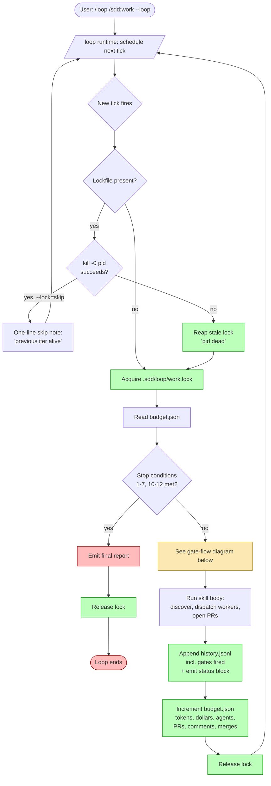
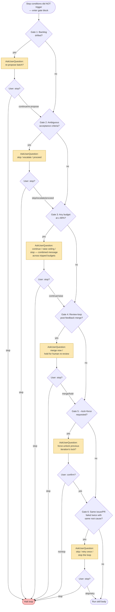

# Design: /loop Autonomous Mode for /sdd:work and /sdd:review

## Overview

ADR-0028 chose a skill-side `--loop` flag (Option 2) over status-quo manual wrapping, background-daemon mode, or pure runtime wrapping. This spec realizes that decision: the runtime `/loop` skill remains the re-invocation engine, and `/sdd:work` / `/sdd:review` enforce the autonomous-mode contract — stop conditions, concurrency, user-prompt gates, budget ceilings, and inter-iteration telemetry — on every tick.

The *how* is three on-disk artifacts per skill (`{skill}.lock`, `{skill}.budget.json`, `{skill}.history.jsonl` under `.sdd/loop/`), one PID-based liveness check that is the sole authority on lock staleness, six conservative `AskUserQuestion` gates that fire on every relevant tick (no debouncing), four declared budgets (iterations, distinct PRs, wall-clock minutes, dollar estimate) inclusive across the run, and a resume contract that restores counters from the most recent history line while recomputing fresh stop-condition and gate evaluations. The *why* is that Option 2 is the only option that preserves both ADR-0010's bounded-iteration invariant and the user-in-the-loop preference without redesigning `/loop` itself.

This is not a web surface. ADR-0018 security-by-default does not apply. All artifacts live under `.sdd/loop/` (covered by SPEC-0019's `.sdd/` gitignore entry).

## Architecture

The high-level flow has two halves: a control-flow loop (lockfile, budget, stop-condition evaluation, telemetry) and a gate block (the six `AskUserQuestion` gates). The two diagrams below are reproduced from ADR-0028 for reference; the spec preserves them as the canonical visual contract.

### Control flow



### Gate flow



## Lockfile and Concurrency

### Lockfile schema

`.sdd/loop/{skill}.lock` is JSON:

```json
{
  "pid": 12345,
  "iteration": 3,
  "started_at": "2026-05-09T14:50:00Z",
  "skill": "work"
}
```

Atomic write: the skill writes to `.sdd/loop/{skill}.lock.tmp` and renames over the target. POSIX rename guarantees atomicity on the same filesystem.

### PID-liveness check

POSIX path:

```
kill -0 <pid>     # exit 0 = alive (or running under a different user, treat as alive)
                  # exit 1 with ESRCH = dead (reap)
                  # exit 1 with EPERM = alive (we just lack signal permission)
```

Windows path: `OpenProcess(SYNCHRONIZE, FALSE, pid)` followed by `GetExitCodeProcess`; `STILL_ACTIVE` (259) means alive. Failure to open is treated as ambiguous (skip the iteration with a one-line warning) since `OpenProcess` can fail for permission reasons on a live process.

### Why PID liveness is the *sole* staleness signal

ADR-0028 is explicit on the two contradictions this retires:

1. **Worktrees are not lock state.** `skills/work/SKILL.md` Rules require "MUST preserve worktrees for failed issues — never auto-clean failures." Failed-issue worktrees can therefore long outlive the iteration that created them. Using worktree presence as a staleness signal would either (a) leak liveness info from older runs, falsely claiming the lock is held, or (b) require the loop to distinguish "this iteration's worktrees" from "older iterations' worktrees", which is exactly the kind of cleanup-state bookkeeping a lockfile is supposed to eliminate.

2. **Team membership is not lock state.** When `TeamCreate` fails, `/sdd:work` falls back to single-agent sequential mode (per `skills/work/SKILL.md` step 8 fallback path) where there are no team members to enumerate. Using team membership as a staleness signal would falsely claim the lock is stale during a perfectly healthy single-agent fallback iteration.

Worktrees and team membership are orthogonal cleanup state, not lock state. The lockfile's authority is the PID it records; PID liveness is the only signal the loop trusts.

### Stale-lock reaping

```
read lockfile → check kill -0 <pid>
  alive   → --lock=skip: emit "previous iter alive" note, return
            --lock=wait: poll until released or wall-clock budget exhausted
            --lock=force: fire force-unlock gate, then reap if confirmed
  dead    → reap (rm -f), then acquire fresh lock
  ambig.  → treat as alive (skip), emit one-line warning
```

## Budget Model

### `budget.json` schema

The schema is defined normatively in spec.md ("Budget Schema and Persistence"). Fields are written atomically (write-temp + rename) on every tick. The dollar estimate is the canonical spend signal; wall-clock alone is a poor proxy because a 4-agent iteration costs roughly 4× a single-agent iteration of the same duration.

### `history.jsonl` schema

Append-only JSON Lines. Each line corresponds to exactly one iteration (including iterations that were skipped due to lock contention — those carry `outcome: "skipped_lock"`). The `gates[]` array is the most important debug surface for "why did the loop stop?": every `AskUserQuestion` invocation across the iteration is captured verbatim, so a post-mortem can reconstruct user choices without replaying the run.

The line schema is enumerated normatively in spec.md ("Telemetry Schema"); the canonical example in ADR-0028 sub-decision "Telemetry and observability" remains representative.

### Multi-budget 80% gate batching

Pseudocode for the gate-batching algorithm (single firing, combined prompt):

```
tripped = []
if iterations_used + 1 >= 0.8 * max_iterations: tripped.append("iterations")
if len(prs_touched) + projected_new_prs >= 0.8 * max_prs and not single_pr_mode: tripped.append("prs")
if minutes_elapsed >= 0.8 * max_minutes: tripped.append("minutes")
if dollars_estimate + projected_iter_dollars >= 0.8 * max_dollars and max_dollars > 0: tripped.append("dollars")

if any(matches_100pct(t) for t in tripped):
    fire_stop_condition(t)   # 100% wins; gate is suppressed
elif tripped:
    prompt = combined_prompt(tripped)   # one AskUserQuestion call
    answer = ask(prompt, options=["continue", "raise", "stop"])
    record_gate("budget-escalation", prompt, answer)
    if answer == "stop": halt()
    elif answer == "raise": prompt_for_new_ceilings(tripped)
```

The 100%-wins rule keeps the failure mode unambiguous: a tick that simultaneously trips a 100% stop and an 80% gate halts at the stop condition rather than asking the user a question whose answer is moot.

### Rate-table sourcing

Priority order:

1. CLAUDE.md `### SDD Configuration` `### Loop Cost Rates` — a markdown subsection with rows like `| claude-opus-4-7 | 15.00 | 75.00 |` (USD per million input / output tokens). Per-project authoritative.
2. Built-in default table compiled into the plugin. The default values below are representative Anthropic per-model rates as of Q2 2026 — treat them as a starting point; sourcing path #1 is authoritative when the project declares per-model rates.

| Model | Input ($/Mtok) | Output ($/Mtok) |
|-------|----------------|------------------|
| claude-opus-4-7 | 15.00 | 75.00 |
| claude-sonnet-4-7 | 3.00 | 15.00 |
| claude-haiku-4-7 | 0.25 | 1.25 |

The chosen source is recorded in `budget.json.rate_table_source` (`"CLAUDE.md SDD config"` or `"built-in default"`) for auditability. **Note**: values may need refresh as rate cards evolve; the sourcing path is the durable contract.

## Resume Contract

### Restored vs. recomputed

| Restored from last `history.jsonl` line | Recomputed on resume entry |
|-----------------------------------------|----------------------------|
| `iterations_used`, iteration counter | Stop-condition evaluation for the next iteration |
| `prs_touched`, `comments_pushed`, `merges_attempted` | Gate evaluation for the next iteration (no replay) |
| `minutes_elapsed`, `tokens_in`, `tokens_out`, `agents_dispatched`, `dollars_estimate` | Per-iteration timestamp, elapsed-since-last-tick |
| `qmd_failures_consecutive` | Lockfile state (PID-liveness check + reap) |
| Recorded `gates[]` (audit only) | In-flight worktree / PR HEAD-SHA reconciliation |

The split principle: counters are durable; *judgments* are not. A user's "raise the ceiling" answer in a prior session was bound to that session's context; replaying it silently in a resumed session would let stale judgments rubber-stamp new work.

### Drift handling

For each open PR or active worktree referenced in the last history line:

```
recorded_sha = last_history_line.prs[i].head_sha
current_sha  = git ls-remote origin {branch} | head -1
if recorded_sha == current_sha:
    re-attach silently
else:
    fire AskUserQuestion(
      "PR #N has diverged since the prior iteration crashed — re-attach, skip, or stop the loop?",
      options=["re-attach", "skip", "stop"]
    )
```

Worktrees with no associated open PR are reported (one-line note per worktree) but never auto-cleaned, consistent with `skills/work/SKILL.md` Rules.

## qmd-Unreachable Detection Protocol

Wrapped skills (`/sdd:work`, `/sdd:review`) hard-fail on qmd outage per ADR-0024 sub-decision 2. The signal contract for the loop layer:

- **Sentinel stderr**: any line on stderr containing the literal token `qmd-unreachable`. The wrapped skill's qmd error path is already documented to surface this token via the `references/qmd-helpers.md` § "Error Handling" pattern.
- **Reserved exit code**: `EX_QMD_UNREACHABLE = 78` (chosen to match BSD `sysexits.h` `EX_CONFIG`, the closest semantic match: "configuration error" — qmd is the plugin's configured retrieval primitive).

Either signal is sufficient. The loop reads the wrapped skill's exit status first; on non-zero, it scans the stderr buffer for the sentinel as a fallback so the protocol is robust against subprocess wrappers that lose the exit code.

State machine: `qmd_failures_consecutive` is incremented when a tick exits with the qmd signal; reset to `0` on any successful tick. On increment to `2`, condition #11 fires and the loop halts with a user-facing message naming ADR-0024.

## AskUserQuestion Gate Catalog

| Gate | Trigger | Prompt template | Options | Resulting action |
|------|---------|-----------------|---------|------------------|
| Backlog Drift | Unblocked-issue set differs from prior iteration's snapshot | "Backlog changed since last iteration. Re-propose the next batch?" | `re-propose`, `continue`, `stop` | `re-propose`: re-run discovery this tick. `continue`: use prior plan. `stop`: halt. |
| Ambiguous Criteria | Issue lacks `### Acceptance Criteria` section or contains TBD/TODO | "Issue #N has ambiguous criteria. Skip, escalate, or proceed with my best interpretation?" | `skip`, `escalate`, `proceed`, `stop` | `skip`: drop from this iteration. `escalate`: leave a tracker comment requesting clarification. `proceed`: dispatch with best-effort interpretation. `stop`: halt. |
| Budget Escalation | One or more active budgets at ≥80% (combined message if multiple) | "Approaching {budget(s)} ({used}/{total} each). Continue, raise ceiling(s), or stop?" | `continue`, `raise`, `stop` | `continue`: proceed without changes. `raise`: prompt for new ceilings, update `budget.json`. `stop`: halt. |
| Post-Feedback Merge | `/sdd:review --loop` would merge a PR after responder addressed *human* feedback | "Responder addressed human feedback on PR #N. Merge now or hold for human re-review?" | `merge`, `hold`, `stop` | `merge`: invoke merge API. `hold`: leave PR with comments, do not merge this iteration. `stop`: halt. |
| Force-Unlock | `--lock=force` and lockfile present | "Force-unlock previous iteration's lock? This may corrupt in-flight work." | `yes`, `no`, `stop` | `yes`: reap lock and continue. `no`: skip this tick. `stop`: halt. |
| Repeated Failure | Same issue/PR failed in two consecutive iterations with the same root cause | "Issue/PR #N failed twice with: {root-cause}. Skip, retry once more, or stop the loop?" | `skip`, `retry`, `stop` | `skip`: defer #N for the rest of the run. `retry`: dispatch one more attempt. `stop`: halt. |

All six gates are re-evaluated on every tick. There is no debounce.

## Tradeoffs

- **Chattiness vs. autonomy.** Six gates can prompt several times per long run. The deliberate stance: chatty is the conservative default. Users who want quieter autonomy lower budgets so the loop ends sooner, rather than the plugin relaxing gates. Debouncing gates across iterations would be the obvious "less chatty" lever; the explicit choice not to debounce is documented here so a future contributor doesn't quietly add it.
- **Cost-tracking accuracy vs. complexity.** The dollar estimate is computed from token counts × per-model rates. Real Anthropic billing also includes prompt-caching discounts, vision tokens, and extended-thinking overhead — none of which are modeled. The estimate is conservative-by-construction (no caching discount applied), which is acceptable because the failure mode of an over-estimate is "stop the loop early"; the failure mode of an under-estimate is "overspend." We pick the safer bias.
- **Lock semantics under crash.** PID liveness handles the common crash path (process gone → reap on next tick). The pathological cases — PID reuse by an unrelated process, Windows ambiguous probe results — are handled by skipping the iteration with a warning. Worst case is a wasted tick; the system never corrupts.
- **Explicit choice to NOT debounce gates across iterations.** A user can answer the same gate ten times in a long run. The alternative — caching the answer — would let stale judgments accumulate, which is exactly the silent-novel-action risk that "skew conservative" is meant to avoid. We accept the chattiness.
- **Single-PR review mode is asymmetric.** `prs_touched` is informational there; `comments_pushed` and `merges_attempted` are the meaningful spend surface. We chose to keep the same `budget.json` schema across modes (rather than two separate schemas) so resume and inspection tooling can be uniform; the inactive dimensions are documented as such.

## Testing Strategy

ADR-0028 sub-decision "Confirmation" enumerates 9 integration tests (items 4-9 directly test loop behavior). Each becomes an eval scaffold under SPEC-0017 (skill evaluation and CI testing):

1. **PR-touch budget exhaustion** — `/loop /sdd:work --loop --max-iterations 5 --max-prs 1` against a fixture backlog with two ready stories; assert stop at iteration 2 with `prs_touched_budget` cause.
2. **Live-PID skip vs. dead-PID reap** — two parallel tests asserting the lockfile contention behavior under a live and dead PID respectively. Confirms PID liveness is the sole staleness signal.
3. **Six-gate sandbox** — fixture triggering each `AskUserQuestion` gate; assert the prompt text matches the spec catalog and each invocation appears in the next history line's `gates[]` array.
4. **qmd-unreachable persistence** — mock the wrapped skill to emit the `qmd-unreachable` sentinel for two consecutive iterations; assert condition #11 fires with the ADR-0024 remediation message. Parallel test with one transient failure followed by recovery; assert the counter resets.
5. **Cost-budget exhaustion** — `--max-dollars 0.01` against a non-zero workload; assert stop condition #12 fires with `dollars_estimate >= max_dollars` recorded.
6. **Resume after mid-iteration kill** — kill the loop process mid-flight; resume; assert (a) stale lockfile reaped, (b) open PR re-attached on matching HEAD or drift-gated on divergence, (c) counters resume from the last history line.

These integrate with SPEC-0017's CI scaffolding by registering as eval cases under `evals/loop/`. The fixture backlog and mock qmd are reusable across tests.

## Migration

None. `--loop` is a new flag on existing skills; absence of the flag preserves pre-existing behavior unchanged. No on-disk artifacts are created by skills running without `--loop`. No CLAUDE.md edits are required; the optional `### Loop Cost Rates` block is purely additive.

The plugin version bump (if any) is a routine minor release because there is no breaking change. v5.0.0 already shipped the qmd hard dependency that condition #11 piggybacks on; this spec lands on top of that baseline.

## Open Questions

These do not block this spec but should be tracked:

1. **Should `--lock=wait` poll the lock or use an OS-level wait primitive?** Polling is simpler and platform-uniform; OS waits (e.g., POSIX advisory locks via `flock`) are more efficient but add a portability surface. V1 implementation should poll at a small fixed interval (e.g., 5s); revisit if telemetry shows wait-mode is common enough to justify the optimization.
2. **Should the rate table support explicit "unknown model" handling?** A future Anthropic model not yet in the built-in table or CLAUDE.md would silently zero-cost. Probably the right answer is to record `"rate_table_source": "unknown-model"` and surface a one-line warning, but the contract is currently "the table is exhaustive"; revisit when a new model lands without a rate.
3. **Should `--max-prs` count *opened* PRs or *touched* PRs in `/sdd:work --loop`?** The spec says touched (deduplicated set). For `/sdd:work` this is effectively "opened" because workers always open new PRs, but a pathological case where the same iteration re-touches a PR (e.g., a foundation PR amended after merge) would consume the budget twice if counted naively. Current pseudocode dedups by PR identifier; revisit if telemetry shows the dedup is missing edge cases.
4. **Does `comments_pushed` count the responder's reply-to-comment messages or only top-level review comments?** The spec leaves this to the wrapped skill's existing instrumentation. `/sdd:review`'s reviewer / responder pair already has both kinds of comment activity; counting both gives a faithful spend proxy in single-PR mode. V1 should count both and document the choice.
5. **Should the loop persist a separate "last successful iteration" cursor for `/sdd:work` discovery to avoid re-running the full backlog query every tick?** Currently each tick re-runs discovery (Tier 4 sync per SPEC-0019). For 10+ iteration runs against a large backlog this is non-trivial cost. Probably worth a follow-up optimization once telemetry shows the cost; out of scope for V1.

## More Information

- ADR-0028 — the governing decision record this spec realizes.
- ADR-0010 / SPEC-0009 — the bounded-iteration invariant per PR that this spec preserves under loop wrapping.
- ADR-0017 / SPEC-0015 — the parallel-agent coordination semantics whose worktree and lockfile interactions this spec respects (in particular, the worktree-preservation rule that is the reason PID liveness is the sole staleness signal).
- ADR-0024 / SPEC-0019 — the qmd hard-dependency contract that condition #11 cites for the remediation message.
- ADR-0026 / SPEC-0019 — the tiered freshness model whose Tier 4 issues sync runs at the start of each iteration.
- ADR-0021 / SPEC-0017 — the eval / CI scaffolding under which this spec's testing strategy is implemented.
