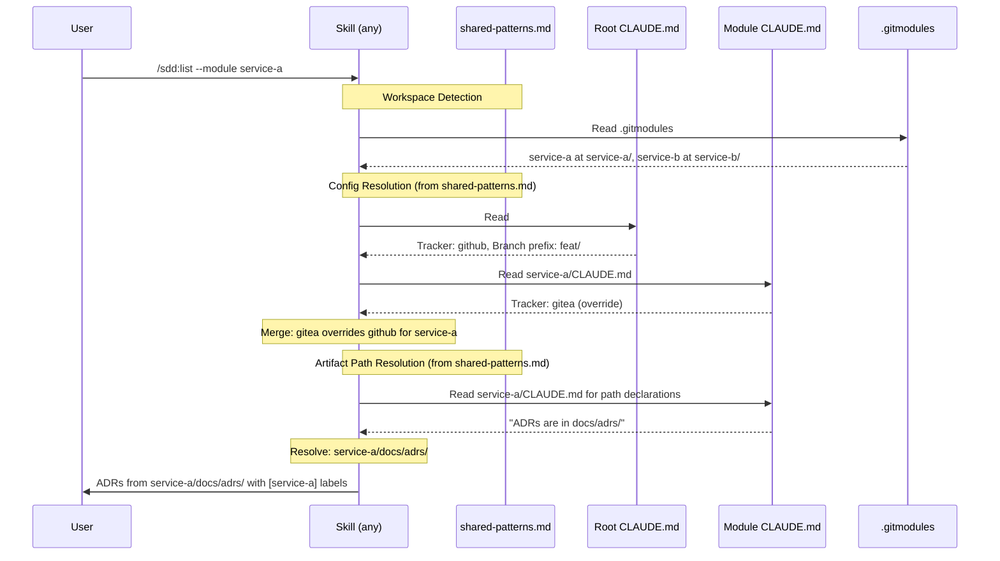
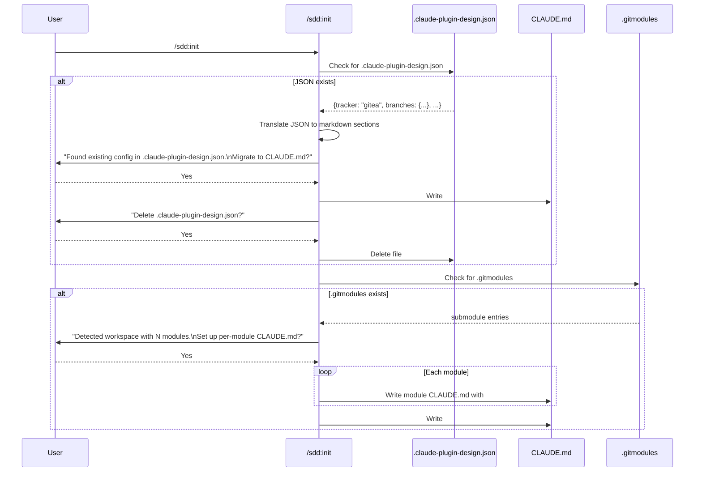

# Design: Markdown-Native Configuration and Workspace Mode

## Context

The SDD plugin stores runtime configuration in `.claude-plugin-design.json` -- tracker choice, branch conventions, PR conventions, worktree settings, and review settings. This creates a split source of truth with `CLAUDE.md`, which already carries architecture context and instructions interpreted natively by Claude Code. Three production projects (spotter, joe-links, claude-ops) demonstrated two concrete failures: split truth leading to unpredictable agent behavior, and guaranteed merge conflicts when parallel agents all modify the same JSON file.

Simultaneously, every skill hardcodes `docs/adrs/` and `docs/openspec/specs/` relative to a single project root. Multi-module projects (git submodules, monorepos) cannot use the plugin because skills silently operate on the wrong paths or miss artifacts entirely.

These two problems are coupled: workspace mode requires per-module configuration, and per-module configuration is trivially solved if configuration lives in `CLAUDE.md` -- because Claude Code already recursively loads `CLAUDE.md` from subdirectories.

Governing: SPEC-0014, ADR-0015 (Markdown-Native Configuration), ADR-0016 (Workspace Mode).

## Goals / Non-Goals

### Goals

- Eliminate `.claude-plugin-design.json` as a configuration source, consolidating all plugin config into `CLAUDE.md`
- Remove the #1 merge conflict source in parallel agent workflows
- Enable multi-module workspace support through Claude Code's recursive `CLAUDE.md` loading
- Provide a smooth migration path for existing users with `.claude-plugin-design.json`
- Make artifact path resolution dynamic instead of hardcoded
- Allow module-scoped operations across all skills

### Non-Goals

- Supporting non-git multi-module layouts (e.g., npm workspaces without git submodules) in this iteration
- Creating a custom config parser or schema validator for CLAUDE.md sections
- Changing the format or content of ADRs, specs, or other design artifacts
- Supporting cross-module artifact references (e.g., a spec in module A referencing an ADR in module B)
- Automatically syncing configuration across module CLAUDE.md files

## Decisions

### CLAUDE.md as the Sole Configuration Source

**Choice**: All configuration lives in structured markdown sections within `CLAUDE.md`, using `### SDD Configuration` as the section heading with `####` subsections for each config area.

**Rationale**: Claude Code already loads `CLAUDE.md` natively and interprets its contents as instructions. JSON added false determinism -- the values are interpreted by an LLM either way. Moving config into `CLAUDE.md` eliminates split truth, removes the merge conflict hotspot, and gives workspace support for free through recursive loading. The markdown format is also human-readable and diffable without tooling.

**Alternatives considered**:
- YAML config file: Still split truth, still a merge conflict target, adds YAML footguns
- TOML config file: Cleaner than JSON but still split truth, unfamiliar to many developers
- JSON Schema validation on existing file: Addresses validation but not split truth or merge conflicts

### .gitmodules as Primary Module Discovery

**Choice**: Parse `.gitmodules` for automatic submodule discovery; CLAUDE.md `### Workspace Modules` table as fallback.

**Rationale**: `.gitmodules` is the git-native source of truth for submodules. Parsing it avoids requiring users to manually declare modules in CLAUDE.md. The CLAUDE.md table serves as fallback for non-submodule multi-module layouts (future) and as human-readable documentation of the workspace structure.

**Alternatives considered**:
- CLAUDE.md-only module declaration: Requires manual maintenance; users would forget to update it when adding submodules
- Scan for nested `CLAUDE.md` files: Fragile; would pick up unrelated CLAUDE.md files in vendor directories or test fixtures
- Package manager workspace detection (npm/go/cargo): Too language-specific; git submodules are universal

### Artifact Path Resolution via CLAUDE.md Declarations

**Choice**: Skills read artifact paths from CLAUDE.md sentences like `- Architecture Decision Records are in docs/adrs/`, falling back to hardcoded defaults if undeclared.

**Rationale**: This leverages the existing pattern that `/sdd:init` already writes these declarations into CLAUDE.md. The plugin's own `CLAUDE.md` template already includes `- Architecture Decision Records are in docs/adrs/` and `- Specifications are in docs/openspec/specs/`. Making skills read these declarations instead of hardcoding the paths requires minimal change and supports custom layouts.

**Alternatives considered**:
- Dedicated config keys (e.g., `- **ADR Path**: architecture/decisions/`): Adds yet another config format; the existing natural-language declarations are already present and sufficient
- Convention-only (scan for `ADR-*.md` files anywhere): Too slow on large repos; ambiguous when multiple matches exist

### shared-patterns.md as the Canonical Pattern Source

**Choice**: Config Resolution and Artifact Path Resolution patterns live in `references/shared-patterns.md` alongside existing patterns (Tracker Detection, Severity Assignment, etc.). Skills reference these patterns by heading.

**Rationale**: This is the established pattern distribution mechanism in the plugin. Skills already reference `shared-patterns.md` for Tracker Detection, Team Handoff Protocol, and other cross-cutting patterns. Adding two more patterns follows the existing architecture.

**Alternatives considered**:
- Inline patterns in each skill: Duplication; already rejected when shared-patterns.md was created
- Separate `config-patterns.md` file: Unnecessary fragmentation; shared-patterns.md is the right home

### Module Override Semantics

**Choice**: Module-level CLAUDE.md config overrides root-level config (deepest wins). Missing keys at the module level inherit from the root.

**Rationale**: This mirrors how Claude Code's recursive CLAUDE.md loading works conceptually -- deeper files add specificity. A submodule that uses a different tracker than the root project needs only to declare the tracker override in its CLAUDE.md; all other settings inherit from root. This keeps per-module CLAUDE.md files minimal.

**Alternatives considered**:
- Root-level config only (no module overrides): Too rigid; real-world multi-module projects often have modules deployed to different platforms with different trackers
- Full config required per module: Too verbose; most modules share the same branch conventions and review settings

## Architecture

```mermaid
flowchart TD
    subgraph "Config Resolution Pattern"
        START["Skill needs config"] --> CHECK_MOD{"--module flag?"}
        CHECK_MOD -->|Yes| READ_MOD["Read module CLAUDE.md\n### SDD Configuration"]
        CHECK_MOD -->|No| CHECK_WS{"Workspace detected?"}
        CHECK_WS -->|Yes| READ_ALL["Read root + all module CLAUDE.md"]
        CHECK_WS -->|No| READ_ROOT["Read root CLAUDE.md\n### SDD Configuration"]

        READ_MOD --> MERGE["Merge: module overrides root"]
        READ_ALL --> AGG["Aggregate per-module configs"]
        READ_ROOT --> DEFAULTS["Apply defaults for missing keys"]

        MERGE --> DEFAULTS
        AGG --> DEFAULTS
        DEFAULTS --> RESULT["Resolved config"]
    end

    subgraph "Artifact Path Resolution Pattern"
        ART_START["Skill needs artifact paths"] --> ART_READ["Read module CLAUDE.md"]
        ART_READ --> ART_FIND{"Finds path declarations?"}
        ART_FIND -->|"'ADRs are in X'"| ART_CUSTOM["Use declared path\nrelative to module root"]
        ART_FIND -->|Not found| ART_DEFAULT["Use defaults:\ndocs/adrs/\ndocs/openspec/specs/"]
    end

    subgraph "Workspace Detection"
        WS_START["Skill starts"] --> WS_GIT{".gitmodules exists?"}
        WS_GIT -->|Yes| WS_PARSE["Parse .gitmodules\nExtract name + path"]
        WS_GIT -->|No| WS_MD{"CLAUDE.md has\n### Workspace Modules?"}
        WS_MD -->|Yes| WS_TABLE["Parse markdown table\nExtract Module, Path"]
        WS_MD -->|No| WS_SINGLE["Single-module mode\nOperate on project root"]
        WS_PARSE --> WS_MODULES["Module list with paths"]
        WS_TABLE --> WS_MODULES
    end
```

### Component Interaction

### Migration Flow

## Risks / Trade-offs

- **No schema validation** -- Typos in CLAUDE.md config keys (e.g., "Brunch Conventions" instead of "Branch Conventions") will silently produce default behavior instead of erroring. Mitigation: Claude's natural language understanding tolerates minor variations; `/sdd:init` writes the canonical format; `/sdd:check` could optionally lint config sections in a future iteration.
- **CLAUDE.md coupling** -- The plugin becomes coupled to Claude Code's `CLAUDE.md` convention. If Claude Code changes its file loading behavior, the plugin must adapt. Mitigation: `CLAUDE.md` is a stable, well-documented convention; the plugin already depends on it for architecture context.
- **Module discovery limitations** -- `.gitmodules` parsing covers git submodules but not npm workspaces, Go modules, or Cargo workspaces. Mitigation: the CLAUDE.md fallback table supports any layout; language-specific discovery can be added in future iterations.
- **Migration friction** -- Existing users must run `/sdd:init` to migrate from JSON to CLAUDE.md. Mitigation: the migration is one-time, automated, and preserves all values exactly; skills could also emit a deprecation warning if they detect `.claude-plugin-design.json` during normal operation.
- **Config merge complexity** -- Module-level overrides with root-level inheritance could produce surprising behavior if users forget which level a setting is defined at. Mitigation: `/sdd:prime` will show the resolved config per module, making the effective configuration visible.

## Migration Plan

### Phase 1: Shared Patterns Update

1. Add "Config Resolution" pattern to `references/shared-patterns.md`
2. Add "Artifact Path Resolution" pattern to `references/shared-patterns.md`
3. Update existing "Tracker Detection" pattern to check CLAUDE.md first, then fall back to auto-detection
4. Deprecate (but do not yet remove) the "Config Schema (`.claude-plugin-design.json`)" section

### Phase 2: Init Overhaul

5. Update `/sdd:init` to write `### SDD Configuration` sections in CLAUDE.md instead of `.claude-plugin-design.json`
6. Add JSON-to-CLAUDE.md migration flow to `/sdd:init`
7. Add `.gitmodules` detection and workspace setup to `/sdd:init`

### Phase 3: Skill Migration (Read-Only Skills First)

8. Update `/sdd:prime` to use Config Resolution and Artifact Path Resolution patterns, aggregate across modules
9. Update `/sdd:list` and `/sdd:status` to use Artifact Path Resolution, add module labels
10. Update `/sdd:check` to use both patterns, support `--module` flag
11. Update `/sdd:audit` to use both patterns, aggregate cross-module

### Phase 4: Skill Migration (Write Skills)

12. Update `/sdd:adr` and `/sdd:spec` to use Artifact Path Resolution, accept `--module` flag
13. Update `/sdd:plan`, `/sdd:work`, `/sdd:review` to use Config Resolution
14. Update `/sdd:organize` and `/sdd:enrich` to use Config Resolution
15. Update `/sdd:discover` to use Artifact Path Resolution per module
16. Update `/sdd:docs` to aggregate across modules

### Phase 5: Cleanup

17. Remove "Config Schema (`.claude-plugin-design.json`)" section from `shared-patterns.md`
18. Remove all remaining references to `.claude-plugin-design.json` from skill files
19. Update CLAUDE.md template in `/sdd:init` to reflect the new config structure

### Rollback Strategy

If issues arise during migration:
- Skills can detect both CLAUDE.md config sections and `.claude-plugin-design.json` simultaneously, preferring CLAUDE.md when present
- The JSON file is not deleted until the user confirms, so reverting is as simple as removing the CLAUDE.md config sections
- No destructive changes are made to existing artifacts (ADRs, specs) during migration

## Open Questions

- Should `/sdd:check` lint the CLAUDE.md configuration sections for format correctness (e.g., missing bold keys, wrong subsection headings)?
- Should the plugin support a `.claude-plugin-design.json` compatibility mode for a deprecation period, reading JSON as fallback when CLAUDE.md config is absent?
- For monorepos that are not git submodules (e.g., npm workspaces, Go multi-module), what is the right detection heuristic for the CLAUDE.md fallback table?
- Should cross-module artifact references be supported (e.g., a spec in module A citing an ADR in module B), and if so, what is the reference syntax?
