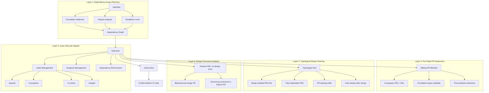
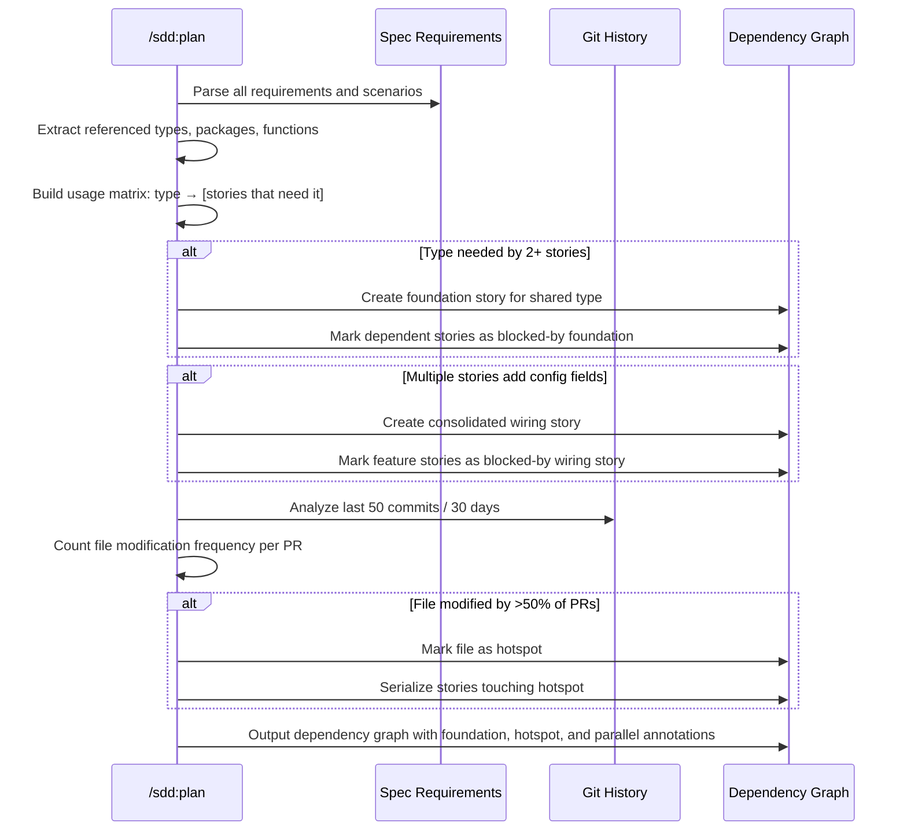
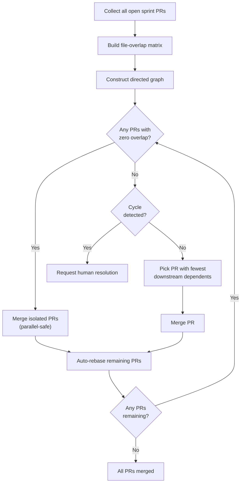

# Design: Parallel Agent Coordination

## Context

The SDD plugin's `/sdd:work` skill spawns multiple agents to implement sprint stories in parallel using git worktrees. A review of three production projects (spotter, joe-links, claude-ops) revealed that uncoordinated parallel execution causes systemic failures: duplicate code, rebase churn, wasted PRs, and — in the worst case — conflict markers merged into main.

The evidence is consistent across all three repos:

- **spotter**: `nopHandler` struct implemented independently in two packages; LLM client code (`ChatRequest`/`ChatResponse`, `callOpenAI()`) duplicated across 4 packages (181 lines removed in cleanup PR 171); PR 144 required merge-conflict-resolution commits after 5 other PRs merged; `cmd/server/main.go` and `internal/config/config.go` were hotspot files touched by 60-70% of PRs.
- **joe-links**: `PublicLink` struct created independently in PRs 112 and 114; `link_store.go` modified by 6 concurrent PRs; PRs 142-144 all closed without merging and recreated as 145-147 (100% wasted effort).
- **claude-ops**: Conflict markers (`<<<<<<<`, `=======`, `>>>>>>>`) merged into `main` in `api_handlers.go`; `.claude-plugin-design.json` modified by all 7 parallel PRs (guaranteed conflicts); 78 concurrent PRs launched in one sprint.

Zero assignees, zero lifecycle labels, and zero machine-readable dependency signals were found across all three repos.

Governing: SPEC-0015, ADR-0017, ADR-0020.

## Goals / Non-Goals

### Goals

- Eliminate duplicate code across parallel agents by detecting shared dependencies before work begins
- Prevent merge conflicts through hotspot serialization and file-level coordination
- Enforce a sustainable parallelism cap backed by empirical evidence (4 agents, not 8+)
- Provide machine-readable lifecycle tracking so agents and humans know what is in flight
- Compute optimal merge ordering to minimize rebase churn
- Isolate design document modifications to prevent guaranteed-conflict files from polluting feature PRs
- Gate PR approval on absence of conflict markers

### Non-Goals

- Replacing git's merge/rebase mechanisms with a custom merge engine
- Automatically resolving merge conflicts (agents request human intervention)
- Managing cross-repository coordination (scope is single-repo sprints)
- Enforcing code style or linting (covered by SPEC-0016)
- Modifying the review agent pair protocol from SPEC-0009 (conflict-marker gate is additive)

## Decisions

### Foundation Detection via Static Requirement Analysis

**Choice**: `/sdd:plan` performs static analysis of spec requirements to identify shared types and packages before decomposing into stories.

**Rationale**: The duplicate-code failures (spotter's `nopHandler`, joe-links' `PublicLink`) all share one root cause: multiple stories independently created the same abstraction because no story was responsible for creating it first. Foundation detection front-loads shared dependency creation into explicit, labeled stories that merge before feature work begins. This is cheaper than detecting duplicates during review (where one PR must be rewritten) or after merge (where cleanup PRs add noise).

**Alternatives considered**:
- **Post-hoc deduplication in review**: Catches duplicates too late; one agent's work is wasted. In spotter, PR 171 removed 181 lines of duplicate code that should never have been written.
- **Shared code registry file**: Adds a coordination artifact that itself becomes a conflict source — the same problem as `.claude-plugin-design.json` in claude-ops.
- **Agent-to-agent chat during implementation**: Requires synchronous coordination between parallel agents; defeats the purpose of parallelism and adds token cost with uncertain reliability.

### Hotspot Serialization Over Optimistic Parallelism

**Choice**: Files modified by >50% of recent PRs are classified as hotspots; stories touching them are serialized.

**Rationale**: In joe-links, `link_store.go` was modified by 6 concurrent PRs — every single one required rebase. In claude-ops, `.claude-plugin-design.json` was modified by all 7 PRs. Serializing stories that touch these files eliminates the rebase cascade at the cost of slightly longer wall-clock time for those stories. The tradeoff is favorable: 3 serial PRs that each merge cleanly beat 3 parallel PRs that each require 2 rebases.

**Alternatives considered**:
- **File locking**: Not supported by git; would require a custom coordination server.
- **Optimistic parallelism with auto-rebase**: What the current system does. Evidence shows it fails: joe-links PRs 142-144 were all closed and recreated.
- **God-file refactoring as prerequisite**: Correct long-term, but cannot be imposed on every project. Hotspot detection works regardless of code quality.

### Hard Cap at 4 Concurrent Agents

**Choice**: Default maximum of 4 concurrent agents, configurable via CLAUDE.md.

**Rationale**: Empirical evidence from all three repos shows that 8+ concurrent PRs cause failures. claude-ops launched 78 concurrent PRs in one sprint — an extreme example, but even spotter's 8 concurrent PRs produced 4 merge-conflict commits and 2 confirmed duplicate implementations. The cap of 4 is derived from observing that batches of 3-4 PRs in spotter and joe-links had materially fewer conflicts than larger batches. Making it configurable allows advanced users to tune based on their codebase's characteristics (e.g., highly modular repos with no hotspots could safely increase to 6).

**Alternatives considered**:
- **No cap (status quo)**: Proven to fail. 78 concurrent PRs is not a coordination problem; it is an absence of coordination.
- **Cap of 2**: Too conservative; projects with well-separated modules (e.g., independent microservices) can safely run 4+ agents.
- **Dynamic cap based on hotspot count**: Appealing but adds complexity. A static default with override is simpler and sufficient.

### Lifecycle Labels Over Status Fields

**Choice**: Use tracker labels (`queued`, `in-progress`, `in-review`, `merged`) rather than custom status fields.

**Rationale**: Labels are universally supported across GitHub Issues, Gitea, GitLab, and Linear. Custom status fields require tracker-specific API knowledge. Labels are visible in issue list views without clicking into the issue, making sprint dashboards immediately readable. The four-state lifecycle maps directly to the work phases: waiting, coding, PR open, PR merged.

**Alternatives considered**:
- **Tracker-native status fields**: Not available on GitHub Issues or Gitea; would require tracker-specific branching logic.
- **Comment-based status**: Machine-parseable but invisible in list views; requires reading each issue to determine state.
- **External state file**: Same conflict problem as `.claude-plugin-design.json`.

### Pre-Flight Manifest Injection

**Choice**: Inject a structured markdown manifest into each agent's context before coding begins.

**Rationale**: Agents cannot coordinate if they do not know what sibling agents are doing. The manifest is a read-only context injection — it does not require agent-to-agent communication or shared mutable state. The information is gathered from tracker labels (what is in-progress), PR diffs (what files are being modified), and foundation PR contents (what types are available). This is the same information a human developer would gather from a standup meeting.

**Alternatives considered**:
- **Shared workspace with real-time file watching**: Violates git worktree isolation; agents would step on each other's files.
- **Central coordination agent**: Adds a bottleneck agent that must stay alive for the duration of all parallel work; single point of failure.
- **Post-implementation deduplication**: Too late. In spotter, 181 lines of duplicate code were written before anyone noticed.

### Topological Sort for Merge Ordering

**Choice**: Compute merge order via topological sort on a file-overlap dependency graph.

**Rationale**: Merging PRs in the wrong order causes cascading rebases. The optimal order minimizes the total number of rebases by merging isolated PRs first, then building outward. The algorithm is a standard topological sort on a directed graph where edges represent "PR A should merge before PR B because B modifies files that A also modifies and A has fewer total modifications."

**Alternatives considered**:
- **FIFO merge order**: Simple but produces unnecessary rebases. In spotter, merging PR 144 (touches everything) first would have forced rebases on all 4 remaining PRs.
- **Manual merge ordering**: Does not scale; the user would need to analyze file overlaps manually for every sprint.
- **Merge queue (GitHub-native)**: Only available on GitHub with specific plan tiers; not portable to Gitea or GitLab.

### Design Document Isolation via Batched Post-Merge PR

**Choice**: Feature PRs must not modify spec/ADR/config files; all design doc updates are batched into a single post-merge PR.

**Rationale**: In claude-ops, `.claude-plugin-design.json` was modified by every single PR — guaranteed merge conflicts on every rebase. Spec and ADR files were similarly touched by 5-7 PRs simultaneously. The root cause is that each agent believed it was responsible for updating design docs. The fix is architectural: no feature agent touches design docs, and a single consolidation step handles all updates after feature work is complete. Governing comments (per ADR-0020) are the exception — they belong in the implementing PR because they annotate the code being written.

**Alternatives considered**:
- **Lock design doc files**: git does not support file-level locking; would require a coordination server.
- **First-writer-wins with rebase**: The current behavior. Produces the exact failures observed in claude-ops.
- **Separate design doc branches per agent**: Multiplies the number of PRs without reducing conflicts at merge time.

## Architecture

### Five-Layer Coordination System



### Foundation Detection Algorithm



The foundation detection algorithm works in three passes:

1. **Type extraction pass**: Parse each spec requirement and its scenarios for references to types, structs, interfaces, packages, and helper functions. Build a map of `identifier -> [stories that reference it]`. Any identifier referenced by 2+ stories becomes a foundation candidate.

2. **Config/wiring pass**: Identify stories that add configuration fields (config struct modifications) or server wiring (route registration, middleware chains). If 2+ stories touch the same config struct or wiring file, consolidate into a single wiring foundation story.

3. **Hotspot pass**: Query `git log --name-only` for recent commits. Count how many distinct PRs (or commits if PRs are not trackable) modified each file. Files exceeding the threshold are marked as hotspots. Stories touching hotspot files are linked with serial-dependency edges instead of parallel edges.

### Pre-Flight Manifest Structure

The manifest injected into each agent's context before coding begins follows this structure:

```markdown
## Active Sprint Context

This issue is part of Epic #268 ({Epic Title}).
Sprint parallelism: 3 of 4 agents active (1 queued).

### In-Progress Sibling PRs
| PR | Issue | Files Being Modified |
|----|-------|---------------------|
| #282 | #272 | internal/handlers/params.go, errors.go, htmx.go |
| #283 | #273 | internal/handlers/auth_helpers.go, loaders.go |

### Files to AVOID Modifying
- internal/handlers/params.go (PR #282)
- internal/handlers/errors.go (PR #282)
- internal/handlers/htmx.go (PR #282)
- internal/handlers/auth_helpers.go (PR #283)
- internal/handlers/loaders.go (PR #283)

### Shared Types Available (from foundation/merged PRs)
- `store.PublicLink` in internal/store/link_store.go (foundation PR #281, merged)
- `ParseIntParam()` in internal/handlers/params.go (PR #282, in-progress)
- `HTTPError` in internal/handlers/errors.go (PR #282, in-progress)

### Dependency Status
- Foundation PR #281: merged
- Blocking issues: none
```

The manifest is assembled by:
1. Querying the tracker for all issues in the current sprint/epic with `in-progress` or `in-review` labels.
2. For each in-progress PR, reading the PR diff to extract modified file paths.
3. For foundation PRs (merged), reading their diffs to extract exported types and functions.
4. For in-progress sibling PRs, reading their diffs to extract new type/function definitions that other agents should import rather than recreate.

### Topological Merge Sort Algorithm



The algorithm:

1. **Build overlap matrix**: For each pair of PRs (A, B), compute `overlap(A, B)` = the set of files modified by both. If `overlap(A, B)` is non-empty, A and B have a dependency.

2. **Construct directed graph**: For each overlapping pair, add an edge from the PR with fewer total modifications to the PR with more. Rationale: the smaller, more focused PR should merge first because it is less likely to cause widespread rebase failures.

3. **Topological sort**: Process the graph in topological order. PRs with zero incoming edges (no dependencies) are merged first. After each merge, trigger auto-rebase of all remaining PRs and recompute the overlap matrix (since rebased PRs may have resolved some overlaps).

4. **Cycle handling**: If the graph contains a cycle (A should merge before B, B should merge before A), report the cycle to the user with the specific files causing the conflict and request manual ordering.

5. **PR stacking offer**: When a direct dependency exists (B requires types from A), offer to rebase B's branch onto A's branch instead of main. This eliminates the rebase cascade entirely for that pair.

### Conflict-Marker Gate

The conflict-marker CI gate in `/sdd:review` is a pre-review check that runs before any code quality or spec compliance analysis:

1. Retrieve the full PR diff.
2. Scan every file in the diff for the patterns: `<<<<<<<`, `=======` (7 consecutive equals signs at line start), `>>>>>>>`.
3. If any match is found, immediately reject the PR with file paths and line numbers.
4. Only if the gate passes does the normal review process continue.

This is deliberately a hard gate with no override. Evidence: in claude-ops, conflict markers were merged into `main` in `api_handlers.go` and required a follow-up cleanup commit. The cost of a false positive (rejecting a PR that legitimately contains these character sequences) is far lower than the cost of a false negative (merging conflict markers into main).

## Risks / Trade-offs

- **Foundation detection false positives** -- The algorithm may create foundation stories for types that end up being used by only one feature story. Mitigation: foundation stories are small by definition (extract a type/package, not implement a feature); the cost of an unnecessary foundation story is low compared to the cost of duplicate code cleanup.
- **Hotspot serialization slows sprints** -- Serializing stories that touch hotspot files increases wall-clock time. Mitigation: hotspot serialization only applies to the subset of stories touching those files; other stories still run in parallel. The alternative (parallel execution with repeated rebases) is empirically slower due to wasted work.
- **Parallelism cap frustrates users with modular codebases** -- A cap of 4 may be too conservative for repos with zero file overlap between stories. Mitigation: the cap is configurable via CLAUDE.md; the default is a safe floor, not a hard ceiling.
- **Pre-flight manifest staleness** -- The manifest is a snapshot taken before work begins; if a sibling PR merges during work, the manifest is stale. Mitigation: the manifest is conservative (avoid files, import types) so staleness causes unnecessary caution, not incorrect behavior. Dynamic manifest updates can be added in a future iteration.
- **Topological sort does not handle semantic dependencies** -- The file-overlap heuristic misses dependencies that are semantic (function signature change) rather than file-level. Mitigation: foundation detection handles the common case (shared types); the topological sort handles the file-level case; semantic dependencies that span files with zero overlap are rare and can be caught during review.
- **Design document isolation delays spec updates** -- Specs are not updated until after all feature PRs merge, creating a temporary drift window. Mitigation: governing comments in feature PRs provide traceability during the drift window; the batched post-merge PR closes the window promptly.

## Migration Plan

1. **Phase 1 -- Plan skill update**: Add foundation detection, hotspot analysis, and parallelism cap to `/sdd:plan`. Existing sprint plans are unaffected; the new features only activate on subsequent `/sdd:plan` runs.
2. **Phase 2 -- Work skill update**: Add lifecycle labels, pre-flight manifest injection, dependency enforcement, topological merge ordering, auto-rebase, design document isolation, and queue management to `/sdd:work`. Existing worktrees are unaffected; new work sessions use the updated coordination.
3. **Phase 3 -- Review skill update**: Add conflict-marker CI gate to `/sdd:review`. This is additive and does not change existing review behavior for clean PRs.
4. **Phase 4 -- Shared patterns**: Add "Foundation Story Detection", "Pre-Flight PR Awareness", and "Topological Merge Ordering" patterns to `references/shared-patterns.md` for use by other skills.

No data migration is required. Existing projects gain coordination features on the next `/sdd:plan` or `/sdd:work` invocation.

## Open Questions

- Should the pre-flight manifest be refreshed mid-implementation if a sibling PR merges, or is a one-time snapshot sufficient for v1?
- Should hotspot analysis weight recent PRs more heavily than older ones (e.g., exponential decay), or is a flat window sufficient?
- Should the topological sort incorporate PR review complexity (lines changed, number of files) as a secondary sort key, or is file-overlap sufficient?
- Should `/sdd:work` emit a post-sprint coordination report summarizing: total rebases triggered, PRs queued due to dependencies, foundation stories created, and hotspot serialization events?
