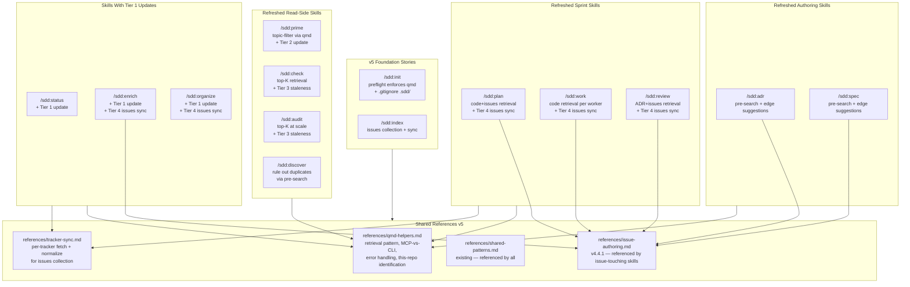

# Design: qmd-Native Skills

## Context

Three ADRs landed in v4.4.0 (proposed) defining the v5.0.0 architecture: ADR-0024 (qmd as a hard dependency), ADR-0025 (tracker issues as a fourth qmd collection), and ADR-0026 (tiered index freshness strategy). Each ADR makes a single architectural commitment; this spec realizes all three by enumerating the per-skill behavioral requirements that the implementation sprint must satisfy.

The current shape of the plugin treats qmd as an optional accelerator. `/sdd:index` (introduced in v4.3.0) creates per-repo collections, but every other read-side skill (`/sdd:prime`, `/sdd:check`, `/sdd:audit`, `/sdd:discover`) still scans the full ADR + spec corpus on every invocation. Authoring skills (`/sdd:adr`, `/sdd:spec`) ask the user to declare frontmatter edges (per the graph from SPEC-0018) without surfacing candidate matches. Sprint skills (`/sdd:plan`, `/sdd:work`, `/sdd:review`) are unaware of existing code patterns and unaware of recent tracker activity beyond what they explicitly query at dispatch time. Each of these is a missed opportunity to leverage hybrid retrieval; collectively they justify the v5.0.0 breaking change.

This spec is the single coordination point between the three ADRs and the implementation sprint that follows. `/sdd:plan SPEC-0019` will break it into ~12-16 stories spanning two new shared references (qmd-helpers, tracker-sync), one foundation story (the issues-collection sync), one migration story (`/sdd:init` enforcement + version bump), and one feature story per refreshed skill.

## Goals / Non-Goals

### Goals

- Make every appropriate read-side skill use hybrid retrieval as the default retrieval primitive — not as a fallback or optional accelerator
- Make authoring skills (`/sdd:adr`, `/sdd:spec`) suggest frontmatter graph edges (per SPEC-0018) by pre-searching the corpus
- Make sprint skills (`/sdd:plan`, `/sdd:work`, `/sdd:review`) aware of existing code and existing issues so stories are framed accurately and duplicate-implementation drift is reduced
- Land the four-tier freshness model (ADR-0026) so the index stays honest without per-call user friction
- Establish two new shared references (`qmd-helpers.md`, `tracker-sync.md`) that absorb the cross-cutting concerns and prevent each consumer skill from reinventing the patterns
- Preserve the user-explicit-action invariant: every cross-system mutation still gets either explicit user invocation or AskUserQuestion confirmation. qmd integration changes the *how*, not the consent model

### Non-Goals

- Tier 5 (scheduled background sync) — explicitly out of scope; deferred to v5.1+ after the V1 baseline produces evidence
- A native qmd MCP for write operations (collection-add, embed, etc.) — that's an upstream qmd feature request, not in this spec
- Cross-repo semantic queries — siloed per-repo today; future work
- Modifying the qmd CLI itself — we consume its current API surface
- Removing the optional fallback paths that previously qmd-aware skills had — there are none; the consumer skills built around qmd availability assumption (per ADR-0024) ship that way from the start in v5.0.0

## Architecture

### High-level dependency layout

### Cross-cutting components

**`references/qmd-helpers.md`** — the single source of truth for how the plugin talks to qmd. Sections:

- **MCP-vs-CLI** — prefer the qmd MCP `mcp__plugin_qmd_qmd__*` tools when loaded (declarative, no shell invocation cost); fall back to the `qmd` CLI when MCP is not loaded. Both surfaces talk to the same `~/.cache/qmd/index.sqlite`, so swapping is transparent for read operations. Write operations (collection-add, embed, update, context-add) are CLI-only today.
- **Hybrid Retrieval** — canonical pattern for top-K retrieval: construct a query document with `lex` + `vec` sub-queries, send via MCP `query` tool (or CLI `qmd query --json`), parse the result format, treat results below threshold (~0.3) as non-matches.
- **This-Repo Collection Identification** — exact-prefix match on collection names. A collection belongs to this repo iff its name equals `{slug}-adrs`, `{slug}-specs`, `{slug}-code`, `{slug}-issues`, OR `{slug}-{module}-{kind}` in workspace mode. Substring match would falsely claim sibling-repo collections.
- **Error Handling** — qmd timeout (5s default for queries; longer for rerank), qmd-not-running (start daemon if HTTP mode configured; otherwise CLI), no-collections-for-this-repo (route to `/sdd:index`), partial-embedding (degrade to BM25-only with a one-line note).
- **Update Patterns** — Tier 1 narrow update for mutating skills (per-collection scope where qmd supports it; full update otherwise). Tier 2/3 silent updates with timestamp checks.

**`references/tracker-sync.md`** — the single source of truth for syncing tracker issues into `.sdd/issues/`. Sections:

- **Per-tracker fetch and normalize** — one section per supported tracker (GitHub, Gitea, GitLab, Jira, Linear, Beads, tasks.md). Each section documents the fetch command, incremental cursor mechanism, response shape, and the normalization to the canonical frontmatter schema.
- **Frontmatter schema** — copy of the schema defined in ADR-0025 sub-decision 2, with field-by-field requirements.
- **Sync triggering** — when consumer skills should sync (always at entry for sprint skills, with the 5-minute dedup window).
- **Cursor management** — `.sdd/issues/_meta.json` schema and update protocol.
- **Failure modes and degradation** — rate-limit handling, retry/backoff, fallback to live tracker queries on persistent failure.

### Per-skill refresh shape

Every refreshed skill follows the same retrofit pattern:

1. **Replace corpus-scanning prelude** — wherever the skill currently does "read every ADR / every spec / every issue", replace with a call into `qmd-helpers.md` § Hybrid Retrieval scoped to the skill's question.
2. **Add freshness logic** — Tier 2 for `/sdd:prime` only; Tier 3 for `/sdd:check`, `/sdd:audit`, `/sdd:discover`; Tier 4 for sprint skills (always sync issues at entry).
3. **Add Tier 1 mutation update** — for skills that write artifacts or merge code/issues, append a `qmd update` call (via qmd-helpers patterns) before returning.
4. **Surface freshness state** — one-line note in the report when the index was refreshed, when chunks remain unembedded, when a sync happened.
5. **Remove fallback** — the pre-v5 "scan everything" path is removed. If a repo isn't indexed, the skill stops and points to `/sdd:index`.

This pattern is mechanical enough that the per-skill stories from `/sdd:plan SPEC-0019` should be similarly sized (medium, ~250-450 line PR each).

## Key Design Decisions

### Why a single spec rather than per-skill specs

Each refreshed skill is small individually, but the *coordination* between them — sharing the qmd-helpers reference, agreeing on freshness tiers, agreeing on the issues-collection schema — is the load-bearing work. Splitting into per-skill specs would force each spec to re-derive the cross-cutting decisions, leading to drift. One spec per ADR (three specs) was the alternative; rejected because the implementation work crosses ADR boundaries (every refreshed skill consumes all three ADRs' decisions).

### Why qmd-helpers and tracker-sync as references, not as new skills

Skills are agent-invocable behaviors. qmd-helpers and tracker-sync are *patterns* consumed by skills. They have no standalone invocation use case. Treating them as references (the same pattern as `shared-patterns.md`, `issue-authoring.md`) keeps the surface area honest and prevents `/sdd:qmd-query` or `/sdd:tracker-sync` from existing as awkward partial duplicates of `qmd:qmd` (which already exposes the qmd MCP) or `gh issue list`.

### Why the Tier 4 dedup window is 5 minutes (not 1 minute or 30 minutes)

Sprint skills frequently run back-to-back during active development sessions. A 1-minute window would miss the common "I just ran `/sdd:plan`, now I'm running `/sdd:work`" sequence. A 30-minute window would let the issues collection drift uncomfortably during long sprints where issues are actively being closed in the GitHub UI between dispatches. 5 minutes fits the natural cadence of focused work without thrashing the tracker API.

### Why CPU-default-background embeds skip the prompt

Per the user's revised guidance (during the v4.4.0 polish pass): the AskUserQuestion-based three-way prompt was friction every time, and the answer was the same 95% of the time. Hardware detection is reliable; the right answer is implicit in the hardware, so don't ask. The `--foreground` and `--skip` flags handle the long tail.

### Why mutation-aware updates are best-effort, not blocking

A failed Tier 1 update is annoying but does not corrupt the user's actual work — the artifact (ADR, spec, code, issue) is already written/merged at the point the update would run. Blocking on the update would invert the cost: a working write blocked by an index refresh failure. Best-effort + one-line warning is the right trade.

### Why `/sdd:status` updates the affected collection (not the whole index)

`/sdd:status` flips status fields in either YAML frontmatter or inline bullets. The change is small and local. Touching only the affected collection (the one containing the artifact whose status changed) keeps the update cheap. The same logic applies to /sdd:adr / /sdd:spec / /sdd:work — narrow updates over wide ones whenever the change is scoped.

## Migration / Rollout

### v5.0.0 release shape

The v5.0.0 release ships **all** requirements in this spec atomically. We do not stage v5.0.0 → v5.1.0 → v5.2.0 because the qmd-hard-dependency commitment (ADR-0024) requires every consumer skill to be ready to assume qmd availability — partial release would leave some skills in the optional-fallback state and others in the assumed-presence state, which is exactly the dual-path complexity ADR-0024 was meant to eliminate.

### Upgrade path for existing v4.x users

1. User installs `sdd@claude-plugin-sdd` v5.0.0 via `/plugin install` or `/plugin update`
2. On their next `/sdd:init` invocation (in any project), the qmd preflight runs
3. If qmd is missing, init refuses with the install command
4. User runs `npm install -g @tobilu/qmd` (one-time, machine-global)
5. User re-runs `/sdd:init`; preflight passes; init writes / updates CLAUDE.md and `.gitignore`
6. User runs `/sdd:index` to populate the per-repo collections (one-time per repo; `qmd embed` runs in background on CPU machines)
7. From this point forward, every refreshed skill works as designed

The "manual install qmd once" cost is paid once per machine, not per project. The "manual run /sdd:index once" cost is paid once per project.

### Backwards incompatibilities

- `/sdd:init` will refuse on machines without qmd — breaking change for users who don't intend to install qmd. The CHANGELOG must call this out prominently.
- The pre-v5 "scan everything" path in `/sdd:check`, `/sdd:audit`, `/sdd:discover` is removed. Users who liked the verbose-everything mode no longer have it; they must rely on qmd's hybrid retrieval (which is strictly better on relevance, but different on output volume).
- `.sdd/` directory introduced in user repos. The `/sdd:init` change adds it to `.gitignore` to prevent the local cache from being committed.

### Telemetry / verification

After v5.0.0 ships, the plugin's CI eval suite (per ADR-0021 / SPEC-0017) gains coverage for:

- Each refreshed skill's qmd-driven behavior (top-K retrieval returns the expected candidates for synthetic queries)
- The freshness tier logic (mock the qmd index timestamp; verify the right tier triggers)
- The CPU-default-background embed flow (mock `qmd status` to report no GPU; assert background mode)

The eval framework already exercises individual skills; the new evals integrate qmd as a fixture.

## Risks and Mitigations

| Risk | Mitigation |
|------|------------|
| Users on bandwidth-constrained networks balk at the ~2GB GGUF model download on first embed | CHANGELOG documents the size; `/sdd:init` final report previews the cost; `/sdd:index embed` is the explicit trigger |
| Users without GPU experience slow embeds | CPU-default-background mode (per the embed policy) keeps the session unblocked; HTTP daemon mode (qmd's feature) keeps models warm across queries; `/tmp/qmd-embed-{repo}.log` lets users inspect progress |
| Issues sync rate-limits user's GitHub account during heavy sprint work | Tier 4 dedup window prevents redundant syncs; backoff retries on 429; fallback to live tracker queries on persistent failure |
| Users who liked seeing the full corpus output from `/sdd:prime` find the new top-K mode less helpful | `/sdd:prime` with no topic argument retains the full overview; only the topic-filtered mode uses qmd retrieval |
| qmd CLI changes its output format and breaks the qmd-helpers parsers | Pin to a tested qmd version range in the install instructions; integration tests against the pinned version; document the supported range in qmd-helpers.md |
| Cross-repo semantic queries arrive on user wishlists before they're scoped | Out of Scope section makes the deferral explicit; add to the v5.1 wishlist once V1 ships |
| Workspace mode (per ADR-0016) interacts unexpectedly with the new collections | Issues collection in workspace mode follows the existing per-module naming pattern (`{repo}-{module}-issues`); tracker-sync layer scopes to the module's tracker config; tested via the existing workspace fixture in the eval suite |

## Open Questions

These do not block this spec but should be tracked for follow-up specs or ADRs:

1. **Should `/sdd:graph` ingest the issues collection's `references` block to extend the artifact graph beyond ADRs and specs?** The synced issue files have a `references` block listing `SPEC-XXXX` and `ADR-XXXX` mentions. ADR-0023 / SPEC-0018 currently cover only ADR-to-ADR and spec-to-ADR edges. Adding issue → spec edges would extend impact analysis to "which open issues touch SPEC-X". Deferred — needs its own spec to define the edge schema and semantics.
2. **Should the staleness threshold be auto-tuned per consumer skill?** A drift-detection skill (`/sdd:check`) probably wants tighter freshness than a stable-context skill (`/sdd:prime`). Currently one global threshold. Auto-tuning would require telemetry; revisit after V1 ships.
3. **Should qmd-helpers.md include rate-limiting on retrievals?** A pathological case: an agent in a tight loop calls `qmd query` 100 times in a row. Currently no throttle. Probably fine because the qmd reranker is the bottleneck (multi-second per call on CPU); revisit if telemetry shows otherwise.
4. **Should `/sdd:init` offer to start the qmd HTTP daemon for CPU users?** The HTTP daemon (`qmd mcp --http --daemon`) keeps models loaded across requests, dramatically improving CPU-only performance. Currently `/sdd:init` just verifies qmd is installed; it doesn't start the daemon. Adding daemon-start to init would be a UX win on CPU machines but adds a long-running process under init's responsibility. Revisit after V1 produces real CPU-user feedback.

## More Information

- ADR-0024 (qmd as hard dependency) — the dependency commitment this spec realizes
- ADR-0025 (tracker issues as fourth qmd collection) — the issues-collection design this spec realizes
- ADR-0026 (tiered index freshness strategy) — the freshness model this spec realizes
- ADR-0023 / SPEC-0018 (frontmatter DAG and `/sdd:graph`) — the graph layer the authoring-skill edge suggestions populate
- ADR-0017 / SPEC-0015 (parallel agent coordination) — the worker / sibling-PR awareness logic that `/sdd:work`'s qmd-smartness extends
- `references/issue-authoring.md` (v4.4.1) — the issue-body conventions consumed by all issue-touching skills, including the new sprint-skill behaviors
- `references/shared-patterns.md` — the existing umbrella reference; this spec's two new references (qmd-helpers, tracker-sync) sit alongside it
