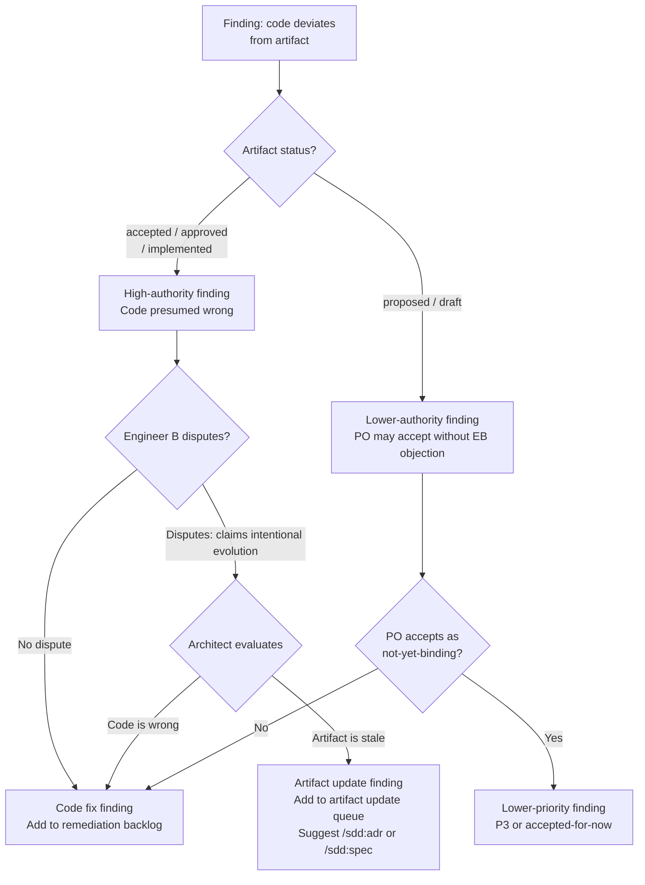

# Design: Scrum Mode Audit Triage

## Context

The `/sdd:audit` skill produces a comprehensive findings table across six drift categories. On a mature project, this table can contain 30–80 rows sorted by severity within category — accurate, but not actionable. A developer looking at the output must mentally re-cluster findings into themes, estimate effort, and decide what to fix first before any work can begin. This cognitive overhead is the problem this capability solves.

The audit scrum mode layers a triage ceremony on top of the existing audit analysis. The ceremony takes raw findings as input and produces a prioritized remediation roadmap with themes, priority tiers, effort estimates, and a clear distinction between "fix the code" and "update the artifact" resolutions.

Governing: SPEC-0013, ADR-0014, ADR-0001.

## Goals / Non-Goals

### Goals

- Transform raw drift findings into themed, prioritized, effort-estimated remediation work
- Provide a legitimate challenge mechanism for false positives and intentional evolution
- Distinguish code-fix findings from artifact-update findings before work begins
- Preserve the ADRs/specs-as-source-of-truth principle with a narrow, justified escape hatch
- Keep the ceremony mechanics consistent with `/sdd:plan --scrum` (ADR-0013, SPEC-0012)

### Non-Goals

- Replacing or modifying the standard six-category audit analysis
- Automatically creating tracker issues without user consent
- Making architectural decisions on behalf of the team (the ceremony informs, humans decide)
- Producing a velocity forecast or sprint timeline

## Decisions

### `--scrum` Flag vs. New `/sdd:triage` Skill

**Choice**: `--scrum` flag on the existing `/sdd:audit` skill

**Rationale**: Consistent with ADR-0013's choice for `/sdd:plan`. The triage ceremony is a richer mode of drift auditing, not a separate operation. It composes naturally with scope arguments, requires the full audit context (findings, file locations, spec text) that would be expensive to re-read if triage were a separate skill, and keeps the plugin's command surface at 15 skills.

**Alternatives considered**:
- `/sdd:triage`: Adds a 16th skill, requires serializing and re-reading audit output, makes the audit report format a contract between two skills
- Extend `--review`: Breaking change to established review semantics (drafter + reviewer, 2 rounds)
- `/sdd:prioritize`: Same problems as `/sdd:triage`; too narrow a name for a full triage ceremony

### Artifacts as Source of Truth with Escape Hatch

**Choice**: ADRs (`accepted`) and specs (`approved`/`implemented`) are presumed correct; code deviation is presumed wrong unless the Architect reclassifies

**Rationale**: Without a clear SoT rule, the ceremony degenerates into "the code is probably right and the spec is probably stale" — which defeats the purpose of having governance artifacts. The escape hatch (Architect reclassification → artifact update) is narrow and requires justification, preventing rubber-stamping.

**Alternatives considered**:
- Symmetric treatment (code and artifact equally suspect): Undermines the governance model; `accepted` ADRs and `approved` specs carry authority precisely because they were reviewed and accepted
- No escape hatch (code always wrong): Ignores the reality that code sometimes reflects genuine architectural evolution that predates a spec update

### Engineer B's Role Adaptation for Audit Context

**Choice**: Engineer B challenges whether findings are genuine drift, with a specific bias toward the artifact being correct

**Rationale**: The grumpy-pedant persona from plan scrum (ADR-0013) applies here too, but the challenge direction reverses. In plan scrum, Engineer B challenges story quality. In audit scrum, Engineer B challenges finding validity — but is explicitly instructed to require a stronger argument to dismiss a finding than to accept it. "The code looks intentional" is not sufficient; Engineer B must articulate why the code represents a better decision and why the spec should be updated.

**Alternatives considered**:
- Engineer B as pure false-positive hunter (no artifact-vs-code distinction): Creates an agent that always argues findings away, undermining the audit's value
- No false-positive challenge role: The existing `--review` auditor+reviewer pair only validates findings are accurate, not whether they represent genuine vs. intentional drift

### P1/P2/P3 Priority Tiers

**Choice**: Three coarse priority tiers (must fix / fix soon / technical debt)

**Rationale**: More granular priority scales (1-5, MoSCoW) produce false precision and longer debates. Three tiers map directly to sprint planning decisions: P1 items go in the next sprint, P2 items go in the sprint backlog, P3 items go in the technical debt queue.

**Alternatives considered**:
- 1–5 scale: Too granular; adjacent levels (3 vs. 4) are indistinguishable without explicit rubrics
- MoSCoW (Must/Should/Could/Won't): Good for requirements; less intuitive for remediation scheduling

### Theme Grouping by Functional Area

**Choice**: Group findings by the affected part of the system (functional area), not by drift category

**Rationale**: A developer assigned "Fix authentication drift" can open the codebase, find the auth module, and work through all related findings. A developer assigned "Fix Code vs. Spec drift" must scatter across the entire codebase. Functional themes map to how teams organize work.

**Alternatives considered**:
- Group by severity: Mixes unrelated findings; a P1 auth issue and a P1 billing issue have nothing in common despite equal severity
- Group by drift category: Already what the standard audit does; adds no organizational value

## Architecture

```mermaid
sequenceDiagram
    participant U as User
    participant L as Lead (Auditor)
    participant PO as Product Owner
    participant SM as Scrum Master
    participant EA as Engineer A
    participant EB as Engineer B
    participant AR as Architect

    U->>L: /sdd:audit [scope] --scrum
    L->>L: Phase 1: Standard audit analysis (6 categories)
    note over L: Raw findings: CRITICAL/WARNING/INFO per category

    L->>L: Phase 2: Group findings into 4–8 functional themes

    par Spawn triage team (parallel per theme)
        L->>PO: Prioritize themes (P1/P2/P3) by business impact
        L->>SM: Estimate effort (XS–XL) per theme; flag oversized
        L->>EA: Assess technical complexity and refactor risk
        L->>EB: Challenge false positives; require justification for evolution claims
        L->>AR: Validate SoT; identify artifact-update findings
    end

    PO-->>L: Priority verdicts + reasoning
    SM-->>L: Effort estimates + split proposals
    EA-->>L: Complexity flags
    EB-->>L: Disputes (if any) or explicit approval
    AR-->>L: SoT validation + artifact-update list

    alt EB disputes a finding
        L->>AR: Evaluate: code fix or artifact update?
        AR-->>L: Code fix required / Artifact update needed
    end

    alt PO proposes deferring a MUST violation
        EB-->>L: Objection (documented)
        L->>PO: Written justification required
        PO-->>L: Justification
        note over L: Added to accepted-for-now list
    end

    L->>L: Phase 3: Finalize themes with priority + effort
    L->>U: Triage report (themes, artifact updates, accepted-for-now)
    L->>U: Offer tracker issue creation for P1/P2 themes
```

### Phase Breakdown

| Phase | What Happens | Input | Output |
|-------|-------------|-------|--------|
| 1. Standard Audit | Six-category drift analysis, severity assignment | ADRs, specs, source code | Raw findings table |
| 2. Theme Grouping | Lead clusters findings into 4–8 functional themes | Raw findings | Themed finding groups |
| 3. Parallel Triage | 5 agents review themes concurrently; PO prioritizes, SM estimates, EA flags complexity, EB disputes, AR validates SoT | Themed findings + ADRs + specs | Verdicts per theme |
| 4. Resolution | EB disputes resolved by Architect; MUST deferrals documented | Disputes, PO proposals | Reclassifications, accepted-for-now entries |
| 5. Triage Report | Emit prioritized roadmap with all sections | Finalized themes | Report + issue creation offer |

### Source of Truth Determination Logic



### SKILL.md Implementation Notes

The `--scrum` implementation in `skills/audit/SKILL.md` MUST:

1. Parse `--scrum` from arguments; when set, run the standard audit first, then enter the triage ceremony
2. After collecting raw findings, the lead performs theme grouping (in the lead's turn, not a sub-agent) before spawning the team
3. Spawn five specialist agents with verbatim persona definitions from SPEC-0013/ADR-0014
4. Collect parallel feedback via `SendMessage` / `TaskUpdate` coordination
5. Handle EB disputes as a synchronous lead-mediated exchange with the Architect
6. Handle PO MUST-deferral proposals as a documented exception with mandatory justification
7. Emit the triage report with all required sections (theme summary table, per-theme details, artifact update queue, accepted-for-now list)
8. Use `AskUserQuestion` to offer tracker issue creation after the report; if accepted, follow the tracker detection flow from `/sdd:plan` steps 4–5

## Risks / Trade-offs

- **Token cost** → Full project audit + six-agent triage on a mature codebase is expensive. Mitigation: scope argument narrows both the audit and triage (`/sdd:audit auth --scrum`); `--scrum` is opt-in.
- **Theme subjectivity** → Two runs may produce different theme boundaries. Mitigation: themes are named for functional areas, and the Lead applies consistent grouping heuristics; the report shows which findings are in each theme so discrepancies are visible.
- **Engineer B persona drift** → Without verbatim instructions, an agent playing Engineer B may drift toward approval. Mitigation: SKILL.md MUST include verbatim persona with explicit instructions that dismissing a finding requires a stronger justification than accepting it.
- **Architect bottleneck** → If Engineer B disputes many findings, the Architect must evaluate each one sequentially. Mitigation: disputes are batched and evaluated in one Architect turn after all EB feedback is collected.

## Open Questions

- Should the triage report be optionally persisted to `docs/openspec/audits/{date}.md` for historical comparison?
- Should P1 themes automatically trigger issue creation without an offer step, matching the urgency of MUST violations?
