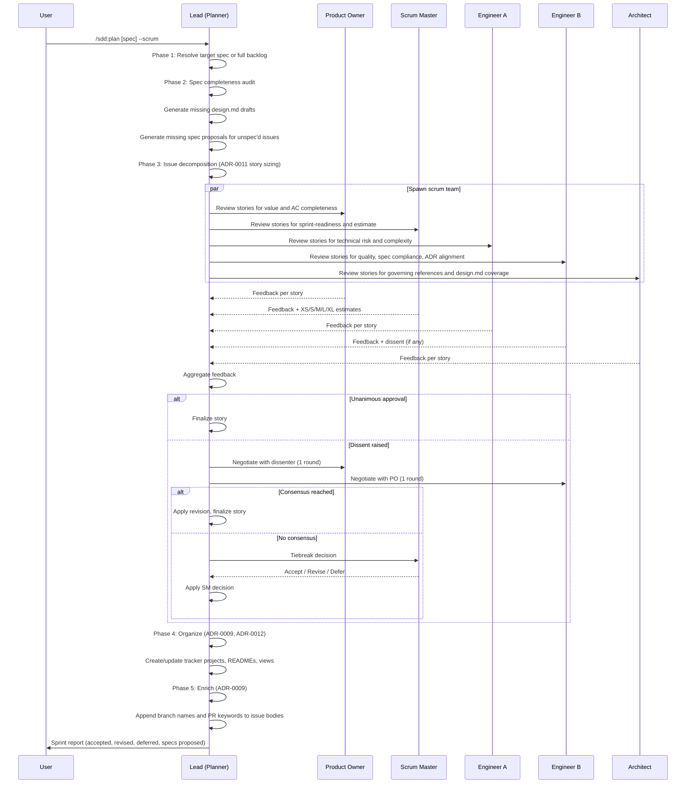
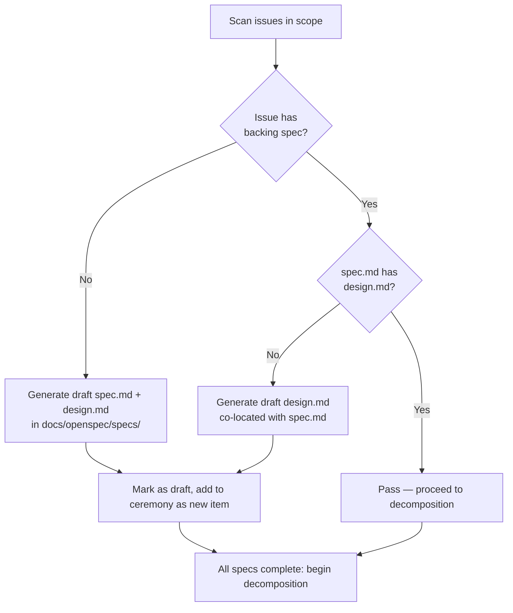

# Design: Scrum Mode Sprint Planning

## Context

The SDD plugin's sprint planning workflow currently requires three separate commands (`/sdd:plan`, `/sdd:organize`, `/sdd:enrich`) that must be run in sequence, with no mechanism to review the quality of the produced backlog before committing it to the tracker. Planning is mechanical: requirements are decomposed into stories, but no agent challenges whether the stories are well-sized, spec-complete, or technically sound.

ADR-0013 identified two gaps: (1) the missing one-shot invocation that unifies the three-command sequence, and (2) the absence of deliberative grooming — the human-style scrutiny that determines whether a backlog is worth implementing. The `--scrum` flag addresses both by adding a multi-agent ceremony layer to the existing planning flow.

This spec formalizes SPEC-0012: the scrum mode sprint planning capability. Governing: ADR-0013, ADR-0008, ADR-0009, ADR-0011, ADR-0012.

## Goals / Non-Goals

### Goals

- One command produces a fully groomed, organized, enriched sprint backlog
- A multi-agent scrum team provides genuine deliberation before stories are committed
- Spec completeness is enforced before grooming (every issue has a spec with both spec.md and design.md)
- Organize and enrich run automatically after grooming, eliminating manual follow-up
- Engineer B's high-bar skepticism provides a quality gate that improves story quality

### Non-Goals

- Time-boxing sprints (this is a planning ceremony, not a sprint execution scheduler)
- Implementing the stories (that is `/sdd:work`'s responsibility)
- Replacing `/sdd:plan` for simple, fast planning runs — `--scrum` is opt-in
- Providing a persistent sprint history or velocity tracking

## Decisions

### `--scrum` Flag on `/sdd:plan` vs. a New Skill

**Choice**: `--scrum` flag on the existing `/sdd:plan` skill

**Rationale**: The scrum ceremony is a richer mode of sprint planning, not a different operation. Adding a flag keeps the invocation surface minimal and composes naturally with existing arguments (`--no-projects`, `--no-branches`, `--project`). A new `/sdd:sprint` skill would split related functionality across two commands and require duplicating spec resolution and tracker detection logic.

**Alternatives considered**:
- `/sdd:sprint` skill: Adds a 16th command, duplicates planning logic, implies time-boxing semantics the skill does not provide
- `--review` enhancement: Overloads the existing review pattern (drafter + reviewer, 2 rounds) with a semantically different ceremony; breaks consistency with how `--review` works in other skills (adr, spec, audit)

### Multi-Agent Team Structure

**Choice**: Five specialist agents (PO, SM, Engineer A, Engineer B, Architect) plus an orchestrating lead

**Rationale**: Each role brings a distinct, non-overlapping perspective that catches different classes of backlog problems. A single reviewer would miss the interplay between product value, engineering effort, architectural compliance, and process readiness. The five-role structure mirrors the real scrum team composition that practitioners use.

**Alternatives considered**:
- Single reviewer agent: No separation of concerns; one agent cannot convincingly hold conflicting priorities (PO vs. Engineer B)
- Generic "review" agents without personas: Produces consensus-seeking feedback without the deliberate skepticism that makes grooming valuable

### Engineer B's Grumpy Persona

**Choice**: A deliberately high-bar, pedantic, dissenting persona that is explicitly configured to push back on weak stories

**Rationale**: Research on code review quality and group decision-making shows that a designated devil's advocate produces better outcomes than consensus-seeking groups. Without an agent explicitly tasked with finding problems, grooming ceremonies tend toward rubber-stamping. Engineer B's persona ensures at least one agent is looking for reasons a story is not ready, which surfaces problems before they become bad PRs.

**Alternatives considered**:
- A neutral "senior engineer" persona: Produces balanced feedback but no systematic skepticism
- Configurable dissent level: Adds complexity without clear benefit — the ceremony always benefits from a high-bar reviewer

### Spec Completeness Enforcement Before Grooming

**Choice**: Audit and generate missing spec artifacts before the grooming team is spawned

**Rationale**: The scrum team cannot meaningfully groom a story that lacks a spec. Checking completeness first ensures the Architect and Engineer B have governing documents to reference, and avoids a mid-ceremony discovery that a story has no backing requirements. Generating drafts (not finished artifacts) keeps the process moving while flagging work for follow-up.

**Alternatives considered**:
- Check completeness during grooming: The Architect would need to generate missing documents mid-ceremony, creating sequential dependencies that undermine parallel review
- Fail and stop if specs are incomplete: Too aggressive; prevents the ceremony from providing value on a partially-spec'd backlog

### One-Round Dissent Resolution with SM Tiebreaker

**Choice**: PO and dissenter negotiate for one round; Scrum Master tiebreaks if unresolved

**Rationale**: Unlimited negotiation rounds waste compute and time. One round is sufficient to surface the core disagreement and explore an obvious compromise. The SM tiebreaker mirrors the real scrum master role: a neutral process facilitator who unblocks the team when debates stall.

**Alternatives considered**:
- Two revision rounds (matching `--review` convention): Adds time and cost without proportional quality benefit in a grooming context
- No structured negotiation: Dissent would either always be overridden by the PO or always block stories, neither of which is the right outcome

### T-Shirt Sizing for Estimates

**Choice**: XS/S/M/L/XL t-shirt sizing by the Scrum Master

**Rationale**: T-shirt sizes are tracker-agnostic, familiar to all engineering teams, and produce less contention in grooming than numeric story points. They also don't require baseline calibration — teams can interpret sizes relative to the current sprint's scope.

**Alternatives considered**:
- Story points (Fibonacci): Tracker-specific, requires calibration, contentious in practice
- Hours: Too precise for planning estimates; creates false precision

## Architecture

The ceremony executes in five sequential phases. Within the grooming phase (phase 3), the five specialist agents work in parallel to review stories.

### Phase Breakdown

| Phase | What Happens | Dependencies |
|-------|-------------|-------------|
| 1. Target Resolution | Resolve spec identifier or scan full backlog | None |
| 2. Completeness Audit | Check spec.md + design.md exist for all referenced specs; generate missing drafts | Phase 1 |
| 3a. Decomposition | Apply ADR-0011 story sizing to produce 3-4 stories per spec | Phase 2 |
| 3b. Grooming | 5 agents review all stories in parallel; dissent resolution runs synchronously per story | Phase 3a |
| 4. Organize | Create/update projects, READMEs, iteration fields, views | Phase 3b |
| 5. Enrich | Append branch + PR sections to finalized issue bodies | Phase 4 |
| 6. Report | Emit sprint report with all sections | Phase 5 |

### Spec Completeness Flow

### Skill.md Implementation Notes

The `--scrum` flag implementation in `skills/plan/SKILL.md` MUST:

1. Parse `--scrum` from arguments before entering the standard planning flow
2. Run spec completeness audit as a pre-grooming step (read all spec directories, check for design.md)
3. Spawn the five specialist agents with explicit persona descriptions (verbatim role and personality definitions from ADR-0013)
4. Collect feedback via `SendMessage` / `TaskUpdate` coordination using the existing team pattern
5. Apply dissent resolution in the lead's turn, not in a sub-agent
6. Call the organize logic (equivalent to `/sdd:organize`) inline after grooming
7. Call the enrich logic (equivalent to `/sdd:enrich`) inline after organize
8. Respect all existing opt-out flags (`--no-projects`, `--no-branches`, `--project`, `--branch-prefix`)
9. Write the sprint report as the final output

## Risks / Trade-offs

- **Token cost** → `--scrum` spawns 5 agents and runs a full ceremony; this is expensive. Mitigation: the flag is opt-in; standard `/sdd:plan` remains the fast path.
- **Non-determinism** → Two `--scrum` runs on the same spec may produce differently ordered backlogs depending on how Engineer B's dissent resolves. Mitigation: the sprint report documents every dissent and its resolution, making the ceremony auditable.
- **Shallow generated design.md** → Auto-generated `design.md` drafts for unspec'd issues may be thin. Mitigation: drafts are clearly marked `status: draft`; the Architect agent in the ceremony flags thin design documents for follow-up.
- **Engineer B persona drift** → Without explicit persona instructions, an agent playing Engineer B may drift toward generic approval. Mitigation: the SKILL.md MUST include verbatim persona instructions, and the scenario requirement ("Engineer B MUST raise a substantive objection if issues exist") is a hard constraint.

## Open Questions

- Should the sprint report be optionally persisted to `docs/openspec/sprints/{date}.md` for a durable record? (ADR-0013 mentions this as optional but does not specify the format.)
- Should `--scrum` support a `--max-pairs` equivalent to cap agent count for large backlogs?
