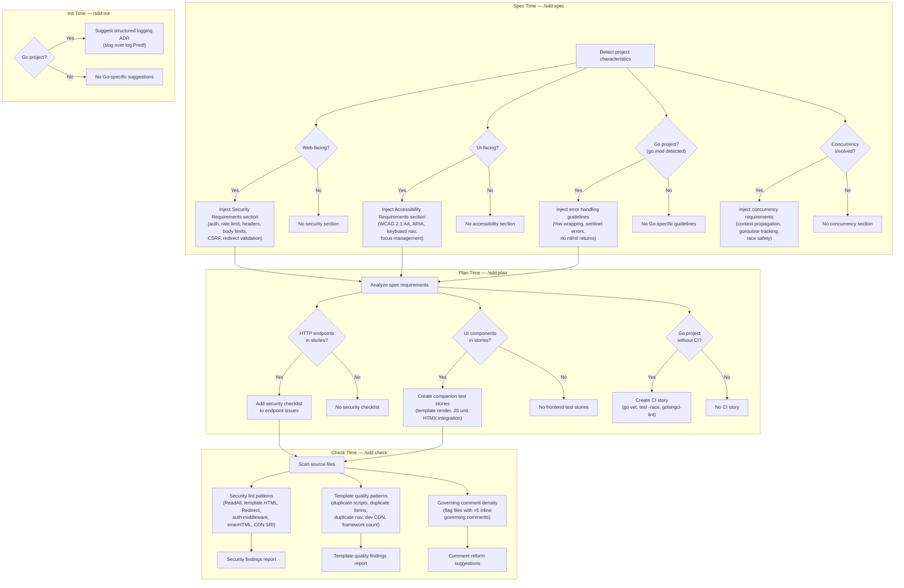
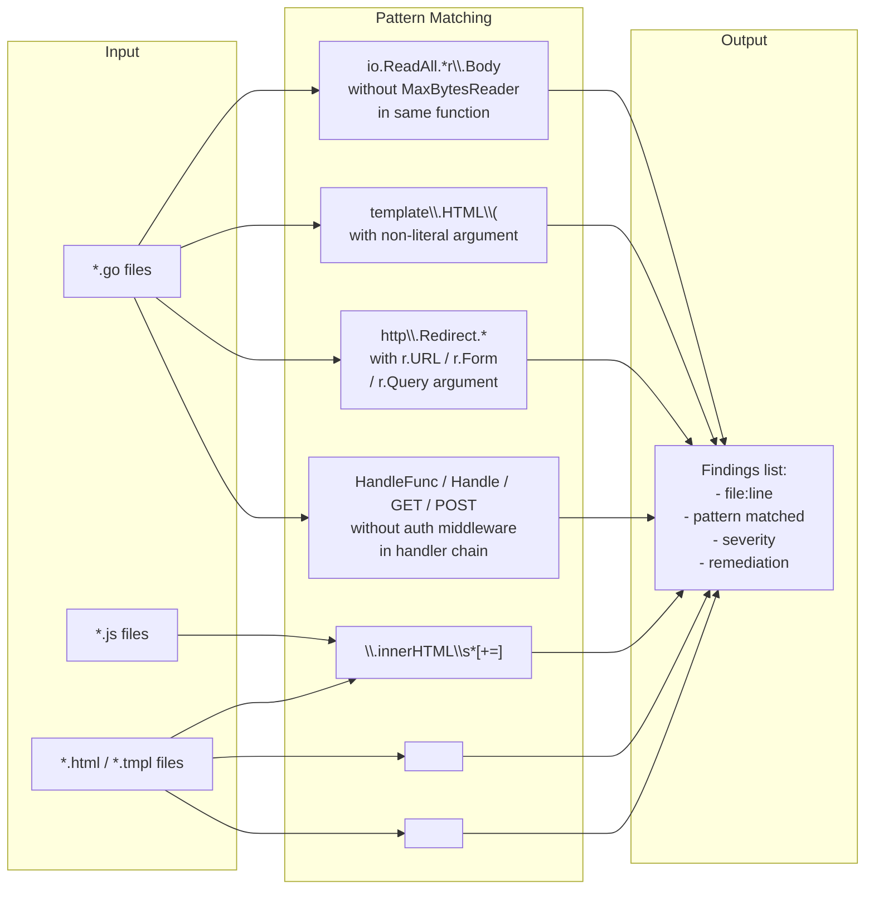

# Design: Security and Quality Guardrails

## Context

The SDD plugin produces well-structured, thoroughly documented codebases with strong traceability from architectural decisions to implementation. However, a review of three production projects (spotter, joe-links, claude-ops) revealed that the plugin has no guardrails for security, frontend quality, or governing comment hygiene. The result: claude-ops shipped an unauthenticated dashboard, all three repos have zero frontend tests, accessibility is near-absent, and governing comments have become so verbose they hurt readability and cause merge conflicts.

This capability weaves security defaults, code quality checks, frontend quality standards, and governing comment reform into the existing skill pipeline — `/sdd:spec`, `/sdd:plan`, `/sdd:check`, and `/sdd:init` — rather than introducing standalone skills. The approach mirrors the plugin's core design principle: make good practices the path of least resistance by integrating them into the workflows developers already use.

Governing: ADR-0018 (Security-by-Default), ADR-0019 (Frontend Quality Standards), ADR-0020 (Governing Comment Reform), SPEC-0016.

## Goals / Non-Goals

### Goals

- Ensure every web-facing spec includes security requirements (authentication, rate limiting, headers, body limits, CSRF, redirect validation) from day one
- Make authentication the default for all endpoints; force explicit justification for public endpoints
- Detect dangerous code patterns (unbounded body reads, innerHTML, missing SRI, unauthenticated routes) during `/sdd:check`
- Inject accessibility requirements into every UI-facing spec (WCAG 2.1 AA, ARIA, keyboard navigation, focus management)
- Create companion frontend test stories automatically during `/sdd:plan`
- Detect template quality issues (duplication, dev-only CDN, framework sprawl) during `/sdd:check`
- Reform governing comments to file-level blocks, eliminating per-line annotation density and retroactive batching
- Apply Go-specific quality guidelines (structured logging, error handling, concurrency safety) when a `go.mod` is detected

### Non-Goals

- Performing AST-level static analysis (patterns use text-based matching; false positives are acceptable)
- Replacing dedicated security scanning tools (SAST, DAST) — the plugin flags obvious patterns, not all vulnerabilities
- Enforcing specific testing frameworks — companion test stories describe what to test, not which library to use
- Auto-fixing detected issues — findings are reported for human review and decision
- Retroactively cleaning up existing governing comments — migration is organic, happening when files are next modified

## Decisions

### Integration into Existing Skills vs. New Skills

**Choice**: Inject security and quality checks into `/sdd:spec`, `/sdd:plan`, `/sdd:check`, and `/sdd:init` rather than creating `/sdd:security`, `/sdd:a11y`, or `/sdd:quality` skills.

**Rationale**: Security is not a separate phase — it is a cross-cutting quality attribute that must be present at specification, planning, and verification time. A standalone `/sdd:security` skill requires developers to remember to invoke it, which is the exact failure mode that led to claude-ops shipping an unauthenticated dashboard. Integration ensures coverage without opt-in.

**Alternatives considered**:
- Separate `/sdd:security` skill: Adds a 16th skill, requires developers to remember to invoke it, creates a false separation between "building" and "securing"
- Post-hoc audit only (extend `/sdd:audit`): Catches issues after implementation — the same retrofit pattern that cost spotter 3 dedicated security issues (#94, #101, #107)
- Security checklist in CLAUDE.md: Advisory only; compliance is voluntary; no verification that the checklist was followed

### Text-Based Pattern Matching for Lint

**Choice**: Security and template quality lint uses grep/regex text matching, not AST parsing.

**Rationale**: The plugin operates across Go, JavaScript, HTML templates, Python, and other languages. Building language-specific AST parsers for each would be prohibitively complex and fragile. Text-based matching catches the majority of dangerous patterns found in the three reviewed projects (all `io.ReadAll(r.Body)` instances, all `innerHTML` assignments, all missing `integrity` attributes). False positives are an acceptable tradeoff — the findings are for human review, not automated remediation.

**Alternatives considered**:
- AST-based analysis per language: Higher accuracy but requires language-specific parsers; maintenance burden grows with each supported language
- External linting tool integration (golangci-lint, eslint): Introduces external dependencies; does not cover cross-language patterns; fragments the quality workflow across multiple tools
- No lint, only spec-time requirements: Misses implementation-time violations entirely; relies on developers following spec requirements perfectly

### Auth-by-Default with Explicit Opt-Out

**Choice**: All endpoints in web-facing specs default to "Auth: Required". Public endpoints must be explicitly declared with justification.

**Rationale**: The dangerous default is "unauthenticated unless someone remembers." claude-ops proves this: the dashboard was unauthenticated because no one specified auth requirements. Inverting the default forces a conscious decision about every public endpoint, following the principle of least privilege.

**Alternatives considered**:
- Auth-by-default without justification: Too strict — health checks and login pages must be public, and requiring justification for these creates unnecessary friction without justification text to document the reasoning
- Auth-optional with nudge: Maintains the dangerous default while adding a reminder that developers can ignore
- Per-project auth policy in CLAUDE.md: Creates a global override that may not apply to all endpoints; endpoint-level decisions are more granular

### File-Level Governing Comments

**Choice**: Single governing block at file top instead of per-line annotations. Inline comments only for non-obvious connections. No retroactive batching.

**Rationale**: Spotter's `main.go` has 40+ per-line governing comments — more comment lines than code. claude-ops launched ~78 concurrent PRs just to add retroactive governing comments, creating merge conflicts on every overlapping file. File-level blocks provide the same traceability (which ADRs and specs govern this file) at ~90% less annotation volume, and the "no retroactive batching" rule prevents PR explosions.

**Alternatives considered**:
- Keep per-line annotations: Proven to produce unreadable files (spotter) and conflict-prone retroactive campaigns (claude-ops)
- External traceability matrix: Loses co-location; line numbers go stale with every edit; a single matrix file is an even worse merge conflict hotspot
- Remove governing comments entirely: Loses code-level traceability; `/sdd:check` and `/sdd:audit` lose their primary signal for verifying implementation alignment

### Go-Specific Quality as Conditional Injection

**Choice**: Go quality guidelines are injected only when `go.mod` is detected, making them conditional on project technology.

**Rationale**: The three reviewed projects are all Go, but the plugin supports any language. Go-specific guidelines (slog, %w wrapping, sentinel errors, context propagation) should not appear in Python or TypeScript specs. Detection via `go.mod` is simple, reliable, and extends the same pattern that `/sdd:spec` uses to detect web-facing vs. non-web specs.

**Alternatives considered**:
- Always include Go guidelines: Irrelevant noise for non-Go projects
- Language detection via file extensions: Less reliable than `go.mod`; a project could have `.go` files as generated code
- Language configuration in CLAUDE.md: Requires manual setup; `go.mod` detection is automatic

## Architecture

### Skill Integration Flow



### Security Lint Pattern Detection Approach

The check skill scans source files using text-based pattern matching. Each pattern is a regex applied to relevant file types, with contextual analysis for reducing false positives where feasible.



Each lint pattern operates independently. The check skill iterates over all patterns, collects matches, deduplicates (same file+line), and emits a consolidated findings table sorted by severity.

### Template Quality Detection Approach

Template quality detection uses a combination of content hashing and structural pattern matching:

1. **Duplicate inline scripts**: Extract `<script>` block contents (excluding `src` attribute scripts), normalize whitespace, hash. Flag blocks with identical hashes across files or within the same file.
2. **Duplicate forms**: Extract `<form>` element structures (field names, types, structure), normalize, hash. Flag forms with identical structures across different template files.
3. **Duplicate navigation**: Identify `<nav>` elements and elements with `role="navigation"`. Flag when navigation markup appears in more than one template without being included via a partial/include directive (e.g., Go `{{template}}`, Jinja ``).
4. **Dev-only CDN**: Regex match against known dev-only CDN URLs (`cdn.tailwindcss.com`, `unpkg.com` for certain libraries).
5. **Framework count**: Scan all HTML/JS files for framework identifiers (HTMX: `hx-` attributes or `htmx.org`; Alpine.js: `x-data` or `alpinejs`; Hyperscript: `_="` or `hyperscript.org`; React: `react`, `ReactDOM`; Vue: `vue.js`, `createApp`). Flag when more than one framework is detected.

### Governing Comment Consolidation Format

The canonical format for file-level governing blocks:

```go
// Governing: ADR-0001 (brief description), ADR-0005 (brief description)
// Implements: SPEC-0003 REQ "Requirement Name", SPEC-0007 REQ "Requirement Name"
```

Rules for the block:
- Placed at the top of the file, after the package declaration (Go) or after any shebang/file-type comment
- One `Governing:` line listing all relevant ADRs with parenthetical descriptions
- One `Implements:` line listing all relevant spec requirements
- Either line may be omitted if there are no ADRs or no spec requirements (but at least one must be present)
- ADR descriptions in parentheses are brief (2-4 words) — enough to identify the decision without re-reading the ADR

The check skill flags files exceeding 5 inline governing comments as candidates for consolidation to the file-level format.

### Conditional Section Injection Logic in /sdd:spec

The spec skill determines which sections to inject based on capability characteristics detected from the user's description, referenced ADRs, and codebase analysis:

| Signal | Detection Method | Injected Section |
|--------|-----------------|------------------|
| HTTP endpoints | User mentions "API", "endpoint", "route", "handler", "server", "dashboard"; spec references HTTP verbs or URL paths; codebase contains `http.ListenAndServe`, `gin.Default()`, `echo.New()`, `http.NewServeMux()` | Security Requirements |
| Browser UI | User mentions "template", "page", "dashboard", "form", "UI", "frontend"; spec references HTML, CSS, HTMX, templates; codebase contains `.html` or `.tmpl` files in the spec's scope | Accessibility Requirements |
| Go project | `go.mod` exists at project root | Error handling guidelines, logging suggestion (init only) |
| Concurrency | User mentions "goroutine", "background", "worker", "scheduler", "async"; spec references concurrent operations | Concurrency requirements |

The detection is intentionally broad — it is better to inject a section that the spec author removes (low cost) than to miss a section that leads to a security or accessibility gap (high cost).

## Risks / Trade-offs

- **Mandatory sections add spec length** -> For simple internal tools, the security and accessibility sections may feel heavy-handed. Mitigation: spec authors can pare down the sections to match their threat model, but the sections are present as a starting point rather than absent by default.
- **False positives in lint patterns** -> Text-based matching will flag safe usages (e.g., `io.ReadAll` on an already-bounded body, `innerHTML` with pre-sanitized content). Mitigation: findings are for human review with remediation suggestions, not automated blocking. Projects can add suppression comments (e.g., `// nosec: body already bounded by MaxBytesReader`).
- **Companion test stories increase sprint volume** -> Creating test stories for every UI-touching feature adds 30-50% more issues per sprint. Mitigation: test stories are estimated at half the effort of feature stories; they can be batched or deprioritized by the team if capacity is limited.
- **Go-specific guidelines may not cover all Go patterns** -> The initial set (slog, %w, sentinel errors, context propagation) addresses findings from three repos but is not exhaustive. Mitigation: the pattern set is additive — new patterns can be added in future spec revisions without breaking existing behavior.
- **Governing comment migration is organic, not enforced** -> Existing files with per-line comments will coexist with files using the new format until they are naturally modified. Mitigation: `/sdd:check` flags files with high inline comment density, providing a nudge without forcing retroactive cleanup campaigns.

## Migration Plan

This capability modifies existing skills, not standalone infrastructure. Migration is additive:

1. **Shared patterns update**: Add "Security Lint Patterns", "Template Quality Patterns", and "Governing Comment Format" sections to `references/shared-patterns.md` so all skills reference canonical pattern definitions.
2. **Spec skill update**: Add conditional section injection logic to `skills/spec/SKILL.md` for Security Requirements, Accessibility Requirements, Go error handling, and concurrency sections.
3. **Plan skill update**: Add security checklist injection, companion test story creation, and CI story creation to `skills/plan/SKILL.md`.
4. **Check skill update**: Add security lint patterns, template quality patterns, and governing comment density detection to `skills/check/SKILL.md`.
5. **Init skill update**: Add Go project detection and logging ADR suggestion to `skills/init/SKILL.md`.
6. **All skills**: Update governing comment references to use file-level consolidation format per ADR-0020.

No breaking changes to existing specs, ADRs, or project configurations. Existing governing comments are not retroactively modified — they adopt the new format when their containing files are next modified for functional reasons.

## Open Questions

- Should `/sdd:check` support a `// nosec` or `// lint:ignore` comment convention for suppressing specific lint findings, and if so, should the convention be standardized across security and template quality patterns?
- Should the Go quality guidelines extend to other languages (e.g., Python type hints, TypeScript strict mode) in a future spec revision, or should language-specific quality be a separate per-language spec?
- Should companion test stories be mandatory (MUST) or recommended (SHOULD) — the current spec uses MUST, but teams with limited capacity may want to defer frontend tests in early sprints?
- Should the security section injection detect the specific web framework in use (Gin, Echo, Chi, net/http) and tailor the security requirements to framework-specific patterns (e.g., Gin middleware vs. net/http middleware wrapping)?
