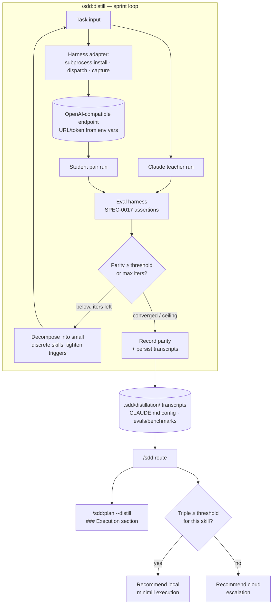

# Design: Skill Distillation

## Context

The SDD plugin already is, in effect, a skill factory: it authors `SKILL.md` files, measures them with an eval harness (SPEC-0017 / ADR-0021), and plans work from specs (SPEC-0007). Tomasz Tunguz's "skill distillation" technique uses a frontier model as a teacher that refines markdown skills until a cheap local model can run them well, keeping most work on a laptop and escalating only the hard cases to the cloud (the "minimill"). ADR-0034 adopts this technique by recombining the plugin's existing primitives rather than building a new subsystem.

This design covers the distillation sprint loop (`/sdd:distill`), the routing recommender (`/sdd:route`), the harness-adapter abstraction, the markdown-native manifest, and the `/sdd:plan --distill` integration. It deliberately scopes out weight-level fine-tuning.

## Goals / Non-Goals

### Goals
- Let Claude iteratively refine — primarily by decomposing into smaller, discrete skills — until a local model reaches a measured, Claude-relative parity threshold on a given skill.
- Reuse the existing eval harness (SPEC-0017) for parity scoring instead of building a second grader.
- Keep distilled skills as version-controlled, reviewable markdown; keep configuration in `CLAUDE.md` (ADR-0015) and noisy runtime artifacts in a gitignored `.sdd/distillation/` directory.
- Insulate the design from harness and runner churn via a subprocess adapter contract and an OpenAI-compatible model endpoint configured by environment variables.
- Surface, at plan time, which model/harness/skill can run an issue locally and when to escalate to the cloud.

### Non-Goals
- Weight distillation, fine-tuning, or DSPy/GEPA prompt optimization. These are a deferred, optional second track (see Open Questions) that would consume the pair-session transcripts this capability produces.
- Shipping or endorsing any specific local model. The design is model-agnostic; models are configured, not bundled.
- Building or vendoring a harness. Harnesses are external dependencies reached through adapters; Crush is the only adapter implemented first.
- Absolute-correctness benchmarking. Parity is relative to Claude's own (variable) output on the same task.

## Decisions

### Distillation loop reuses the eval harness for scoring

**Choice**: Parity is computed by running the skill's existing eval assertions (SPEC-0017) against the student's pair run, scored relative to Claude's reference run — not by a new grader.
**Rationale**: The plugin already maintains per-skill assertions and a benchmark store; a second scoring path would drift from them and double the maintenance surface. Reuse also means a skill's distillation parity and its CI eval share one definition of "good."
**Alternatives considered**:
- A bespoke distillation grader: rejected — duplicates SPEC-0017 and invites divergence.
- Human spot-checking only: rejected — not repeatable, can't gate convergence.

### Subprocess adapters; endpoints/tokens from the environment

**Choice**: Harnesses sit behind a three-operation adapter contract (install-skill, dispatch-task, capture-output) where dispatch shells out to the harness's own CLI as a subprocess; Crush is the reference adapter. The student model is reached through a generic OpenAI-compatible endpoint whose URL and token come from conventional environment variables (`OPENAI_BASE_URL`, `OPENAI_API_KEY`, plus each harness's native env conventions).
**Rationale**: The student is a different model running in a different program, so it cannot be a Claude Code subagent (those run Claude); shelling out to the harness binary is the substrate that already exists. The open-harness and local-model ecosystems move fast, so pinning to one would date the plugin; the three-operation subprocess contract is the smallest surface that supports the loop, and env-var endpoints keep secrets out of the repo while making any OpenAI-compatible runner (Ollama, llama.cpp, vLLM) interchangeable.
**Alternatives considered**:
- Claude Code subagents as the student: rejected — they run Claude models, not the local student.
- A bespoke backend/daemon to manage harness+model selection: rejected for v1 — adds an always-on service; an MCP-backed adapter remains an optional variant for harnesses exposed that way.
- Endpoints/tokens in committed config: rejected — leaks secrets and duplicates what env vars already standardize.
- Support every harness up front: rejected — unbounded adapter work before the loop is proven; Crush-first proves the contract, others follow.

### Convergence by skill decomposition

**Choice**: Gap-closing happens primarily by decomposing a skill into smaller, single-purpose discrete skills with tightened triggers — not by accumulating additive guidance on one skill. Any decomposition that would change the frontier outcome is rejected.
**Rationale**: Many local models have small context windows, so the binding constraint is per-skill context budget, not the teacher's. Small discrete skills keep each unit inside the student's context while remaining individually reviewable; routing then selects the minimal skill(s) per step. The decomposed set must still compose back to the frontier skill's behavior so the teacher's CI evals do not regress.
**Alternatives considered**:
- Additive references/scripts on one `SKILL.md`: rejected — inflates context, the opposite of what small-context students need.
- Separate per-model skill forks: rejected for v1 — multiplies maintenance; decomposition keeps a single shared set that composes for both teacher and student.

### Configuration in CLAUDE.md, runtime artifacts in a hidden directory

**Choice**: Registration of harness adapters and model identifiers lives in a structured **Distillation** section in `CLAUDE.md` (per ADR-0015), not a bespoke file. Pair-session transcripts and working parity state are written to a gitignored `.sdd/distillation/` directory; durable parity scores are recorded in `evals/benchmarks/` (per SPEC-0017). `/sdd:route` reads the CLAUDE.md registration plus the recorded scores.
**Rationale**: ADR-0015 already mandates configuration as `CLAUDE.md` sections rather than parallel config files, so a separate "manifest" would reintroduce the split-truth problem that ADR retired. Transcripts are bulky and regenerable, so they belong in hidden, gitignored state (matching the repo's existing `.sdd-*` convention), not the committed docs tree.

### Plan integration is opt-in and non-destructive

**Choice**: `/sdd:plan --distill` (default off) adds an `### Execution` section per issue; without the flag, output is byte-for-byte unchanged.
**Rationale**: Mirrors the existing optional-section flag pattern (`--no-branches`, `--no-projects`), so the feature is additive and cannot regress the default planning path.

## Architecture

## Risks / Trade-offs

- **Parity is Claude-relative, not absolute** → label every score as parity-relative-to-Claude in outputs and benchmarks; document that a high score inherits Claude's own task variance.
- **Decomposition diverges from the teacher** → require the decomposed set to compose back to the frontier outcome; reject splits that regress the skill's own CI evals.
- **Local harness/endpoint absent in many environments** → every dependent operation degrades gracefully, names the missing dependency, and never fabricates results or blocks the SDD flow.
- **Parity drift vs. reality** → record the measurement date per triple in `evals/benchmarks/`; treat stale parity as a routing signal to re-distill rather than trust silently.
- **Adapter sprawl** → keep the adapter contract to three subprocess operations; add harness adapters only after Crush proves the contract.

## Migration Plan

Greenfield capability — additive only. The two new skills, the `.sdd/distillation/` artifact directory (gitignored), the `CLAUDE.md` Distillation section, and the `--distill` flag introduce no changes to existing skill behavior; `/sdd:plan` without `--distill` is unchanged. No data migration is required. With no triples recorded yet, `/sdd:route` and `/sdd:plan --distill` default to cloud recommendations until the first sprint records a distilled triple.

## Open Questions

- Should the optional weight/prompt-optimization second track (DSPy/GEPA over logged pair sessions) be a future spec that `requires` this one, and what artifacts would it add to the manifest?
- What is the right default parity threshold and maximum iteration count, and should they be per-skill (tier-aware, per SPEC-0017 tiers) rather than global?
- Beyond Crush, what is the priority order for additional harness adapters (OpenCode, Goose, Codex CLI), and do any require more than the three-operation contract?
- Should `/sdd:work` eventually consume the `### Execution` annotations to actually dispatch local runs, or does routing stay advisory in v1?
