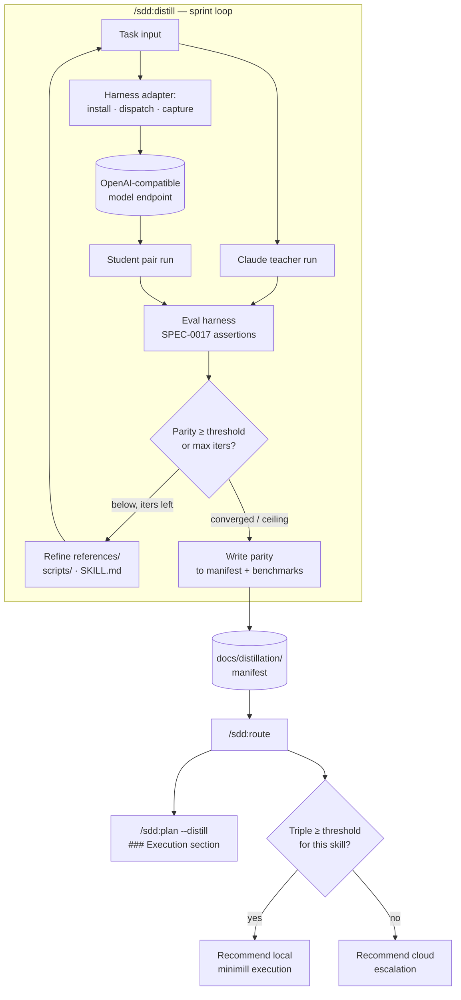

# Design: Skill Distillation

## Context

The SDD plugin already is, in effect, a skill factory: it authors `SKILL.md` files, measures them with an eval harness (SPEC-0017 / ADR-0021), and plans work from specs (SPEC-0007). Tomasz Tunguz's "skill distillation" technique uses a frontier model as a teacher that refines markdown skills until a cheap local model can run them well, keeping most work on a laptop and escalating only the hard cases to the cloud (the "minimill"). ADR-0034 adopts this technique by recombining the plugin's existing primitives rather than building a new subsystem.

This design covers the distillation sprint loop (`/sdd:distill`), the routing recommender (`/sdd:route`), the harness-adapter abstraction, the markdown-native manifest, and the `/sdd:plan --distill` integration. It deliberately scopes out weight-level fine-tuning.

## Goals / Non-Goals

### Goals
- Let Claude iteratively refine markdown skill artifacts until a local model reaches a measured, Claude-relative parity threshold on a given skill.
- Reuse the existing eval harness (SPEC-0017) for parity scoring instead of building a second grader.
- Keep all distilled artifacts as version-controlled, reviewable markdown (skills, references, scripts, manifest).
- Insulate the design from harness and runner churn via an adapter contract and an OpenAI-compatible model endpoint.
- Surface, at plan time, which model/harness/skill can run an issue locally and when to escalate to the cloud.

### Non-Goals
- Weight distillation, fine-tuning, or DSPy/GEPA prompt optimization. These are a deferred, optional second track (see Open Questions) that would consume the pair-session transcripts this capability produces.
- Shipping or endorsing any specific local model. The design is model-agnostic; models are configured, not bundled.
- Building or vendoring a harness. Harnesses are external dependencies reached through adapters; Crush is the only adapter implemented first.
- Absolute-correctness benchmarking. Parity is relative to Claude's own (variable) output on the same task.

## Decisions

### Distillation loop reuses the eval harness for scoring

**Choice**: Parity is computed by running the skill's existing eval assertions (SPEC-0017) against the student's pair run, scored relative to Claude's reference run — not by a new grader.
**Rationale**: The plugin already maintains per-skill assertions and a benchmark store; a second scoring path would drift from them and double the maintenance surface. Reuse also means a skill's distillation parity and its CI eval share one definition of "good."
**Alternatives considered**:
- A bespoke distillation grader: rejected — duplicates SPEC-0017 and invites divergence.
- Human spot-checking only: rejected — not repeatable, can't gate convergence.

### Harness-agnostic adapters, runner-agnostic model layer

**Choice**: Harnesses sit behind a three-operation adapter contract (install-skill, dispatch-task, capture-output); Crush is the reference adapter. Models are reached through a generic OpenAI-compatible endpoint configured in the manifest.
**Rationale**: The open-harness and local-model ecosystems move fast. Pinning to one of either would date the plugin quickly. The adapter contract is the smallest surface that supports the loop, and the OpenAI-compatible endpoint is the de-facto common interface across Ollama, llama.cpp, and vLLM.
**Alternatives considered**:
- Hard-code Crush + Ollama: rejected — couples the plugin to two fast-moving externals.
- Support every harness up front: rejected — unbounded adapter work before the loop is proven; Crush-first proves the contract, others follow.

### Refinements are additive and student-scoped

**Choice**: Gap-closing changes prefer `references/` and `scripts/` over edits to the core `SKILL.md` body, and any change that would weaken the skill for the frontier teacher is rejected or relocated.
**Rationale**: A single skill serves both teacher and student. Dumbing down the body to satisfy a weaker model would regress frontier quality and the skill's CI evals. Additive, student-scoped guidance closes the gap without that regression.
**Alternatives considered**:
- Maintain separate per-model skill forks: rejected for v1 — multiplies maintenance and diverges from the single-source-of-truth skill model; reconsider if additive guidance proves insufficient.

### Markdown-native manifest as the routing source of truth

**Choice**: A markdown manifest under `docs/distillation/` (per ADR-0015) records adapters, endpoints, and per-triple parity scores with dates; `/sdd:route` reads only this file.
**Rationale**: Consistent with the plugin's markdown-native configuration convention; keeps distillation state diffable and reviewable through the same SDD flow as ADRs and specs.

### Plan integration is opt-in and non-destructive

**Choice**: `/sdd:plan --distill` (default off) adds an `### Execution` section per issue; without the flag, output is byte-for-byte unchanged.
**Rationale**: Mirrors the existing optional-section flag pattern (`--no-branches`, `--no-projects`), so the feature is additive and cannot regress the default planning path.

## Architecture

## Risks / Trade-offs

- **Parity is Claude-relative, not absolute** → label every score as parity-relative-to-Claude in outputs and the manifest; document that a high score inherits Claude's own task variance.
- **Refining for the student dilutes the teacher** → enforce the additive/student-scoped refinement rule; reject core-body edits that regress the skill's own CI evals.
- **Local harness/endpoint absent in many environments** → every dependent operation degrades gracefully, names the missing dependency, and never fabricates results or blocks the SDD flow.
- **Manifest drift vs. reality** → record the measurement date per triple; treat stale parity as a routing signal to re-distill rather than trust silently.
- **Adapter sprawl** → keep the adapter contract to three operations; add harness adapters only after Crush proves the contract.

## Migration Plan

Greenfield capability — additive only. The two new skills, the manifest directory, and the `--distill` flag introduce no changes to existing skill behavior; `/sdd:plan` without `--distill` is unchanged. No data migration is required. Initial rollout seeds an empty manifest, so `/sdd:route` and `/sdd:plan --distill` default to cloud recommendations until the first sprint records a distilled triple.

## Open Questions

- Should the optional weight/prompt-optimization second track (DSPy/GEPA over logged pair sessions) be a future spec that `requires` this one, and what artifacts would it add to the manifest?
- What is the right default parity threshold and maximum iteration count, and should they be per-skill (tier-aware, per SPEC-0017 tiers) rather than global?
- Beyond Crush, what is the priority order for additional harness adapters (OpenCode, Goose, Codex CLI), and do any require more than the three-operation contract?
- Should `/sdd:work` eventually consume the `### Execution` annotations to actually dispatch local runs, or does routing stay advisory in v1?
