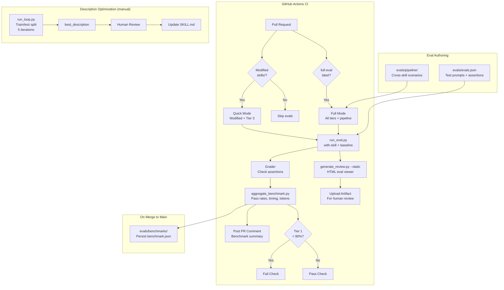
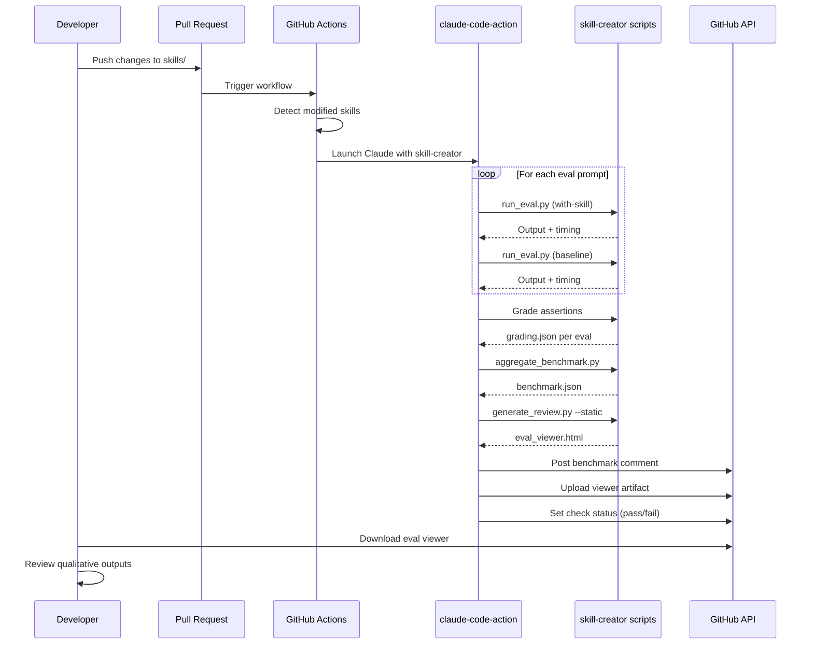

# Design: Skill Evaluation and CI Testing

## Context

The SDD plugin has 15 skills and zero test coverage. A major v3.0 overhaul added config migration, workspace mode, security injection, worker protocols, and parallel coordination — all untested. The skill-creator plugin provides a complete eval framework (run_eval.py, grader, aggregate_benchmark.py, generate_review.py) that has never been applied to this plugin. The existing CI pipeline uses `claude-code-action` for PR code review but has no skill-level testing.

See ADR-0021 (Skill Evaluation and CI Testing Framework).

## Goals / Non-Goals

### Goals
- Every skill has eval coverage with realistic test prompts
- CI catches regressions automatically on PRs that touch skills
- Benchmark data tracks performance across releases
- Cross-skill pipeline tests validate the end-to-end workflow
- Skill descriptions are optimized for triggering accuracy

### Non-Goals
- 100% deterministic test outputs (LLMs are inherently non-deterministic)
- Testing against live external services (GitHub, Gitea) in CI — use mocked/local repos
- Real-time performance monitoring (benchmarks are per-release, not continuous)

## Decisions

### Decision 1: Skill-Creator Eval Framework

**Choice**: Use skill-creator's existing eval infrastructure rather than building custom
**Rationale**: The framework handles non-deterministic outputs through assertion-based grading, provides benchmark aggregation, and includes an HTML eval viewer. Building custom would duplicate effort.
**Alternatives considered**:
- Custom deterministic test harness: Too brittle for LLM outputs
- Manual testing scripts: Doesn't scale, no CI integration
- Property-based schema validation: Only tests structure, not behavior

### Decision 2: Three-Tier Eval Strategy

**Choice**: Assign skills to 3 tiers based on complexity, with different eval counts and CI behavior
**Rationale**: Tier 1 skills (plan, work, review, audit) are multi-agent workflows that are expensive to test but critical to get right. Tier 3 skills (list, status, etc.) are cheap and simple. Running all tiers on every PR would be prohibitively expensive.
**Alternatives considered**:
- Flat allocation (same # of evals per skill): Wastes budget on simple skills
- Only test modified skills: Misses cross-skill regressions

### Decision 3: claude-code-action for CI

**Choice**: Use `anthropics/claude-code-action@v1` in GitHub Actions to run evals
**Rationale**: Already used for code review (`claude-code-review.yml`). Provides Claude runtime in CI with plugin support. Supports the skill-creator's `run_eval.py` and `aggregate_benchmark.py` scripts.
**Alternatives considered**:
- Raw `claude -p` in CI: Less integration, harder to manage tokens and permissions
- Local-only testing: No CI automation

### Decision 4: Disposable Test Repos for Pipeline Tests

**Choice**: Create temporary repositories for cross-skill pipeline testing
**Rationale**: Pipeline tests (spec → plan → work → review) create real issues, branches, and PRs. Using the actual plugin repo would pollute it with test artifacts. Disposable repos ensure clean state.
**Alternatives considered**:
- Test against the plugin repo itself: Too risky, creates real issues
- Mock all tracker interactions: Wouldn't test actual integrations

### Decision 5: Benchmark Persistence in Git

**Choice**: Commit benchmark data to `evals/benchmarks/` on merge to main
**Rationale**: Enables cross-release comparison and trend analysis. Git provides natural versioning. No external service needed.
**Alternatives considered**:
- External dashboard (Grafana, etc.): Overkill for this stage
- PR-only benchmarks (no persistence): Loses historical data

## Architecture





## File Structure

```
evals/
├── evals.json                    # All test prompts and assertions
├── pipeline/
│   ├── core-workflow.json        # spec → plan → work → review
│   └── workspace-workflow.json   # multi-module scenario
├── benchmarks/
│   ├── 2026-03-27-v3.0.json     # Historical benchmark data
│   └── latest.json              # Symlink to most recent
└── feedback/
    └── iteration-1/             # Human review feedback

.github/workflows/
├── skill-evals.yml              # New: eval workflow
├── claude-code-review.yml       # Existing: code review
└── deploy-docs.yml              # Existing: docs deployment
```

## Risks / Trade-offs

- **Cost per eval run** — Each eval invokes Claude (~$0.10-$0.50 per skill). Full suite across 15 skills at 2-4 prompts each = ~$5-$15 per full run. Mitigated by tiered approach and quick mode.
- **Non-deterministic flakiness** — LLM outputs vary. Mitigated by running assertions 3x with majority vote for borderline cases, and focusing assertions on structural properties not content quality.
- **Pipeline test complexity** — Cross-skill tests require disposable repos and multi-step orchestration. Mitigated by running only on releases and manual triggers.
- **Eval maintenance burden** — As skills evolve, evals must be updated. Mitigated by keeping assertions structural (file exists, section present) rather than content-specific.

## Migration Plan

1. **Phase 1**: Author evals for Tier 3 skills (7 skills × 2 prompts = 14 evals) — cheapest and fastest to validate the framework
2. **Phase 2**: Author evals for Tier 2 skills (4 skills × 2-3 prompts = 8-12 evals)
3. **Phase 3**: Author evals for Tier 1 skills (4 skills × 3-4 prompts = 12-16 evals)
4. **Phase 4**: Create GitHub Actions workflow (`skill-evals.yml`)
5. **Phase 5**: Author pipeline tests and run description optimization
6. **Phase 6**: Establish baseline benchmarks and begin tracking

## Open Questions

- Should eval runs use a specific Claude model version, or always latest? Pinning ensures reproducibility but misses improvements.
- How to handle skills that create real side effects (issues, PRs, branches) in eval runs? Disposable repos solve some cases but not all (e.g., MCP tools that call real APIs).
- Should `evals/evals.json` be one file or split per skill (e.g., `evals/plan.json`)? One file is simpler; per-skill is more modular.
- What's the budget ceiling per month for CI eval runs? This determines how aggressively we can run full mode.
