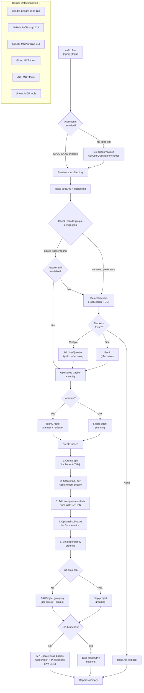
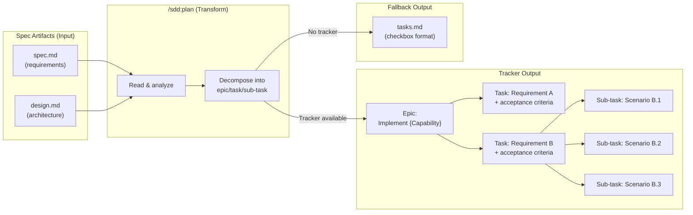
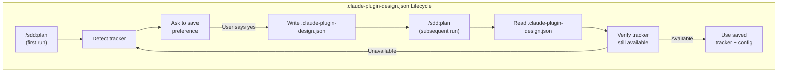
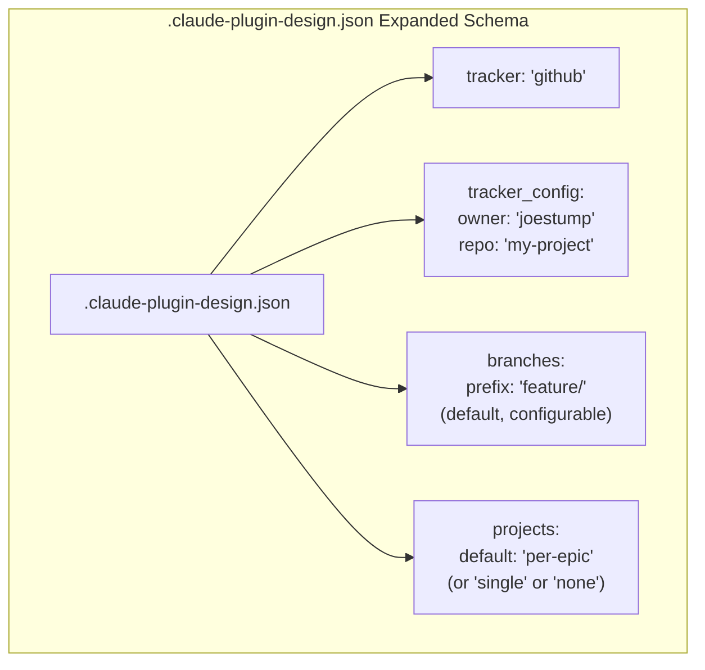

# Design: Sprint Planning

## Context

Sprint planning was previously embedded as step 8 of the `/sdd:spec` skill, which limited it to planning only during spec creation and supported only three trackers (Beads, GitHub, Gitea). Users with existing specs had no way to generate work items, and users with GitLab, Jira, or Linear were excluded. ADR-0008 decided to extract sprint planning into a standalone `/sdd:plan` skill with broader tracker support, preference persistence, and a clean separation from spec authoring. See ADR-0008 and SPEC-0007.

## Goals / Non-Goals

### Goals
- Enable sprint planning for any existing spec, not just newly created ones
- Support six issue trackers (Beads, GitHub, GitLab, Gitea, Jira, Linear) with runtime detection
- Persist tracker preferences and configuration to `.claude-plugin-design.json` to avoid repeated prompts
- Decompose spec requirements into an epic/task/sub-task hierarchy with traceability
- Fall back to `tasks.md` generation (SPEC-0006) when no tracker is available
- Support `--review` mode for team-based plan review
- Organize created issues into tracker-native projects (per-epic default, single project, or skip)
- Include deterministic branch naming conventions in issue bodies (`feature/` for tasks, `epic/` for epics)
- Include tracker-specific PR close keywords in issue bodies for auto-resolution on merge

### Non-Goals
- Replacing or modifying the spec authoring workflow (`/sdd:spec`)
- Syncing issues back to spec artifacts when tracker state changes
- Supporting tracker-specific features beyond issue creation (boards, sprints, labels)
- Implementing `--gaps` or `--analyze` modes (documented as future considerations)
- Tracking issue completion status from within the plugin
- Retroactive issue organization and enrichment (separate `/sdd:organize` and `/sdd:enrich` skills per ADR-0009)

## Decisions

### Standalone skill over spec extension

**Choice**: Create `/sdd:plan` as its own skill rather than extending `/sdd:spec` with a `--plan` flag.
**Rationale**: Spec authoring and sprint planning are fundamentally different activities: one produces requirements and design documents, the other produces trackable work items. Coupling them forces users to invoke the spec workflow just to re-plan, and it bloats the spec skill's allowed-tools list with tracker-related tools. A standalone skill has a focused responsibility and can evolve independently.
**Alternatives considered**:
- Extend `/sdd:spec` with `--plan` flag: Overloads the spec skill; confusing argument semantics
- Generic `/sdd:execute` skill: Too broad; bundles unrelated modes under a vague name

### Runtime tracker detection via ToolSearch

**Choice**: Use `ToolSearch` at runtime to probe for MCP tool servers, supplemented by CLI availability checks (`gh --version`, `glab --version`, `bd --version`).
**Rationale**: MCP tool availability is dynamic -- users may add or remove tool servers between sessions. Static configuration would go stale. ToolSearch discovers what is actually available at invocation time, and CLI fallbacks cover tools that expose a command-line interface without MCP.
**Alternatives considered**:
- Static tracker configuration in plugin.json: Goes stale; cannot adapt to environment changes
- Require user to specify tracker on every invocation: Adds friction; ignores detectable information

### Preference persistence to `.claude-plugin-design.json`

**Choice**: Store tracker choice and configuration in a `.claude-plugin-design.json` file at the project root. The skill checks this file before running detection.
**Rationale**: Most projects consistently use one tracker. Asking the user to confirm their tracker on every invocation is unnecessary friction. A project-root JSON file is version-controllable, shareable with teammates, and inspectable without special tooling. The merge-on-write approach (`tracker` and `tracker_config` keys only) avoids clobbering other potential keys.
**Alternatives considered**:
- In-memory preference (per-session): Lost between sessions; no benefit for returning users
- Environment variable: Not version-controllable; not shareable across team members
- Store in CLAUDE.md: Mixes tooling config with human-readable instructions

### Epic-to-task-to-sub-task hierarchy

**Choice**: Create an epic for the overall spec, tasks for each `### Requirement:` section, and optional sub-tasks for complex requirements with 3+ scenarios.
**Rationale**: This mirrors the spec's structure directly: the spec is the epic, requirements are tasks, and scenarios are potential sub-tasks. The mapping provides traceability between spec artifacts and tracker issues. Sub-tasks are optional to avoid over-decomposition for simple requirements.
**Alternatives considered**:
- Flat task list (no epic): Loses grouping and spec-level context
- One task per scenario: Too granular; floods the tracker with small issues
- Custom hierarchy based on design.md architecture: Harder to trace back to spec requirements

### Acceptance criteria from WHEN/THEN scenarios

**Choice**: Derive acceptance criteria directly from the spec's WHEN/THEN scenarios, formatted as checkboxes with spec references.
**Rationale**: The spec already defines verifiable behavior through its scenarios. Translating these directly into acceptance criteria ensures issues are testable against the spec, not against invented criteria. The `Per SPEC-XXXX Scenario "Name"` format maintains traceability.
**Alternatives considered**:
- Free-form acceptance criteria: Loses traceability to spec; may drift from actual requirements
- Link to spec without extracting criteria: Forces developers to read the full spec for each task

### Project grouping strategy

**Choice**: Default to one tracker-native project per epic, with `--project <name>` for a single combined project and `--no-projects` to skip entirely.
**Rationale**: Most teams want issues organized by capability (one epic = one project), but some prefer a single sprint-level project or no project at all. The per-epic default mirrors the spec's structure: each planned spec becomes a self-contained project in the tracker. The `--project` flag supports sprint-based workflows where multiple specs feed into one project. The `--no-projects` flag supports teams that manage projects manually or use trackers without native project support.
**Alternatives considered**:
- Always create a project: Too rigid; fails for trackers without project support
- Never create a project: Misses a key organizational benefit that trackers provide
- Single project per `/sdd:plan` run: Confusing when planning multiple specs; per-epic is more natural

### Branch naming convention

**Choice**: Use `feature/{issue-number}-{slug}` for tasks and `epic/{issue-number}-{slug}` for epics, with configurable prefixes via `--branch-prefix` or `.claude-plugin-design.json` `branches.prefix`.
**Rationale**: Deterministic branch names eliminate the "what should I name this branch?" friction. The `feature/` and `epic/` prefixes follow Git Flow conventions that most teams already recognize. Including the issue number ensures traceability from branch to issue. The slug provides human-readable context. Configurability via `--branch-prefix` and `.claude-plugin-design.json` respects teams with established naming conventions.
**Alternatives considered**:
- Free-form branch names: No consistency; defeats the purpose of automation
- Issue number only (e.g., `feature/42`): Lacks human-readable context when listing branches
- Full requirement name without truncation: Branch names become unwieldy; many tools truncate long refs

### PR close keyword convention

**Choice**: Embed tracker-specific close keywords in issue bodies so developers can copy them into PR/MR descriptions.
**Rationale**: Every tracker has different syntax for auto-closing issues from pull requests. GitHub and Gitea use `Closes #N` in PR descriptions. GitLab uses the same syntax in MR descriptions. Beads uses `bd resolve`. Jira and Linear use native key references. Embedding the correct keyword in the issue body means developers do not need to remember the syntax -- they copy it from the issue into their PR.
**Alternatives considered**:
- Document keywords in a reference table: Requires developers to look up syntax each time
- Use a universal keyword: No universal keyword exists across all six trackers
- Skip PR conventions entirely: Loses the "spec to merged PR" end-to-end value proposition

### Retroactive skills as separate commands

**Choice**: Create `/sdd:organize` and `/sdd:enrich` as separate skills rather than adding retroactive modes to `/sdd:plan`.
**Rationale**: Retroactive operations (grouping existing issues into projects, adding branch/PR metadata to existing issue bodies) operate on previously created issues, not on spec requirements. They require different user interactions (selecting which issues to update, handling conflicts with manually edited issue bodies) and different tool permissions. Combining them with `/sdd:plan` would violate the plugin's single-purpose skill convention and bloat the planning flow with conditional logic for forward vs. retroactive paths.
**Alternatives considered**:
- Add `--organize` and `--enrich` flags to `/sdd:plan`: Overloads the planning skill; confusing when combined with `--review`
- Single `/sdd:workflow` skill: Too broad; bundles unrelated operations under a vague name (see ADR-0009 Option 3)

## Architecture

## Risks / Trade-offs

- **Tracker API variability**: Each of the six trackers has different APIs, terminology (epic vs. initiative vs. project), and capabilities. Mitigation: the skill uses `ToolSearch` to discover available operations at runtime rather than assuming a fixed API; the SKILL.md provides tracker-specific guidance for config gathering.
- **Stale preferences**: If a user switches trackers (e.g., migrates from GitHub to Jira), the saved preference in `.claude-plugin-design.json` will be wrong. Mitigation: the skill validates that the saved tracker is still available and warns + falls through to detection if not.
- **Over-decomposition**: Breaking every requirement into tasks and every complex requirement into sub-tasks could flood the tracker. Mitigation: sub-tasks are only created for requirements with 3+ scenarios; the review mode (`--review`) provides a check against over-decomposition.
- **Spec drift**: If the spec changes after planning, the created issues may not reflect the current requirements. Mitigation: the skill does not track previously created issues; the proposed `--gaps` mode (future) would address this by comparing spec requirements against implementation and existing issues.
- **MCP tool naming instability**: ToolSearch patterns like `mcp__*github*` depend on MCP server naming conventions that could change. Mitigation: CLI fallbacks (`gh`, `glab`, `bd`) provide a secondary detection path; patterns are broad enough to match common naming variations.
- **GitHub Projects V2 API complexity**: GitHub Projects V2 is GraphQL-only with a different permission model than the REST API used for issues. Rate limits are separate and more restrictive. Mitigation: the skill should handle GraphQL errors gracefully and fall back to skipping project creation with a warning rather than failing the entire planning run.
- **Slug derivation edge cases**: Unicode characters, very long requirement names, and names consisting entirely of special characters can produce empty or misleading slugs. Mitigation: the slug derivation algorithm has explicit steps (lowercase, replace non-alphanumeric with hyphens, collapse, truncate to 50 chars, strip trailing hyphens) and falls back to the issue number alone if the slug would be empty.
- **Project creation rate limits**: Creating a project per epic in a single planning session that covers multiple specs could hit tracker rate limits. Mitigation: project creation is a single API call per epic (not per task), and the `--no-projects` and `--project` flags provide escape hatches.
- **Two-pass issue creation**: Branch and PR sections reference the issue number, requiring the skill to create the issue first and then update it. This doubles the API calls for enriched issues and introduces a window where the issue exists without branch/PR metadata. Mitigation: the update is immediate after creation; if the update fails, the issue is still usable without the metadata.

## Migration Plan

1. The `/sdd:spec` SKILL.md's step 8 (sprint planning) should be replaced with a note directing users to `/sdd:plan` for sprint planning after spec creation.
2. No data migration is needed -- existing specs are fully compatible since `/sdd:plan` reads the same `spec.md` and `design.md` format.
3. The `tasks.md` fallback behavior is unchanged from SPEC-0006; it now lives in the plan skill instead of the spec skill.

## Open Questions

- Should `/sdd:plan` detect and skip requirements that already have corresponding issues in the tracker (idempotent re-planning)?
- Should the skill support partial planning (e.g., plan only requirements that match a filter or tag)?
- When `--gaps` mode is implemented, should it compare against tracker issues, `tasks.md`, or both?
- Should the planning report include estimated effort or complexity scores derived from the spec's scenario count?
